<Note type="warning">
**Educational Content**: This document presents hypothetical ENSIP-19 integration concepts for research purposes only.
</Note>

## 1. Introduction

### 1.1. Document Purpose

This document provides a comprehensive technical reference for implementing [ENSIP-19](https://docs.ens.domains/ensip/19/) (Multichain Primary Names) as a profile in the Universal Resolver Matrix (URM), expanding its normative specification with detailed implementation guidance for EVM ecosystems.

### 1.2. Universal Resolver Matrix Framework

The Universal Resolver Matrix (URM) is a systematic framework for mapping resolution pathways across namespaces using four core dimensions: 

1. **Trust Model**, 
2. **Proof System**, 
3. **Rules & Lifecycle**, and 
4. **Verification Path**. 

This document structures ENSIP-19 implementation around these dimensions, with additional sections covering implementation details:
- Contract & Namespace Inventory
- URM Mapping (Resolver Profiles)
- Edge Cases & Client Requirements

## 2. Scope & Goals

### 2.1. ENSIP-19 Overview

ENSIP-19 standardizes reverse and primary name resolution for all coin types in EVM based ecosystems. It extends ENSIP-3's Ethereum-only reverse resolution via a two-phase verification (reverse then forward), enabling Ethereum-wide default names and chain-specific primary names for consistent identity resolution across EVM chains.

### 2.2. Coin Type Resolution Scope

ENSIP-19 provides a framework for resolving addresses using any coin type from SLIP-44 (via ENSIP-9), but support levels differ by chain type. EVM chains (mainnet coinType=60, rollups via ENSIP-11) support full bidirectional resolution. Non-EVM chains (Bitcoin, Cosmos, Solana) support forward resolution only.

### 2.3. EVM vs Non-EVM Chains (Bidirectional vs Forward-only)

EVM chains enable bidirectional resolution: forward (name → address via `addr(node, coinType)`) and reverse (address → name via primary names). Non-EVM chains support forward resolution only; reverse resolution requires infrastructure (chain-specific registrars, state bridges, verifier contracts) that non-EVM chains currently lack.

Each profile prioritizes both forward and reverse resolution. Chain-specific registrars are required (not optional) for rollups to achieve full chain-specific primary name functionality. Without chain-specific registrars, rollups must fall back to default primary names, which reduces the ability to have chain-specific identity semantics.

### 2.4. Non-EVM Resolver Profile & Future Framework

Non-EVM chains cannot have primary names via ENSIP-19 without additional infrastructure: chain-specific registrar contracts, state commitment bridges to L1, and verifier contracts. See [Profile 3 (Section 8.3)](#83-profile-3-non-evm--legacy-coin-types-ensip19-non-evm) for current limitations and the Non-EVM Resolver Profile for detailed implementation strategies addressing these gaps.

### 2.5. Deployment Architecture: Hybrid L1 + Namechain

ENSIP-19 uses a hybrid deployment architecture balancing trustlessness, cost-effectiveness, and ENSv2 integration. The system requires exactly 7 core contracts deployed across L1 and L2 chains.

#### 2.5.1. Architecture Overview

ENS infrastructure migrates to Namechain (ENS L2) as part of ENSv2, with critical infrastructure remaining on L1:

| Deployment Location | Component | Purpose |
|---------------------|-----------|---------|
| **Ethereum L1** | ENS Registry | Canonical root of trust for all ENS name registrations and resolver assignments |
| **Namechain (ENS L2)** | Default Registrar | Maintains address → name mappings for default primary names across all EVM chains |
| **Namechain (ENS L2)** | Default Resolver | Wildcard resolver intercepting `default.reverse` and `[coinTypeAsHex].reverse` lookups |
| **Ethereum L1** | Bridge Verifiers | Validates L2 state proofs against L1-committed state roots for rollups |
| **Ethereum L1** | Universal Resolver | Routes resolution requests to appropriate namespace-specific resolvers |
| **Namechain (ENS L2)** | Chain-Specific Resolvers | Cost-effective resolvers per chain that verify registrar lookups via CCIP-Read; validate pre-settled TEE proofs natively in callbacks, fallback to L1 DA + settled ZK proofs |
| **L2 Chains** | Chain-Specific Registrars | Per-chain registrars maintaining address → name mappings for chain-specific primary names |

#### 2.5.2. Contract Inventory (7-Contract Pattern)

**Existing Infrastructure (5 Contracts - No Deployment Needed):**

1. **ENS Registry (L1)** - Central registry mapping names to resolvers (`0x00000000000C2E074eC69A0dFb2997BA6C7d2e1e`)
2. **Default Registrar (Namechain)** - Handles default EVM primary name mappings
3. **Default Resolver (Namechain)** - Resolves default and legacy reverse names
4. **Bridge Verifiers (L1)** - Validates L2 state proofs (deployed by rollup infrastructure teams)
5. **Universal Resolver (L1)** - Resolution entry point (optional but recommended)

**New Contracts per Chain (2 Contracts - Must Deploy):**

6. **Chain Registrar (L2)** - Stores address → name mappings on target chain
7. **Chain Resolver (Namechain)** - Handles chain-specific resolution with CCIP-Read validation; validates pre-settled TEE proofs natively in callbacks, fallback to L1 DA + settled ZK proofs

#### 2.5.3. Roots of Trust & Security

The canonical root of trust consists of:
- **ENS Registry on Ethereum L1**: Primary source of truth for all name registrations and resolver assignments
- **Registrar contracts per chain**: Default registrar on Namechain for fallback, chain-specific registrars on L2 chains
- **Bridge verifiers on L1**: Validate rollup state proofs against L1-committed state roots

Security is inherited from Ethereum consensus and contract immutability. Primary names are valid only if reverse and forward mappings agree.

#### 2.5.4. Benefits & Tradeoffs

This hybrid architecture enables:
- **Cost-effectiveness**: Chain-specific resolvers and verifiers deployed on Namechain benefit from significantly lower gas costs
- **Trustlessness**: Core ENS infrastructure (Registry) remains on L1 for maximum security, while chain-specific verifiers on Namechain validate L2 state proofs
- **Scalability**: **Dual-path proof validation enables flexible latency/security tradeoffs:**
  - **Fast path:** Namechain resolvers validate pre-settled TEE proofs natively in CCIP callbacks
  - **Secure path:** Fallback to L1 DA + settled ZK proofs via cross-chain calls to bridge verifiers
- **ENSv2 integration**: Migration path for existing infrastructure

#### 2.5.5. Governance Requirements

**DAO Approval: When Is It Needed?**

While not strictly required for basic resolver operation, a production-ready ENSIP-19 resolver should go through ENS DAO governance for integration into core ENS infrastructure. DAO approval is required if you want your resolver to be:

- Set as the default resolver for ENS (e.g., for the reverse registrar or for .eth names)
- Integrated at the protocol level (e.g., replacing the public resolver, or being referenced in official ENS contracts)

**Why Governance Matters:**

DAO approval is a matter of governance and trust. If you want your resolver to be widely used, trusted, or set as a default in ENS infrastructure, DAO approval:
- Signals community trust and security review
- Ensures the resolver is maintained and meets ENS standards
- Protects against unauthorized trust anchor modifications during key rollovers

**ENSIP-19 Specific Considerations:**

For ENSIP-19 implementations, governance approval ensures proper integration with the existing ENS ecosystem and maintains backward compatibility with ENSIP-3 reverse resolution while extending functionality to multichain environments.

## 3. Trust Model

### 3.1. Roots of Trust

The canonical root of trust for ENSIP-19 establishes the cryptographic foundation for multichain primary names through this hierarchical trust model:

1. **ENS Registry (L1)** - Immutable source of truth for all name registrations and resolver assignments, secured by Ethereum consensus
2. **Registrar Contracts (per chain)** - Maintain address-to-name mappings with chain-specific semantics and lifecycle management
3. **Bridge Verifiers (L1)** - Cryptographically validate rollup state proofs against L1-committed state roots for cross-chain consistency
4. **Universal Resolver (L1)** - Routes resolution requests to appropriate resolvers while maintaining backward compatibility

This architecture enables primary names that work seamlessly across EVM ecosystems while preserving ENS's decentralized security guarantees.

### 3.2. Multichain Ethereum Assumptions

ENSIP-19 targets the "multichain Ethereum" environment where EVM-compatible chains are the primary scaling solution for Ethereum. Many addresses are chain-agnostic (EOAs, deterministic deployments), while smart contract accounts and alternative derivation schemes mean an identity may have multiple addresses across chains.

### 3.3. Security Guarantees

Security is inherited from Ethereum consensus and the immutability of deployed contracts. New registrars are registry-independent and intentionally minimal: they operate separately from the ENS Registry and only store the reverse mapping (address → name), reducing attack surface through limited functionality. 

A primary name is valid only if reverse and forward mappings agree: the reverse record (address → name) must match forward resolution (name → address for the relevant coinType).


### 3.4. Trust Assumptions by Chain Class

#### 3.4.1. L1 Ethereum

Users trust Ethereum L1 and ENS contracts. The ENS Registry on L1 serves as the canonical root of trust for all name registrations and resolver assignments, with security inherited from Ethereum consensus and contract immutability.

#### 3.4.2. Rollups Posting State to L1

Users trust the rollup's security model and the correctness of its state commitment to L1. Rollups can have chain-specific primary names via their own registrars, with trustless verification enabled through state commitment bridges that post state roots to L1, allowing bridge verifiers to validate L2 state proofs.

#### 3.4.3. Non-rollup EVM Chains (Default Name/Address Semantics)

Non-rollup EVM chains (e.g., BSC, Polygon, Avalanche C-Chain) lack state commitment bridges to L1, making trustless verification impossible. They rely entirely on L1 infrastructure: no chain-specific registrars exist, so all addresses resolve to the shared default primary name via `default.reverse`. For forward resolution, if no chain-specific address is set, resolvers fall back to `addr(node, 0x8000_0000)` (default EVM address). Unlike rollups, these chains cannot have chain-specific primary names.

## 4. Proof System

### 4.1. Inputs & Core Definitions

ENSIP-19's resolution process takes an address and coin type as inputs, converts them to hex-encoded strings for namespace construction, and uses a mapping function to determine which EVM chain (if any) the coin type represents. The system relies on ENSIP-10's `resolve()` function (with [CCIP-Read](https://eips.ethereum.org/EIPS/eip-3668) support) to perform the actual resolution queries against onchain state. 

All inputs are derived from ENSIP-9 (coin types) and ENSIP-11 (chain ID mapping), ensuring compatibility with the broader multichain ENS ecosystem.

**Core Definitions:**

- **`addressBytes`**: Target address as bytes (ENSIP-9 address encoding).

- **`[addressAsHex]`**: Prefix-free lowercase hex representation of `addressBytes`. Example: `0x0000ABcD` → `"0000abcd"`.

- **`coinType`**: Coin type per ENSIP-9. `coinType = 60` corresponds to Ethereum mainnet (L1 testnets may also use this). EVM `chainId` can be mapped to a `coinType` via ENSIP-11.

- **`[coinTypeAsHex]`**: Prefix-free lowercase hex representation of `coinType` (no leading zeros). Equivalent to `BigInt(coinType).toString(16)` in JavaScript. Example: `4095` → `"fff"`.

- **`chainFromCoinType(coinType)`**: Mapping function that converts coin type to chain ID:
  ```text
  if coinType = 60:
      return 1
  if 0x8000_0000 ≤ coinType ≤ 0xffff_ffff:
      return coinType ^ 0x8000_0000
  else:
      return 0
  ```

  Example mappings:

  | Network  | `coinType`    | `chainFromCoinType()` | EVM |
  | -------- | ------------- | --------------------- | --- |
  | Default  | `0x8000_0000` | `0`                   | ✓   |
  | Ethereum | `60`          | `1`                   | ✓   |
  | Chain(2) | `0x8000_0002` | `2`                   | ✓   |
  | Bitcoin  | `0`           | `0`                   |     |

- **`resolve(name, data)`**: An ENSIP-10 implementation (CCIP-Read capable).

**Example Usage:**

For reverse resolution (address → name), given `addressBytes = 0x1234...abcd` and `coinType = 60`:
- Construct `reverseName = "1234...abcd.addr.reverse"`
- Compute `reverseNode = namehash(reverseName)`
- Call `resolve(reverseName, abi.encodeCall(INameResolver.name, (reverseNode)))`
- Returns the primary name (e.g., `"alice.eth"`)

For forward resolution (name → address), given `name = "alice.eth"` and `coinType = 60`:
- Compute `node = namehash("alice.eth")`
- Call `resolve("alice.eth", abi.encodeCall(IAddrResolver.addr, (node)))`
- Returns the resolved address

For forward resolution with non-mainnet coin type (e.g., `coinType = 0x8000000a` for Optimism):
- Call `resolve("alice.eth", abi.encodeCall(IAddressResolver.addr, (node, coinType)))`
- Returns the chain-specific address or falls back to default address

### 4.2. Cryptographic Primitives

#### 4.2.1. ECDSA (secp256k1)

ECDSA (secp256k1) is used for account control, authorizing transactions that set or update primary name mappings. Account owners sign transactions to register or update their primary names. Verification uses the native Ethereum `ecrecover` precompile (no additional cost). This primitive is used for all EVM chains (L1 and L2s).

#### 4.2.2. Namehash

Namehash creates deterministic, collision-resistant node identifiers from names using the recursive namehash function (ENSIP-1). It converts reverse names like `"[addressAsHex].[coinTypeAsHex].reverse"` into nodes. Key properties include: one-way function, no collisions, and deterministic behavior across all implementations.

#### 4.2.3. Merkle / Storage Proofs for L2

Merkle and storage proofs prove L2 registrar/resolver state to L1 verifier contracts for rollups. Proof types vary by rollup architecture: optimistic rollups use fraud proofs (challenge-response) or state root commitments; ZK rollups use SNARK/STARK proofs of state transitions; Validium uses similar ZK proofs but with offchain data availability. Bridge verifier contracts on L1 validate proofs against L1 state roots. This primitive applies only to rollups that post state to L1 and have wildcard resolvers.

### 4.3. Proof Types (URM Terms)

#### 4.3.1. onchain_state(L1)

**When Used:**
- Default registrar on L1 ("default.reverse")
- Ethereum mainnet registrar (implicit, via ENSIP-3 reverse resolution)
- Any resolution that reads directly from L1 contracts

**Proof Mechanism:**
- No explicit proof needed — state is directly accessible via EVM calls
- Trust Source: Ethereum L1 consensus
- Verification: Standard EVM execution validates state reads
- Gas Cost: Standard storage read costs (~2100 gas per SLOAD)

**Example Flow:**

```mermaid
flowchart TD
    Start([Client initiates resolution]) --> BuildName["Build reverseName from addressBytes + coinType"]
    BuildName --> ComputeNode["Compute reverseNode = namehash(reverseName)"]
    ComputeNode --> CallUR["Client calls UniversalResolver.resolve(reverseName, nameCallData)"]
    
    CallUR --> URRoute{"Universal Resolver routes to resolver"}
    URRoute -->|Query ENS Registry| ENSReg["ENS Registry looks up resolver for reverseNode"]
    ENSReg --> GetResolver["Get resolver address from registry"]
    GetResolver --> CallResolver["Call resolver.resolve(reverseName, nameCallData)"]
    
    CallResolver --> DecodeData["Resolver decodes nameCallData to extract function selector + params"]
    DecodeData --> DetermineRegistrar{"Determine which registrar based on coinType"}
    
    DetermineRegistrar -->|coinType = 60| MainnetReg["Use mainnet registrar addr.reverse namespace"]
    DetermineRegistrar -->|coinType = 0x8000_0000| DefaultReg["Use default registrar default.reverse namespace"]
    
    MainnetReg --> ReadStorage1["Read registrar.name(address) from contract storage via SLOAD"]
    DefaultReg --> ReadStorage2["Read default registrar.name(address) from contract storage via SLOAD"]
    
    ReadStorage1 --> CheckResult{"Name exists? name != empty"}
    ReadStorage2 --> CheckResult
    
    CheckResult -->|Yes: name found| ReturnName["Return name ABI-encoded bytes"]
    CheckResult -->|No: name empty| ReturnEmpty["Return empty bytes array"]
    
    ReturnName --> ForwardPhase["Continue to forward verification phase §4"]
    ReturnEmpty --> StopEmpty["Stop resolution - Display address"]
    
    ForwardPhase --> VerifyForward["Verify forward mapping: resolve(name) → address, compare to input addressBytes"]
    VerifyForward --> Match{"Addresses match?"}
    
    Match -->|Yes| Valid["Primary name valid - Return to client"]
    Match -->|No| Invalid["Revert or return empty - Inconsistent mapping"]
    
    StopEmpty --> End1([End: No primary name])
    Valid --> End2([End: Primary name resolved])
    Invalid --> End3([End: Invalid primary name])
    
    style Start fill:#e1f5ff
    style End1 fill:#ffe1e1
    style End2 fill:#e1ffe1
    style End3 fill:#ffe1e1
    style DetermineRegistrar fill:#fff4e1
    style CheckResult fill:#fff4e1
    style Match fill:#fff4e1
```



#### 4.3.2. rollup_storage_proof(chainId)

**When Used:**
- Chain-specific registrars on rollups that post state to L1
- Chains with wildcard resolvers registered at `"[coinTypeAsHex].reverse"`
- Examples: Optimism, Arbitrum, Base, Scroll, Linea

**Proof Mechanism:**
- **State proof required** — L2 state must be proven to L1 verifier
- **Trust Source:** Rollup bridge security + L1 state root commitments
- **Verification:** Dual-path validation enables flexible latency/security tradeoffs:
  - **Fast path:** Namechain resolvers validate pre-settled TEE proofs natively in CCIP callbacks
  - **Secure path:** Bridge verifier contract validates full proofs against L1-committed state root
- **Gas Cost:** Variable (native TEE validation vs onchain proof verification: ~200k-500k gas)

**General Flow:** See the [Trustless Gateway Model](#trustless-gateway-model-required-default) below for the complete resolution flow.

**Chain-Specific Example:** See the [ær Rollup Example](#642-resolution-flow-trustless-gateway-model) for a concrete implementation.

```mermaid
flowchart TD
    Start([Client initiates resolution]) --> BuildName["Build reverseName from addressBytes + coinType"]
    BuildName --> ComputeNode["Compute reverseNode = namehash(reverseName)"]
    ComputeNode --> CallUR["Client calls UniversalResolver.resolve(reverseName, nameCallData)"]
    
    CallUR --> URRoute{"Universal Resolver routes to resolver"}
    URRoute -->|Query ENS Registry| ENSReg["ENS Registry looks up chain resolver for reverseNode"]
    ENSReg --> GetResolver["Get chain resolver address from registry"]
    GetResolver --> CallResolver["Call chain resolver.resolve(reverseName, nameCallData)"]
    
    CallResolver --> ResolverCheck{"Resolver checks if name in cache"}
    ResolverCheck -->|Name cached| ReturnCached["Return cached name"]
    ResolverCheck -->|Name not cached| TriggerCCIP["Resolver triggers CCIP-Read OffchainLookup"]
    
    TriggerCCIP --> OffchainLookup["Resolver reverts with OffchainLookup error containing: urls, callData, callbackFunction, extraData"]
    OffchainLookup --> ClientReceives["Client receives OffchainLookup error"]
    
    ClientReceives --> ClientFetches["Client selects gateway URL and makes HTTP POST request with callData"]
    ClientFetches --> GatewayReceives["Gateway receives callData: storage slot, address, block number, chain ID"]
    
    GatewayReceives --> GatewayRPC["Gateway calls L2 RPC method based on rollup type"]
    GatewayRPC -->|Optimistic Rollup| OptimisticRPC["Gateway calls eth_getProof(registrarAddress, storageSlots, blockNumber)"]
    GatewayRPC -->|ZK Rollup| ZKRPC["Gateway calls custom prover endpoint or eth_getProof"]
    
    OptimisticRPC --> L2Response1["L2 RPC returns: storageValue, merkleProof[], stateRoot, blockNumber"]
    ZKRPC --> L2Response2["L2 RPC/Prover returns: SNARK proof bytes, publicInputs, stateRoot, blockNumber"]
    
    L2Response1 --> GatewayPack1["Gateway packages Merkle proof structure: stateRoot, storageSlot, storageValue, merkleProof[], l2BlockNumber, chainId"]
    L2Response2 --> GatewayPack2["Gateway packages SNARK proof structure: proof bytes, publicInputs, l2BlockNumber, chainId"]
    
    GatewayPack1 --> GatewayReturns["Gateway returns full proof bundle via CCIP-Read HTTP response"]
    GatewayPack2 --> GatewayReturns
    
    GatewayReturns --> ClientCallback["Client calls resolver.ccipCallback(proofBundle, extraData)"]
    
    ClientCallback --> ResolverDecode["Resolver decodes proofBundle and extracts proof data"]
    ResolverDecode --> ResolverVerify["Resolver calls bridgeVerifier.verifyStorageProof(proof) or bridgeVerifier.verifyZKProof(proof)"]
    
    ResolverVerify --> VerifierCheck1{"Verifier validates Merkle proof"}
    ResolverVerify --> VerifierCheck2{"Verifier validates SNARK proof"}
    
    VerifierCheck1 --> CheckStateRoot1{"State root matches L1-committed root?"}
    VerifierCheck2 --> CheckStateRoot2{"State root matches L1-committed root?"}
    
    CheckStateRoot1 --> CheckBlock1{"Block number recent enough? Within challenge period?"}
    CheckStateRoot2 --> CheckBlock2{"Block number recent enough?"}
    
    CheckStateRoot1 -->|No| Revert1["Revert: Invalid state root"]
    CheckStateRoot2 -->|No| Revert2["Revert: Invalid state root"]
    CheckBlock1 -->|No| Revert3["Revert: Block too old"]
    CheckBlock2 -->|No| Revert4["Revert: Block too old"]
    
    CheckBlock1 -->|Yes| ValidProof1["Proof valid - Return storageValue (name)"]
    CheckBlock2 -->|Yes| ValidProof2["Proof valid - Return storageValue (name)"]
    
    ValidProof1 --> ResolverCache["Resolver caches name for future queries"]
    ValidProof2 --> ResolverCache
    
    ResolverCache --> CheckName{"Name exists? name != empty"}
    ReturnCached --> CheckName
    
    CheckName -->|Yes: name found| ReturnName["Return name ABI-encoded bytes"]
    CheckName -->|No: name empty| FallbackDefault["Fallback to default primary name"]
    
    FallbackDefault --> ReturnDefault["Return default primary name"]
    ReturnName --> ForwardPhase["Continue to forward verification phase §4"]
    ReturnDefault --> ForwardPhase
    
    ForwardPhase --> VerifyForward["Verify forward mapping: resolve(name) → address, compare to input addressBytes"]
    VerifyForward --> Match{"Addresses match?"}
    
    Match -->|Yes| Valid["Primary name valid - Return to client"]
    Match -->|No| Invalid["Revert or return empty - Inconsistent mapping"]
    
    Revert1 --> EndError([End: Proof validation failed])
    Revert2 --> EndError
    Revert3 --> EndError
    Revert4 --> EndError
    Invalid --> EndError
    Valid --> EndSuccess([End: Primary name resolved])
    
    style Start fill:#e1f5ff
    style EndSuccess fill:#e1ffe1
    style EndError fill:#ffe1e1
    style ResolverCheck fill:#fff4e1
    style GatewayRPC fill:#fff4e1
    style VerifierCheck1 fill:#fff4e1
    style VerifierCheck2 fill:#fff4e1
    style CheckStateRoot1 fill:#fff4e1
    style CheckStateRoot2 fill:#fff4e1
    style CheckBlock1 fill:#fff4e1
    style CheckBlock2 fill:#fff4e1
    style CheckName fill:#fff4e1
    style Match fill:#fff4e1
```


#### 4.3.3. none (Informational Only / Non-EVM)

**When Used:**
- Non-rollup, non-EVM coin types where `chainFromCoinType(coinType) = 0`
- Examples: Bitcoin (`coinType = 0`), other non-EVM chains
- These do not participate in ENSIP-19's multichain primary name trust model

**Proof Mechanism:**
- **No proof system** — informational resolution only
- **Trust Source:** None (not part of trustless primary name system)
- **Verification:** N/A
- **Usage:** Coin-type specific `addr(node, coinType)` records only

**Example:**
- Bitcoin addresses can have `addr(node, 0)` records set on ENS
- But they cannot have primary names via ENSIP-19 (no reverse resolution)
- Resolution is one-way: name → address, but not address → name

**Non-EVM Chain Integration Framework**: The limitations described above (no primary name reverse resolution for non-EVM chains) stem from missing infrastructure components (chain-specific registrar contracts, state commitment bridges to L1, verifier contracts). 

See the **[Non-EVM Resolution Pattern](/non-evm-pattern)** for a detailed analysis of required infrastructure, trust models, verification paths, and implementation strategies to enable full bidirectional resolution for non-EVM chains like Bitcoin, Cosmos, and Solana.

#### 4.3.4. Proof Formats

ENSIP-19 requires the **trustless gateway model** for all rollup resolution, ensuring security guarantees and maintaining decentralization.

**1. Onchain State Proofs (L1)**

- **Format:** Direct EVM storage reads via `SLOAD` opcode
- **Structure:** No explicit proof format—the state itself is the proof
- **Validation:** Ethereum consensus guarantees state correctness
- **Gateway Type:** N/A (no gateway needed for L1)
- **Example:** Reading `registrar.name(address)` directly from L1 contract storage

**2. Rollup Storage Proofs (L2 → L1)**

**Trustless Gateway Model (Required Default)**

**Gateway Role:** Untrusted data fetcher
- Gateway fetches raw L2 state data
- Gateway may construct proof structure, but **does not validate**
- Onchain verifier contract generates/validates proof

**Gateway Infrastructure:**
- **Protocol:** CCIP-Read (EIP-3668) is the standard protocol used for offchain data fetching
- **How proof construction works:**
  - Gateway calls L2 RPC methods to fetch proof data:
    - **For Optimistic rollups:** Calls `eth_getProof(contractAddress, [storageSlot], blockNumber)` on the L2 RPC endpoint
    - **For ZK rollups:** Calls custom prover endpoints or `eth_getProof` (chain-dependent) to fetch SNARK proof bytes
  - Gateway receives raw proof data from L2 (Merkle proof paths for Optimistic, SNARK proof bytes for ZK)
  - Gateway packages this raw data into the proof structure format expected by the bridge verifier contract
  - Gateway returns the proof bundle via CCIP-Read response HTTP endpoint
- **Gateway implementation:** Any HTTP server that implements CCIP-Read (EIP-3668) can serve as a gateway. Multiple competing gateways can exist—the protocol is trustless because validation happens onchain. Gateways only provide availability and latency; they cannot compromise correctness because invalid proofs are rejected by the bridge verifier contract.

**Proof Format:** Full cryptographic proof structure

 **Optimistic Rollups:**
  ```
  {
    stateRoot: bytes32,           // L2 state root committed to L1
    storageSlot: bytes32,          // Storage slot being proven
    storageValue: bytes32,         // Value at that slot
    merkleProof: bytes[],          // Merkle proof path (full proof)
    l2BlockNumber: uint256,       // L2 block number
    chainId: uint256              // L2 chain ID
  }
  ```

**ZK Rollups:**
  ```
  {
    proof: bytes,                 // Full SNARK proof bytes
    publicInputs: bytes32,         // Public inputs (state root, etc.)
    l2BlockNumber: uint256,       // L2 block number
    chainId: uint256              // L2 chain ID
  }
  ```

<Note type="info">
**Research Structures**: These JSON proof format examples represent conceptual structures for research purposes. Actual ENSIP-19 implementations may use different data formats optimized for onchain verification and gas efficiency.
</Note>

**Validation:** Dual-path verification enables flexible latency/security tradeoffs
- **Fast path:** Namechain resolvers validate pre-settled TEE proofs natively in CCIP callbacks (lower latency, lower gas cost)
- **Secure path:** Bridge verifier contract on L1 validates full proofs against L1-committed state root (higher security, higher gas cost)
- **Security:** Trustless—gateway cannot lie; invalid proofs are rejected by verifier (TEE or onchain)
- **Gas Cost:** Variable (native TEE validation vs onchain proof verification)
- **Example:** Gateway returns proof bundle; resolver validates TEE proof natively or falls back to `bridgeVerifier.verifyStorageProof(proof)` on L1


### 4.4. ENSIP-10 Resolution Results & ABI Encoding

[ENSIP-10](https://docs.ens.domains/ensip/10) is an optional extension that introduces a universal entry point for advanced and wildcard resolution. The standard resolver interface is defined by [EIP-137](https://eips.ethereum.org/EIPS/eip-137) and related EIPs, which all resolvers must implement for basic functionality.

**ENSIP-10 Overview:**

- **Purpose:** ENSIP-10 defines the resolve(bytes calldata name, bytes calldata data) function, enabling advanced features like wildcard resolution and unified querying.
- **Adoption:** Not all resolvers implement ENSIP-10. Many legacy and basic resolvers only support the standard methods (e.g., addr, text, contenthash).

**How ENSIP-10 Works:**

- **Input `name`:** The ENS name (or reverse name) as a bytes representation (e.g., "alice.eth" or "b8c2c29ee19d8307cb7255e1cd9cbde883a267d5.addr.reverse").
- **Input `data`:** ABI-encoded function call specifying what you want to resolve. This encodes both the function selector (what function to call) and the parameters (like the node hash).
- **Output `return value`:** ABI-encoded return value containing the resolved data (as raw bytes).
- **Format:** Return values are ABI-encoded, following Ethereum's Application Binary Interface encoding standard. This ensures consistent, machine-readable data formats across resolver implementations that support ENSIP-10.

**The structure can include:**
- **Direct contract call results:** (if data is stored onchain)
- **CCIP-Read responses:** (if resolver needs offchain data, it triggers EIP-3668 OffchainLookup, client fetches data, then calls callback)

**Validation:**
- **For onchain data:** Results are verified by re-executing the resolution logic—the EVM executes the resolver contract's code, which reads from contract storage, and the result is verified by Ethereum consensus
- **For offchain/L2 data:** Results are validated through dual-path verification:
  - **Fast path:** Pre-settled TEE proofs validated natively in CCIP callbacks
  - **Secure path:** Cryptographic proofs (Merkle proofs, SNARK proofs) validated onchain by bridge verifier contracts

**Example (Forward Resolution):**
```solidity
// Client wants to resolve an address
resolve(
  "alice.eth", 
  abi.encodeCall(IAddrResolver.addr, (namehash("alice.eth")))
)
// Returns: 0xb8c2C29ee19D8307cb7255e1Cd9CbDE883A267d5 (ABI-encoded address bytes)
```

**Example (Reverse Resolution - Primary Name):**
```solidity
// Client wants to find primary name for an address
resolve(
  "b8c2c29ee19d8307cb7255e1cd9cbde883a267d5.addr.reverse",
  abi.encodeCall(INameResolver.name, (namehash("b8c2c29ee19d8307cb7255e1cd9cbde883a267d5.addr.reverse")))
)
// Returns: "alice.eth" (ABI-encoded string)
```

**Why ABI encoding matters:**
- **Standardization:** All resolvers return data in the same format, so clients know how to decode results
- **Type safety:** The function signature in `data` specifies what type of data to return, and ABI encoding preserves type information
- **Efficiency:** Binary encoding is more gas-efficient than string-based formats for onchain operations

### 4.5. Algorithms

#### 4.5.1. Namehash Algorithm

- **Input:** DNS-style name string (e.g., `"b8c2c29ee19d8307cb7255e1cd9cbde883a267d5.80000002.reverse"`)
- **Process:** Recursive hash of labels from right to left
- **Output:** `bytes32` node identifier
- **Standard:** ENSIP-1 namehash specification

#### 4.5.2. Standard EVM Execution

- **Algorithm:** Standard Ethereum Virtual Machine opcodes
- **Purpose:** Executes resolver contract logic
- **Operations:** Storage reads (`SLOAD`), contract calls (`CALL`, `STATICCALL`), hash operations (`KECCAK256`)
- **Gas Cost:** Standard EVM gas pricing

#### 4.5.3. Rollup State Proof Verification

- **Algorithm:** Varies by rollup type:
  - **Optimistic:** Merkle proof verification + state root comparison
  - **ZK:** SNARK verification (elliptic curve operations, polynomial commitments)
- **Purpose:** Validates L2 state without requiring L2 execution on L1
- **Implementation:** Bridge verifier contracts (e.g., Optimism's `L2OutputOracle`, Arbitrum's `Outbox`)

### 4.6. Proof Generation & Validation Flow

#### 4.6.1. L1 Proof Generation (Default & Mainnet)

**Generation:**
1. No explicit proof generation needed
2. State is directly accessible via EVM calls
3. Resolver contracts read from registrar storage

**Validation:**
1. EVM executes contract call
2. Storage reads are validated by Ethereum consensus
3. Return value is the proof itself (the state)

#### 4.6.2. L2 Proof Generation (Rollups, Trustless Gateway Model)

**Generation (Trustless Gateway Model):**
1. **Client/Gateway** queries L2 RPC for registrar state
2. **Gateway** constructs storage proof structure:
   - For Optimistic: Fetches Merkle proof of storage slot from L2
   - For ZK: Requests SNARK proof from L2 prover or constructs from available data
3. **Gateway** packages proof with state root and block number
4. **Gateway** returns **full proof structure** via CCIP-Read response (does not validate)
5. **Note:** Gateway is untrusted—it may return invalid proofs, but they will be rejected onchain

**Validation (Trustless Gateway Model - Default):**
1. **Resolver** receives proof via `ccipCallback`
2. **Resolver** validates proof natively (fast path):
   - **Namechain resolvers can validate pre-settled TEE proofs directly in CCIP callbacks**
   - TEE proofs are cryptographic attestations of L2 state that have already been verified and settled
   - This enables native validation without requiring cross-chain calls to L1 bridge verifiers
3. **Resolver** falls back to L1 DA + settled ZK proofs (secure path):
   - If TEE proof validation fails or is unavailable
   - **Resolver calls bridge verifier contract on L1** with full proof via cross-chain call
   - **Verifier checks onchain:**
     - Proof is valid (Merkle path verification or SNARK verification)
     - State root matches L1-committed root
     - Block number is recent enough (within challenge period for Optimistic)
4. **Verifier** returns validated state value (or reverts if invalid)
5. **Resolver** uses value to complete resolution
6. **Security:** Gateway cannot lie—invalid proofs are rejected by verifier (TEE or onchain)

### 4.7. Comparison to Other Proof Systems (DNSSEC P-256, WebAuthn)

| Aspect | ENSIP-19 | DNSSEC P-256 | WebAuthn |
|--------|----------|--------------|----------|
| **Proof Type** | Onchain state | Cryptographic signatures | Cryptographic signatures |
| **Primitive** | EVM state + bridge proofs | ECDSA P-256 | ECDSA P-256 |
| **Verification** | Consensus + bridge verifiers | P-256 precompile | P-256 precompile |
| **Trust Anchor** | Ethereum L1 | DNS root KSK | FIDO metadata |
| **Proof Format** | Storage reads or Merkle/SNARK | DNSKEY/DS/RRSIG chain | WebAuthn assertion |
| **Gas Cost** | Low (L1) or Medium (L2 proofs) | Low (with EIP-7951) | Low (with EIP-7951) |

**Key Difference:** ENSIP-19 doesn't require cryptographic proofs for L1 because the state itself is the proof. For L2s, proofs are needed to bridge trust from L2 to L1, but these are infrastructure-level proofs (state commitments) rather than per-query cryptographic proofs like DNSSEC.

## 5. Rules & Lifecycle

### 5.1. High-Level Rules for Primary Names

To establish a primary name for an address:
- Set the address for the name (forward resolution)
- Set the reverse record for the address (reverse resolution)
- The primary name is valid only if reverse and forward mappings are consistent

**Lifecycle operations:**
- **Register:** Map address → name via the relevant registrar
- **Update:** Change mappings (either forward or reverse)
- **Remove:** Unset mappings (e.g., unset resolver or name)
- **Fallback:** If chain-specific primary name is missing, use the default primary name

### 5.2. Reverse Resolution Rules

Given `(addressBytes, coinType)`:

1. Compute `[addressAsHex]` and `[coinTypeAsHex]`
2. Build `reverseName` based on `coinType`:

   | `coinType` | `reverseName` |
   |------------|---------------|
   | `60` | `"[addressAsHex].addr.reverse"` |
   | `0x8000_0000` | `"[addressAsHex].default.reverse"` |
   | `*` (otherwise) | `"[addressAsHex].[coinTypeAsHex].reverse"` |

3. Compute `reverseNode = namehash(reverseName)`
4. Call `name = resolve(reverseName, abi.encodeCall(INameResolver.name, (reverseNode)))`
5. If `name` is empty: no primary name exists; stop and display the address
6. If `name` is non-empty: continue to forward verification (see Section 6)

### 5.3. Chain-Specific Primary Names (Rollups)

New registrars are deployed per chain. Only chains that post state to L1 (rollups) may have a corresponding ENSIP-10 wildcard resolver at `"[coinTypeAsHex].reverse"`.

Each such resolver:
- Verifies registrar lookups trustlessly against L1 commitments, when `addressAsHex` is a valid EVM address
- If there is no chain-specific name, it returns the default name instead

### 5.4. Default Address & Default Chain Behavior

ENSIP-9 required `addr(node)` to match `addr(node, 60)` for backwards compatibility. ENSIP-19 defines a new default for EVM chains:

If `chainFromCoinType(coinType) > 0`, then when no address is stored for that `coinType`, `addr(node, coinType)` must equal `addr(node, 0x8000_0000)`.

**Interpretation:**
- `coinType = 0x8000_0000` represents the default EVM chain
- Chain-specific EVM address records should fall back to this default if unset

### 5.5. Implementation Notes & Deprecations

#### 5.5.1. Mainnet addr.reverse Namespace

ENSIP-19 specifies that `coinType = 60` (Ethereum mainnet) uses `"[addressAsHex].addr.reverse"` as its reverse namespace (see Section 5.2). This namespace format is part of the ENSIP-19 specification itself, not merely legacy support—it's the required format for mainnet primary names. The `addr.reverse` namespace maintains compatibility with existing ENSIP-3 infrastructure while fitting into ENSIP-19's broader multichain framework.

#### 5.5.2. Reverse-Name Avatars (ENSIP-12)

Reverse-name avatars (ENSIP-12) are deprecated:
- New reverse resolvers defined by ENSIP-19 do not support `text()` records on reverse nodes
- Avatar support should be implemented through forward resolution (`text(node, "avatar")`) rather than reverse resolution

#### 5.5.3. Deprecating "Mainnet as Default"

Mainnet as implicit default is deprecated:
- Historically, `addr()` was used as an implicit default chain address, and mainnet primary names were implicitly reused on other chains
- ENSIP-19 requires clients to remove logic treating mainnet as default, because this can mislead users when Smart Contract Accounts (SCAs) or counterfactual addresses cannot be replicated across chains
- Clients must explicitly specify `coinType` for all resolution queries and use the default fallback chain (`0x8000_0000`) rather than assuming mainnet

## 6. Verification Path

### 6.1. Generic Primary Name Verification (Two-Phase Flow)

Given `(addressBytes, coinType)`:

**1. Reverse Phase**

1. Compute `[addressAsHex]` from `addressBytes`
2. Compute `[coinTypeAsHex]` and `chainFromCoinType(coinType)`
3. Build `reverseName` according to the table in Section 5.2
4. `reverseNode = namehash(reverseName)`
5. Call `name = resolve(reverseName, abi.encodeCall(INameResolver.name, (reverseNode)))`
6. If `name` is empty → **no primary name**; abort and display the address

**2. Forward Phase**

1. Compute `node = namehash(name)`
2. Resolve `resolvedAddress = resolve(name, callData)` where the `callData` depends on `coinType` (per ENSIP-19):

   | `coinType` | `callData` |
   | --: | :-- |
   | `60` | `abi.encodeCall(IAddrResolver.addr, (node))` |
   | `*` | `abi.encodeCall(IAddressResolver.addr, (node, coinType))` |

   **Note:** The resolver-profile implementation logic:
   - If `chainFromCoinType(coinType) > 0` and chain-specific semantics are required:
     - Try `addr(node, coinType)` (which uses `IAddressResolver.addr(node, coinType)`)
     - If unset and chain is an EVM chain → fallback to `addr(node, 0x8000_0000)` (default)
   - If `chainFromCoinType(coinType) = 0`:
     - For Ethereum mainnet (`coinType = 60`), use `addr(node, 60)` or `addr(node)` per ENSIP-9/1 compatibility rules (uses `IAddrResolver.addr(node)`)
     - For non-EVM coins, use `addr(node, coinType)` only

3. Compare the resulting address to `addressBytes`
4. If equal → **`name` is a verified primary name** for `(addressBytes, coinType)`
   - If not equal → treat as **invalid** (mismatch between reverse and forward)

   
### 6.2. Resolver / Gateway Topology

ENSIP-19 resolution involves multiple components across different layers, each with distinct responsibilities for maintaining security, performance, and decentralization.

#### Core Infrastructure Layer (L1 - Trust Anchor)
- **ENS Registry**: Authoritative source for all resolver assignments and namespace delegations
- **Bridge Verifier Contracts**: Cryptographically validate L2 state proofs against L1-committed state roots
- **Universal Resolver**: Entry point that routes requests to appropriate namespace-specific resolvers

#### Resolution Layer (Namechain/L2 - Cost Optimization)
- **Default Resolver (`"reverse"`)**: Handles default and legacy reverse namespaces with wildcard resolution
- **Chain-Specific Resolvers (`"[coinTypeAsHex].reverse"`)**: Deployed per rollup chain for cost-effective resolution
  - **Primary validation**: Pre-settled TEE proofs validated natively in CCIP callbacks (fast path)
  - **Fallback validation**: L1 DA + settled ZK proofs via cross-chain calls to bridge verifiers (secure path)


#### State Management Layer (Per Chain)
- **Default Registrar (`"default.reverse"`)**: Maintains address→name mappings for default EVM chains
- **Chain-Specific Registrars**: Per-rollup registrars storing address→name mappings with chain-specific semantics

#### Data Fetching Layer (Offchain - Availability)
- **CCIP-Read Gateways**: Untrusted but crucial infrastructure that:
  - Fetches raw L2 state data from rollup RPC endpoints
  - Constructs cryptographic proof structures (Merkle/SNARK proofs)
  - Returns proof bundles via HTTP for onchain verification
  - **Cannot compromise security** - invalid proofs are rejected by onchain verifiers

#### Trust Model & Division of Responsibilities
- **L1 components** ensure cryptographic security and final authority
- **Namechain components** optimize costs while maintaining L2 security
- **Gateways** provide data availability without requiring trust
- **Cross-chain validation** bridges L2 efficiency with L1 security guarantees


### 6.3. Minimal Client-Side Pseudocode

A simplified client-side function for "get primary name":

```typescript
async function getPrimaryName(addressBytes: Uint8Array, coinType: bigint): Promise<string | null> {
  const addressAsHex = toLowerHex(addressBytes); // without 0x, no leading zeros trimmed
  const coinTypeAsHex = coinType.toString(16);
  const chainId = chainFromCoinType(coinType);

  let reverseName: string;
  if (coinType === 60n) {
    reverseName = `${addressAsHex}.addr.reverse`;
  } else if (coinType === 0x8000_0000n) {
    reverseName = `${addressAsHex}.default.reverse`;
  } else {
    reverseName = `${addressAsHex}.${coinTypeAsHex}.reverse`;
  }

  const reverseNode = namehash(reverseName);
  const name = await ensip10ResolveName(reverseName, reverseNode);
  if (!name) return null;

  const node = namehash(name);

  // Forward verification
  let resolved: Uint8Array | null = null;

  if (chainId > 0) {
    resolved = await resolverAddr(node, coinType);
    if (!resolved) {
      // Default EVM fallback
      resolved = await resolverAddr(node, 0x8000_0000n);
    }
  } else {
    // Non-EVM or legacy
    resolved = await resolverAddr(node, coinType);
  }

  if (!resolved) return null;
  return bytesEqual(resolved, addressBytes) ? name : null;
}
```


## 7. Contract & Namespace Inventory

### 7.1. Core Constants & Helpers

- `DEFAULT_EVM_COIN_TYPE = 0x8000_0000`
- `ETHEREUM_MAINNET_COIN_TYPE = 60`
- `chainFromCoinType(coinType)` as defined in Section 4.1

### 7.2. Reverse Namespaces & Registrars (Mainnet Table)

From ENSIP-19 Annex – Mainnet:

| Network  | `chainId` | `reverseNamespace`   | Registrar Contract (Mainnet)                 |
| -------- | --------: | -------------------- | -------------------------------------------- |
| Default  |         0 | `"default.reverse"`  | `0x283F227c4Bd38ecE252C4Ae7ECE650B0e913f1f9` |
| Ethereum |         1 | `"addr.reverse"`     | (legacy ENSIP-3 registrar; see Section 5.5) |
| Optimism |        10 | `"8000000a.reverse"` | `0x0000000000D8e504002cC26E3Ec46D81971C1664` |
| Base     |      8453 | `"80002105.reverse"` | `0x0000000000D8e504002cC26E3Ec46D81971C1664` |
| Arbitrum |     42161 | `"8000a4b1.reverse"` | `0x0000000000D8e504002cC26E3Ec46D81971C1664` |
| Linea    |     59144 | `"8000e708.reverse"` | `0x0000000000D8e504002cC26E3Ec46D81971C1664` |
| Scroll   |    534352 | `"80082750.reverse"` | `0x0000000000D8e504002cC26E3Ec46D81971C1664` |


### 7.3. Resolver Types

#### 7.3.1. Default Resolver ("reverse")

ENSIP-10 wildcard resolver that handles legacy and default reverse names. Deployed on **Namechain** (ENS L2) for cost-effective operations.

#### 7.3.2. Per-Chain Resolvers ("[coinTypeAsHex].reverse")

ENSIP-10 wildcard resolvers for rollups that:
- Deployed on **Namechain** (ENS L2) for cost-effective operations
- Accept CCIP-Read requests for `name()` of `"[addressAsHex].[coinTypeAsHex].reverse"`
- **Validate proofs natively using pre-settled TEE proofs in CCIP callbacks** (fast path)
- **Fallback to L1 DA + settled ZK proofs** via cross-chain calls to bridge verifiers on L1 (secure path)
- Fallback to default primary name if chain-specific name is missing


## 8. URM Mapping (Resolver Profiles)

ENSIP-19 defines three resolver profiles for different chain types. Each profile uses the same two-phase verification algorithm but differs in trust model, proof system, and verification path.

| Profile | Scope | Trust Model | Proof System | Rules | Verification Path |
|---------|-------|-------------|--------------|-------|-------------------|
| **Profile 1: Default EVM** (`ensip19-default`) | EVM chains with `chainFromCoinType(coinType) > 0`, uses `0x8000_0000` as fallback | L1 default registrar on Namechain | [`onchain_state(L1)`](#432-onchain_state-l1) - direct storage reads | Reverse: `default.reverse`, Forward: `addr(node, coinType)` with default fallback | Direct EVM calls to Namechain registrar, validated by Ethereum consensus |
| **Profile 2: Chain-Specific** (`ensip19-rollup`) | EVM rollups with per-chain registrars posting state to L1 | L2 registrar state + L1 rollup commitment via bridge verifiers | [`rollup_storage_proof(chainId)`](#432-rollup_storage_proof-chainid) - Merkle/SNARK proofs | Reverse: `[coinTypeAsHex].reverse`, Forward: `addr(node, coinType)`, fallback to Profile 1 | CCIP-Read → Gateway → Bridge verifier (L1) validates L2 state proofs |
| **Profile 3: Non-EVM** (`ensip19-non-evm`) | Non-EVM chains where `chainFromCoinType(coinType) = 0` | ENS registry + resolver for forward resolution only | `onchain_state(L1)` or chain-specific | Forward-only: `addr(node, coinType)`, no reverse resolution | Standard ENS forward resolution, no primary name support |


### 8.1 Gap Analysis for Non-EVM Primary Names

**Current State:** Profile 3 covers non-EVM chains (e.g., Bitcoin, Cosmos) but only provides forward address resolution. Primary name reverse resolution is **not supported**.

**Missing Infrastructure for Chains Like Cosmos:**

To enable primary name reverse resolution for non-EVM chains, the following gaps must be addressed:

1. **State Bridge / Proof System:**
   - **Gap:** No mechanism to prove non-EVM chain state to Ethereum L1
   - **Required:** Bridge infrastructure that commits non-EVM state roots to Ethereum (similar to rollup state commitments)
   - **Example:** Cosmos → Ethereum state bridge that posts Cosmos state roots to L1

2. **Registrar Contract:**
   - **Gap:** No registrar contract on non-EVM chains storing reverse mappings (`address → name`)
   - **Required:** Deploy registrar contract on target chain (Cosmos, Bitcoin, etc.) that stores reverse resolution data
   - **Challenge:** Non-EVM chains may not support smart contracts (e.g., Bitcoin)

3. **Verification Path:**
   - **Gap:** No verification path for non-EVM state proofs
   - **Required:** Bridge verifier contract on L1 that validates non-EVM state proofs against L1-committed state roots
   - **Challenge:** May require chain-specific cryptographic primitives (e.g., Cosmos signature verification)

4. **Address Format Compatibility:**
   - **Gap:** Non-EVM addresses (e.g., Cosmos bech32 `cosmos1...`) don't fit EVM address format
   - **Required:** Address encoding/decoding layer to map non-EVM addresses to ENS-compatible format
   - **Challenge:** Standardization of address representation across chains

5. **Trust Model:**
   - **Gap:** No defined trust model for non-EVM chains
   - **Required:** Define root of trust (e.g., Cosmos validator set, Bitcoin miners)
   - **Challenge:** Different consensus mechanisms require different trust assumptions

**DAO Funding Implications:** Mapping these gaps helps the ENS DAO prioritize funding for infrastructure enabling primary name support on high-value chains, understand requirements before committing resources, and assess feasibility of primary name support vs. maintaining forward-only resolution.

**Current Status:** Profile 3 remains forward-only until these infrastructure gaps are addressed. See the Non-EVM Resolver Profile for detailed implementation strategies.

# 9. Edge Cases & Client Requirements

### 9.1. Client Behaviors to Deprecate

From ENSIP-19 "Deprecating Mainnet as Default":

Clients **must not**:
- Treat `addr()` or `addr(node, 60)` as a global default for all chains
- Display mainnet primary names as if they automatically apply on other chains

This pattern leads to dangerous mis-signalling, especially with smart contract accounts that cannot control the same address on other chains.

### 9.2. Migration Edge Cases

#### 9.2.1. Legacy ENSIP-3 Reverse Records

Where a resolver is configured at `"[addressAsHex].addr.reverse"`, a default-aware reverse resolver **must** replace it, or be unset. Legacy ENSIP-3 reverse records do not support default primary name fallback behavior.

#### 9.2.2. Resolvers without Default Address Logic

Most existing resolvers don't implement the fallback from `addr(node, coinType)` → `addr(node, 0x8000_0000)`. They must be redeployed or configured with explicit addresses for each EVM coin type to support ENSIP-19 default address semantics.

### 9.3. URM Implementation Notes

- URM should treat ENSIP-19 as a **family of profiles** (default, rollup, non-EVM) with:
  - Shared algorithmic core (two-phase primary name resolution)
  - Different proof types and namespaces per profile
- Resolver implementers should:
  - Ensure ENSIP-10 gateways handle **name()** for the reverse nodes described in Section 5.2
  - Confirm default fallback semantics are correctly implemented for EVM chains

---