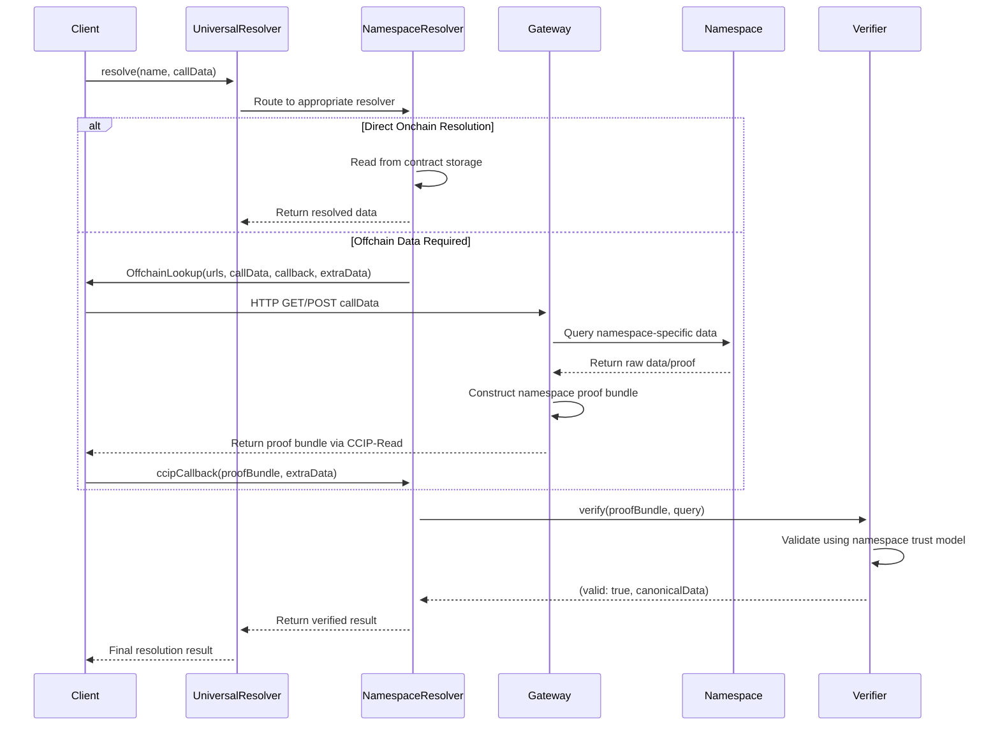

<Note type="warning">
**Research Documentation**: This site presents hypothetical implementations and research concepts for the Universal Resolver Matrix framework. Content represents educational explorations and may not reflect current or planned features of Ethereum Name Service (ENS) or related protocols.
</Note>

## The Universal Resolver Matrix

The **Universal Resolver Matrix (URM)** is a comprehensive framework for implementing universal name resolution across diverse namespaces and ecosystems. It provides a systematic approach to mapping resolution pathways using four core dimensions: 

- **Trust Model**, 
- **Proof System**, 
- **Rules & Lifecycle**, and 
- **Verification Path**.

Built on Ethereum Name Service (ENS) infrastructure, the URM creates a unified identity resolution system that bridges traditional DNS, blockchain ecosystems, and modern authentication methods into a single, coherent framework.

## Universal Resolution Framework

The URM implements a consistent **resolution choreography** across all namespaces through a unified four-dimensional framework:

<Note>
  **Diagram Legend**: The conditional "alt" block shows two resolution strategies - direct onchain resolution for available data vs. CCIP-Read assisted resolution for cross-chain/namespace data fetching.
</Note>

## Core Resolution Profiles

<Columns cols={2}>
  <Card
    title="DNSSEC Onchain Resolution"
    icon="shield-check"
    href="https://www.eketc.co/docs/patterns/dnssec-pattern"
  >
    Trustless DNS→ENS resolution via DNSSEC P-256 signatures validated onchain.
  </Card>
  <Card
    title="EVM Resolution"
    icon="network-wired"
    href="https://www.eketc.co/docs/patterns/evm-pattern"
  >
    ENSIP-19 multichain primary names across EVM ecosystems.
  </Card>
  <Card
    title="Non-EVM Resolution"
    icon="globe"
    href="https://www.eketc.co/docs/patterns/non-evm-pattern"
  >
    Extends ENSIP-19 to non-EVM blockchains (Cosmos, Solana, etc.)
  </Card>
  <Card
    title="WebAuthn Resolution"
    icon="key"
    href="https://www.eketc.co/docs/patterns/webauthn-pattern"
  >
    Passkey-based ENS name control and authentication.
  </Card>
</Columns>

## Framework Architecture

### Four Core Dimensions

The URM structures each resolution profile around four fundamental dimensions:

1. **Trust Model** - Establishes the cryptographic and organizational trust foundations
2. **Proof System** - Defines how proofs are generated, validated, and verified
3. **Rules & Lifecycle** - Governs the creation, management, and expiration of names
4. **Verification Path** - Maps the complete resolution pathway from query to result

### Technical Specifications

Each profile provides comprehensive technical references including:
- Contract & namespace inventory
- Deployment architecture considerations
- Edge cases and client requirements
- Implementation details and best practices

## Getting Started

<Steps>
<Step title="Choose your resolution profile">
  Select the appropriate URM profile based on your target blockchain ecosystem or authentication method.
</Step>

<Step title="Review the technical specification">
  Study the complete implementation details, including trust models, proof systems, and verification paths.
</Step>

<Step title="Implement the resolver contracts">
  Deploy the required smart contracts and integrate with ENS infrastructure.
</Step>

<Step title="Test and validate">
  Ensure proper resolution across all specified pathways and handle edge cases appropriately.
</Step>
</Steps>

## Technical Resources

<Columns cols={2}>
  <Card
    title="ENSIP Specifications"
    icon="file-contract"
    href="https://docs.ens.domains/ensip/"
  >
    Official ENS Improvement Proposals and technical standards.
  </Card>
  <Card
    title="EIP-7951: P-256 Precompile"
    icon="code"
    href="https://eips.ethereum.org/EIPS/eip-7951"
  >
    Ethereum precompile for P-256 elliptic curve operations.
  </Card>
  <Card
    title="ENSIP-19: Multichain Names"
    icon="link"
    href="https://docs.ens.domains/ensip/19"
  >
    Primary name resolution across multiple blockchains.
  </Card>
  <Card
    title="DNSSEC Algorithm 13"
    icon="lock"
    href="https://www.rfc-editor.org/rfc/rfc6605.html"
  >
    P-256 ECDSA signatures for DNSSEC validation.
  </Card>
</Columns>
