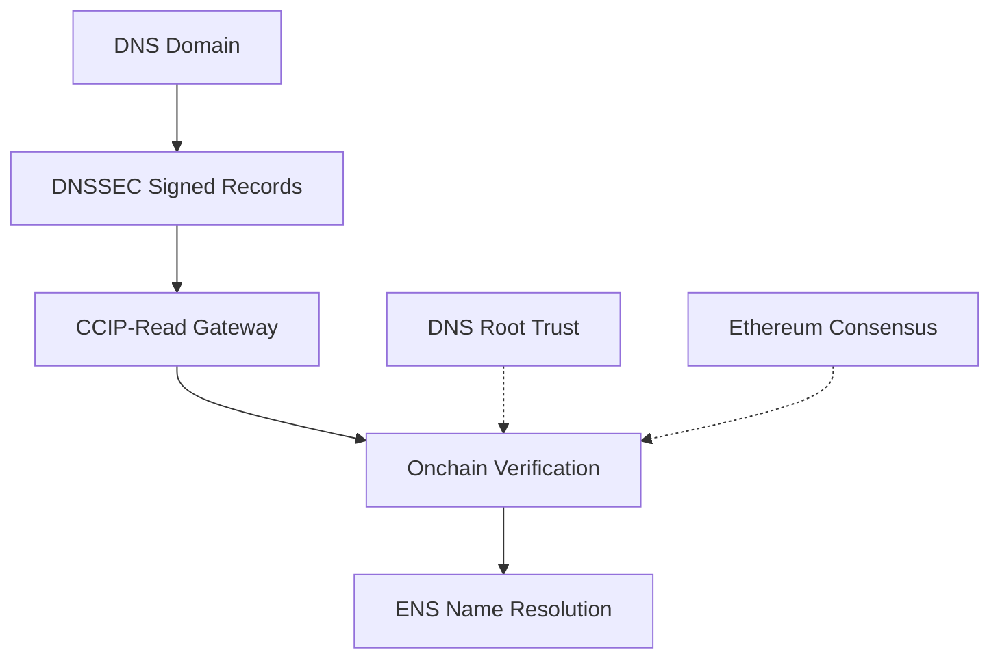

# DNSSEC Resolution Pattern

**DNSSEC Onchain Resolution** enables trustless mapping from DNS domains to ENS names through cryptographic proof validation on Ethereum. This breakthrough allows DNS zones to become first-class participants in the decentralized identity ecosystem, bridging traditional DNS infrastructure with blockchain-based name resolution.

## Core Concept

DNSSEC (Domain Name System Security Extensions) provides cryptographic signatures for DNS records, ensuring their authenticity and integrity. By validating these signatures onchain, we create a trustless bridge between the DNS ecosystem and Ethereum Name Service (ENS).



## Why DNSSEC Onchain Matters

### The Problem
Traditional DNS lacks cryptographic guarantees by default. In contrast, ENS requires cryptographic proof of ownership for both .eth names (via Ethereum transactions) and DNS-based names (via DNSSEC and TXT records). This minimizes trust dependencies on centralized registrars or manual verification processes.

### The Solution
DNSSEC onchain resolution uses DNSSEC’s cryptographic infrastructure to provide verifiable, onchain proof that a DNS domain is controlled by the claimant, enabling secure import of DNS names into ENS.

## Trust Model Architecture

### Hierarchical Chain of Trust
DNSSEC establishes a hierarchical chain of trust, starting from the DNS root zone and extending down to individual DNS records:

1. **DNS Root Zone**: Contains the root Key Signing Keys (KSK), which sign the keys of top-level domains (TLDs).
2. **Top-Level Domains (TLDs)**: Use their keys to sign delegations to second-level domains (SLDs).
3. **Second-Level Domains (SLDs)**: Sign their own zone records, including subdomains and resource records.
4. **Individual Records**: Each resource record is cryptographically signed, allowing verification of authenticity all the way up to the root.


### ENS-Specific Implementation
ENS uses Algorithm 13 (ECDSAP256SHA256) for DNSSEC verification, which requires:

- P-256 (secp256r1) elliptic curve signatures
- SHA-256 hashing
- Onchain verification using a precompile for secp256r1 signatures (as specified in EIP-7951), available at address 0x100 on supported EVM chains
## Proof System Mechanics

### Core Components

- **Resource Records (RR)** - Individual DNS records containing domain data
- **RRSIG Records** - Cryptographic signatures covering RR sets
- **DNSKEY Records** - Public keys used for signature verification
- **DS Records** - Delegation signers proving parent-child zone relationships

### Proof Bundle Structure
When resolving a DNS name, the system constructs a complete cryptographic proof containing:

```json
{
  "question": {
    "qname": "bytes",
    "qtype": "uint16"
  },
  "answerRRsets": "RR[]",
  "canonicalRRsetBytes": "bytes",
  "RRSIGSignatures": "RRSIG[]",
  "DNSKEYRecords": "DNSKEY[]",
  "DSDelegationProofs": "DS[]",
  "timestamps": {
    "queryTime": "uint256",
    "validFrom": "uint256",
    "validUntil": "uint256"
  }
}
```

**Note:** This JSON structure is for educational purposes only and represents a conceptual view of the DNSSEC proof bundle components as described in the Universal Resolver Matrix. Actual contract interfaces may use different data structures.

## Verification Process

### Two-Phase Resolution

**Phase 1: Reverse Resolution**
- Query DNS for TXT records proving ENS name ownership
- Example: `_ens.example.com TXT "ens_name=alice.eth"`

**Phase 2: Forward Verification**
- Resolve the claimed ENS name to verify the reverse mapping
- Ensures bidirectional consistency between DNS and ENS

### Onchain Validation Steps

1. **Canonicalize** DNS records according to RFC standards
2. **Verify RRSIG signatures** using DNSKEY records
3. **Validate delegation chain** through DS record proofs
4. **Check temporal validity** of signatures
5. **Extract ENS attribution** from verified TXT records

## Deployment Architecture

### L1 vs Namechain Considerations

**Ethereum L1 Deployment:**
- Maximum security through L1 consensus
- Higher gas costs (~$5-15 per verification)
- Direct trust in Ethereum's validator set

**ENS Namechain (L2) Deployment:**
- Cost-effective resolution (~$0.01-0.30 per operation)
- Combined security of L2 rollup + DNSSEC cryptography
- Optimal for production DNSSEC integration

## Integration Patterns

### TXT Record Attribution
DNS zones prove ENS name ownership through specially formatted TXT records:

```
_ens.example.com TXT "ens_name=alice.eth"
_ens.subdomain.example.com TXT "ens_name=bob.eth"
```

### Wildcard Resolution
Supports dynamic subdomain resolution for large DNS zones without pre-registering every subdomain.

### Cross-Chain Applications
Once verified onchain, DNS-attributed ENS names work seamlessly across all EVM-compatible chains through ENSIP-19 multichain resolution.

## Security Properties

### Cryptographic Guarantees
- **Authenticity**: DNS records are cryptographically signed by zone operators
- **Integrity**: Any tampering breaks signature verification
- **Non-repudiation**: Zone operators cannot deny signing their records
- **Trust minimization**: Security depends only on DNS root keys + Ethereum consensus

### Protected Attack Vectors
- DNS spoofing and cache poisoning
- Man-in-the-middle attacks
- Gateway manipulation attempts
- Record tampering and injection

## Implementation Considerations

### Contract Architecture
The DNSSEC resolver system uses a two-contract pattern:

1. **DnssecP256Verifier** - Holds trust anchors and performs cryptographic validation
2. **DnssecResolver** - Handles CCIP-Read integration and resolution routing

### Gateway Infrastructure
Trustless gateways fetch DNSSEC proofs from authoritative servers and format them for onchain verification. While gateways provide availability, they cannot compromise correctness - invalid proofs are always rejected.

## Relationship to Universal Resolver Matrix

DNSSEC Onchain Resolution serves as a critical **Trust Model** within the URM framework:

- **Trust Model**: DNSSEC cryptographic signatures + DNS root authority
- **Proof System**: Algorithm 13 (ECDSAP256SHA256) with P-256 signatures
- **Rules & Lifecycle**: DNSSEC key management and signature validity periods
- **Verification Path**: CCIP-Read assisted resolution with onchain validation

This integration enables DNS zones to participate as first-class namespaces in the broader cross-chain identity ecosystem.

## Technical Specification

For complete implementation details, refer to the comprehensive technical specification:

**[DNSSEC Resolution Specification](/dnssec-specification)**

The specification covers contract interfaces, proof formats, deployment architectures, and edge cases in detail.