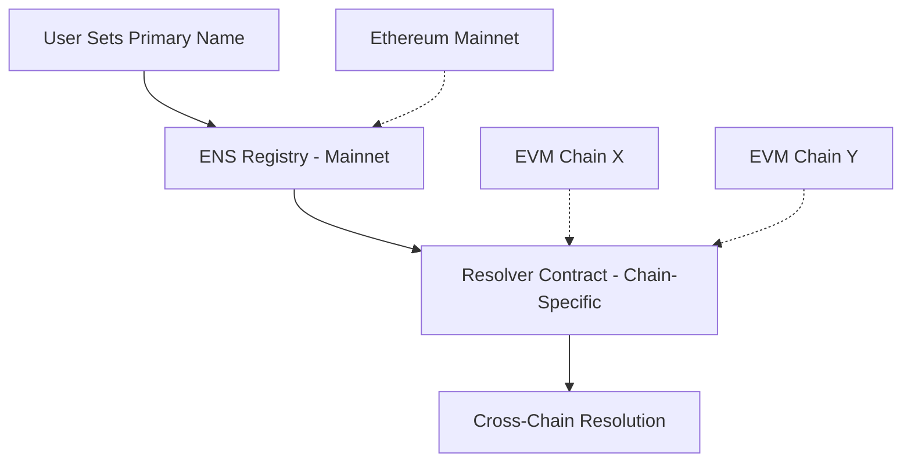

# EVM Resolution Pattern

**EVM Resolution** enables consistent primary name resolution across all Ethereum Virtual Machine (EVM) compatible blockchains through ENSIP-19. This pattern standardizes how users can set and resolve primary names across multiple EVM chains, creating a unified identity experience.

## Core Concept

ENSIP-19 extends ENS functionality beyond Ethereum mainnet to support primary names across the entire EVM ecosystem. Users can set primary names that work consistently across different EVM chains, enabling seamless cross-chain identity resolution.

## Why EVM Resolution Matters

### The Problem
Without ENSIP-19, each EVM chain would need its own primary name system, creating fragmentation and requiring users to manage separate identities on each chain.

### The Solution
ENSIP-19 provides a standardized framework for primary names that works across all EVM chains, with chain-specific resolvers that reference the main ENS registry.

## Trust Model Architecture

### Hierarchical Resolution
Primary names follow a two-phase resolution process:

1. **Reverse Resolution**: Address → Name lookup
2. **Forward Verification**: Name → Address verification

### Chain-Specific Implementation
Each EVM chain can have its own resolver contracts while referencing the authoritative ENS registry on mainnet for primary name ownership.

## Resolution Process

### Primary Name Setting
Users set primary names through resolver contracts on specific chains:

- **Mainnet Primary Names**: Set via `0x00000000000C2E074eC69A0dFb2997BA6C7d2e1e`
- **Chain-Specific Names**: Set via chain-specific resolver contracts

### Cross-Chain Resolution
When resolving on any EVM chain:

1. Query the chain-specific resolver
2. If no chain-specific name exists, fall back to mainnet primary name
3. Return the appropriate name for that context

## Integration Patterns

### Wallet Integration
Wallets can display primary names by:

1. Detecting the current chain
2. Querying the appropriate resolver contract
3. Displaying the chain-specific or fallback primary name

### dApp Integration
Applications can resolve primary names using standard ENS resolution libraries with chain-aware parameters.

## Relationship to Universal Resolver Matrix

EVM Resolution serves as the **ENSIP-19 Profile** within the URM framework:

- **Trust Model**: Ethereum consensus + ENS registry authority
- **Proof System**: ENSIP-19 resolution algorithm with fallback logic
- **Rules & Lifecycle**: Primary name registration and management across chains
- **Verification Path**: Two-phase resolution with chain-specific fallbacks

This integration enables seamless primary name resolution across the entire EVM ecosystem while maintaining backward compatibility with existing ENS infrastructure.

## Technical Specification

For complete implementation details, refer to the comprehensive technical specification:

**[EVM Resolution Specification](/specifications/evm-specification)**

The specification covers ENSIP-19 implementation, resolver contracts, and cross-chain compatibility in detail.