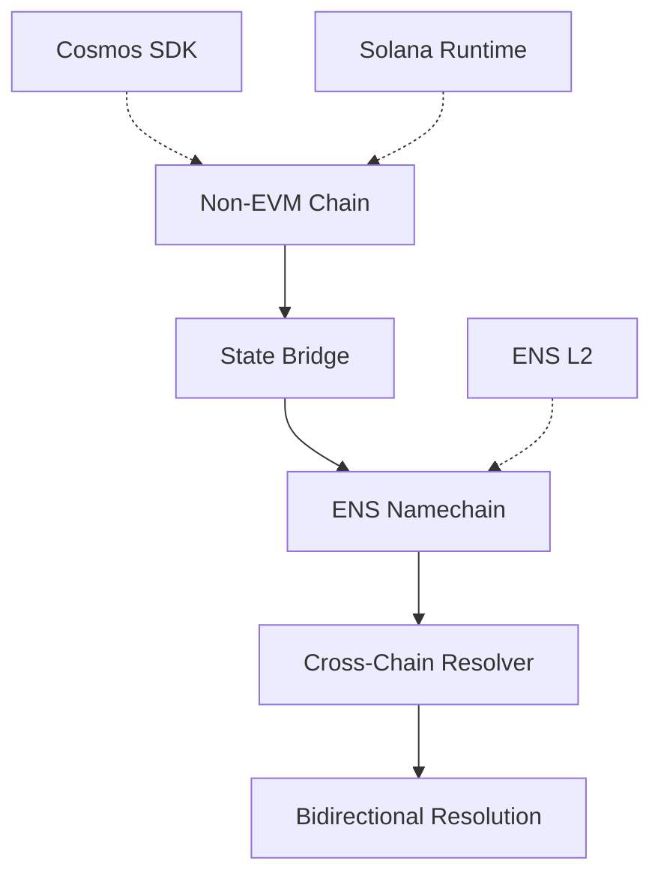

# Non-EVM Resolution Pattern

**Non-EVM Resolution** extends ENSIP-19 to enable primary name resolution for non-Ethereum Virtual Machine (non-EVM) blockchains including Cosmos, Solana, and other ecosystems. This pattern enables bidirectional identity resolution (address ↔ name) across fundamentally different blockchain architectures.

## Core Concept

While ENSIP-19 provides forward resolution (name → address) for non-EVM chains, it lacks reverse resolution (address → name) capabilities. Non-EVM Resolution fills this gap by establishing resolver infrastructure that enables complete bidirectional identity mapping across heterogeneous blockchain networks.

## Why Non-EVM Resolution Matters

### The Problem
Non-EVM blockchains have fundamentally different architectures, consensus mechanisms, and state models than EVM chains. ENSIP-19's EVM-centric design doesn't account for these differences, leaving non-EVM chains with incomplete identity resolution.

### The Solution
Non-EVM Resolution establishes a universal bridge architecture that can handle any blockchain's state model while maintaining ENS compatibility.

## Trust Model Architecture

### Heterogeneous State Models
Different blockchains require different proof systems:

- **Cosmos SDK Chains**: IAVL tree proofs with Tendermint consensus
- **Solana**: Sparse Merkle Tree proofs with proof-of-history
- **Substrate Chains**: Custom state proofs with GRANDPA finality

### Bridge-Based Verification
Trust flows through verified state bridges that commit non-EVM state roots to Ethereum, enabling onchain verification without trusting external oracles.

## Resolution Process

### State Commitment Flow
1. **Non-EVM Registrar**: Records address → name mappings on native chain
2. **State Bridge**: Commits state roots to Ethereum L1
3. **ENS Resolver**: Verifies proofs against committed roots
4. **Bidirectional Resolution**: Enables both forward and reverse lookups

### Proof System Flexibility
The pattern supports multiple proof formats to accommodate different blockchain architectures while maintaining unified ENS interface compatibility.

## Integration Patterns

### Universal Bridge Interface
Resolvers implement a standardized interface that can verify proofs from any supported blockchain, abstracting away the underlying proof system complexity.

### Chain-Specific Adaptations
Each blockchain integration includes:
- Native registrar contracts
- Bridge verifier contracts
- Chain-specific proof formats
- Gas-optimized resolution paths

## Security Properties

### Cryptographic Verification
- **State Proofs**: Each blockchain's native proof system
- **Bridge Security**: Inherits security from both source and destination chains
- **ENS Compatibility**: Maintains full compatibility with existing ENS infrastructure

### Attack Resistance
- **Bridge Manipulation**: Invalid proofs rejected by verifier contracts
- **State Tampering**: Protected by source chain consensus
- **Resolution Spoofing**: Bidirectional verification prevents inconsistencies

## Relationship to Universal Resolver Matrix

Non-EVM Resolution serves as the **Heterogeneous Chain Profile** within the URM framework:

- **Trust Model**: Multi-chain bridge security + native consensus
- **Proof System**: Blockchain-specific cryptographic proofs
- **Rules & Lifecycle**: Cross-chain name registration and management
- **Verification Path**: Bridge-assisted resolution with fallback mechanisms

This integration enables the Universal Resolver to handle any blockchain architecture while maintaining a consistent ENS-based identity interface.

## Technical Specification

For complete implementation details, refer to the comprehensive technical specification:

**[Non-EVM Resolution Specification](/specifications/non-evm-specification)**

The specification covers bridge architectures, proof systems, and cross-chain resolver implementations in detail.