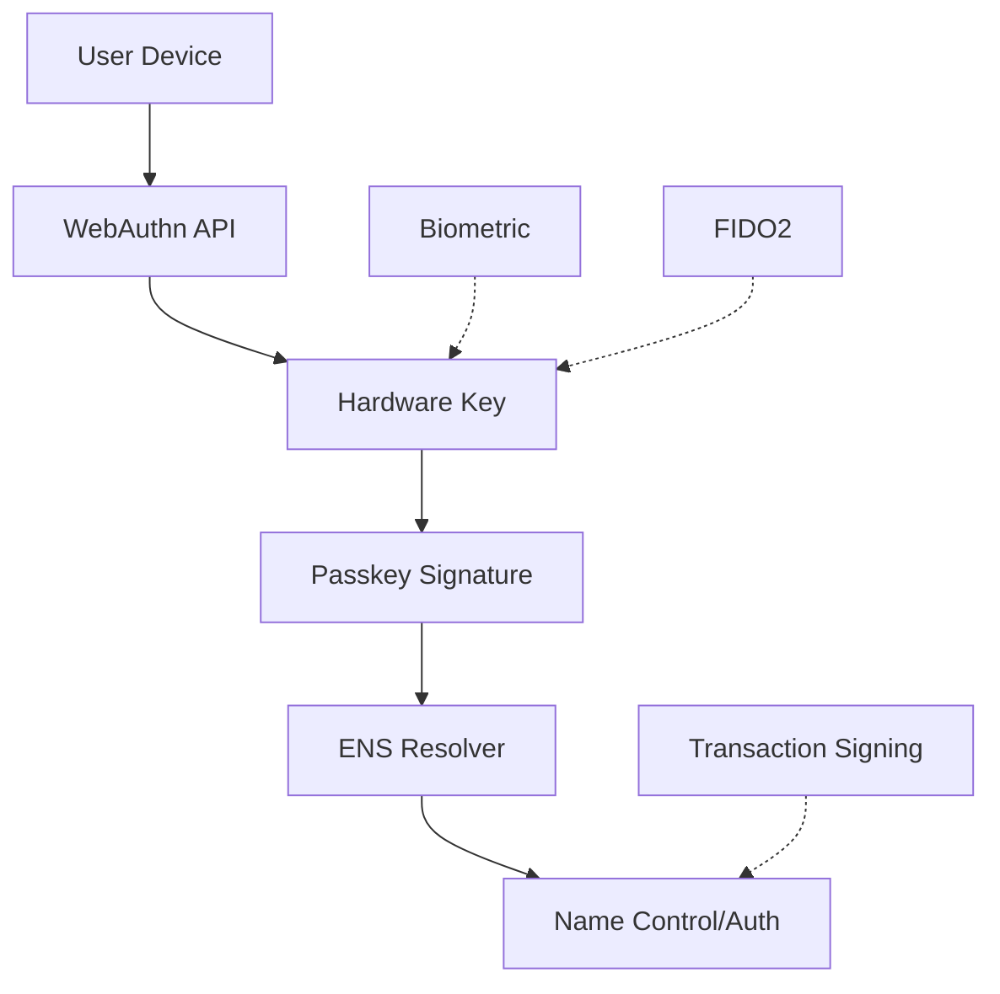

# WebAuthn Resolution Pattern

**WebAuthn Resolution** integrates Web Authentication (WebAuthn) passkeys with Ethereum Name Service (ENS) to enable hardware-backed identity management. This pattern allows users to control ENS names and authenticate transactions using biometric or hardware security keys instead of traditional private keys.

## Core Concept

WebAuthn enables secure, phishing-resistant authentication through hardware-backed credentials. By integrating WebAuthn with ENS, users can control name ownership and execute transactions using passkeys, creating a more secure and user-friendly identity management system.

## Why WebAuthn Resolution Matters

### The Problem
Traditional crypto wallets rely on seed phrases and private keys that are vulnerable to phishing, malware, and user error. ENS name management requires the same security model as token transfers.

### The Solution
WebAuthn Resolution enables ENS name control through hardware-backed passkeys, providing phishing-resistant authentication and eliminating the need for traditional key management.

## Trust Model Architecture

### Hardware-Backed Security
WebAuthn credentials are stored in dedicated hardware security modules:

- **Platform Authenticators**: Built into devices (Touch ID, Face ID, Windows Hello)
- **Roaming Authenticators**: External security keys (YubiKey, Titan Security Key)
- **Cryptographic Isolation**: Private keys never leave the hardware

### ENS Integration
Passkeys are associated with ENS names through resolver contracts that verify WebAuthn signatures onchain using the EIP-7951 P-256 precompile.

## Resolution Process

### Credential Registration
1. **Generate Passkey**: User creates WebAuthn credential via browser API
2. **Register with ENS**: Public key stored in resolver contract
3. **Authorize Control**: Passkey authorized for name management operations

### Authentication Flow
1. **Challenge Generation**: dApp/resolver creates authentication challenge
2. **User Verification**: Passkey signs challenge via WebAuthn API
3. **Onchain Verification**: Resolver verifies signature using stored public key
4. **Access Granted**: User can control ENS name or authenticate transactions

## Integration Patterns

### Dual Profile Architecture

**Profile 1: Controller**
- Passkeys control ENS name ownership
- Users can update records using hardware authentication
- Primary name management without traditional keys

**Profile 2: Authentication**
- Passkeys used for transaction authentication
- dApps can request WebAuthn verification for user actions
- Optional hybrid approach with gateway-assisted verification

### Resolver Implementation
Two resolver types support different use cases:
- **WebAuthnControllerResolver**: Full name control via passkeys
- **WebAuthnCredentialResolver**: Authentication-only operations

## Security Properties

### Cryptographic Guarantees
- **P-256 ECDSA**: Hardware-backed elliptic curve signatures
- **SHA-256 Hashing**: Standard cryptographic hashing
- **Challenge-Response**: Prevents replay attacks
- **Origin Verification**: Prevents cross-origin attacks

### Phishing Protection
- **Relying Party Verification**: Signatures bound to specific origins
- **Challenge Freshness**: Time-limited authentication challenges
- **Hardware Isolation**: Private keys protected by hardware security

## Implementation Architecture

### Onchain Verification
All cryptographic verification happens onchain using:
- **EIP-7951**: P-256 precompile for signature verification
- **ENS Namechain**: Cost-effective verification operations
- **Resolver Contracts**: Store authorized public keys and verify signatures

### Optional Gateway Support
For applications requiring sub-cent verification costs:
- **Offchain Verification**: Gateway verifies signatures before storing attestations
- **Cost Optimization**: Reduces per-verification gas costs
- **Audit Trail**: Maintains onchain verification record

## Relationship to Universal Resolver Matrix

WebAuthn Resolution serves as the **Hardware Authentication Profile** within the URM framework:

- **Trust Model**: Hardware security + WebAuthn protocol guarantees
- **Proof System**: P-256 ECDSA signatures with challenge-response authentication
- **Rules & Lifecycle**: Passkey registration, authorization, and revocation
- **Verification Path**: Direct onchain verification with optional gateway assistance

This integration enables secure, user-friendly ENS name management through hardware-backed authentication while maintaining full compatibility with existing ENS infrastructure.

## Technical Specification

For complete implementation details, refer to the comprehensive technical specification:

**[WebAuthn Resolution Specification](/specifications/webauthn-specification)**

The specification covers WebAuthn integration, resolver contracts, and authentication flows in detail.