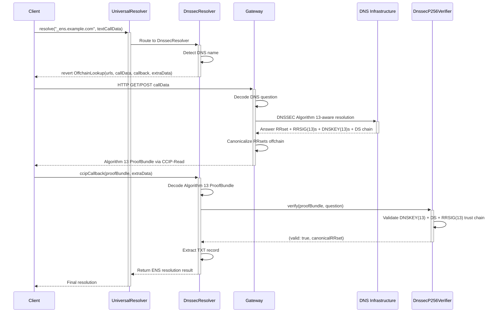

<Note type="warning">
**Educational Content**: This document presents hypothetical DNSSEC integration concepts for research purposes only.
</Note>

## 1. Introduction

### 1.1. Document Purpose

This document provides a comprehensive technical reference for implementing DNSSEC P-256 (Algorithm 13) as a profile in the Universal Resolver Matrix (URM), expanding the normative specification from the proposed <Tooltip tip="ENSIP (Ethereum Name Service Improvement Proposal) is a standards document for improving the ENS protocol. Our intended ENSIP-XX would standardize DNSSEC onchain resolution, enabling DNS domains to be resolved directly on Ethereum through cryptographic proof validation."><strong>ENSIP-XX</strong></Tooltip>.

### 1.2. Universal Resolver Matrix Framework

The Universal Resolver Matrix (URM) is a systematic framework for mapping resolution pathways across namespaces using four core dimensions:

1. **Trust Model**,
2. **Proof System**,
3. **Rules & Lifecycle**, and
4. **Verification Path**.

This document structures DNSSEC P-256 implementation around these dimensions, with additional sections covering:

- Deployment Architecture (L1 vs Namechain considerations)
- Contract & Namespace Inventory
- URM Mapping (Resolver Profiles)
- Edge Cases & Client Requirements

## 2. Scope & Goals

### 2.1. DNSSEC Algorithm 13 (P-256) Overview

ENS uses **Algorithm 13 (ECDSAP256SHA256)** for DNSSEC verification, enabling trustless DNS-to-ENS resolution by validating P-256 ECDSA signatures onchain. A DNS record set (RRset) is considered verifiable if its RRSIG uses Algorithm 13 and the signature can be cryptographically chained—via DNSKEY and DS records—up to the DNS root, forming an unbroken trust chain from the root to the individual record.

This validation relies on Ethereum's P-256 precompile (EIP-7951) available on both L1 and Namechain for efficient onchain signature verification.

**Our reference implementation uses .fr domains** which have DNSKEY records using Algorithm 13, providing a concrete working example of DNSSEC onchain resolution that anchors DNS record authenticity in root trust.

### 2.3. DNS Record Types & Usage

DNSSEC P-256 supports verification of all standard DNS record types (TXT, A, AAAA, CNAME, etc.), with primary focus on:

- **TXT records** for ENS attribution (`_ens.example.com TXT "ens_name=example.eth"`)
- **A/AAAA records** for direct IP address resolution
- **CNAME records** for DNS aliasing with DNSSEC chain following

### 2.4. Deployment Architecture: L1 vs Namechain

DNSSEC P-256 verification requires both P-256 precompile and SHA-256 hashing. The deployment location significantly impacts gas costs and production viability:

#### 2.4.1. Architecture Overview

DNSSEC verification can be deployed across different layers with varying cost profiles:

| Deployment Location | Component | Purpose |
|---------------------|-----------|---------|
| **Ethereum L1** | DnssecP256Verifier | Cost-effective cryptographic verification (EIP-7951) |
| **Namechain (ENS L2)** | DnssecP256Verifier | Cost-effective cryptographic verification (EIP-7951) |
| **Namechain (ENS L2)** | DnssecResolver | Cost-effective resolver operations |

<Note>
**Deployment Recommendation**: While the DnssecP256Verifier can be deployed on either L1 or Namechain, **Namechain deployment is strongly recommended** to avoid expensive cross-chain calls when resolvers need cryptographic verification. This enables seamless L2-to-L2 verification flows without L1 bridging overhead.
</Note>

#### 2.4.2. Contract Inventory (2-Contract Pattern)

DNSSEC onchain resolution follows a minimal 2-contract pattern that separates cryptographic verification from resolution logic. The Universal Resolver serves as the existing resolution entry point, while two new contracts handle DNSSEC-specific functionality: one for cryptographic verification and another for CCIP-Read integration.

**Contract Inventory:**

1. **Universal Resolver (L1/L2)** - Existing resolution entry point (optional but recommended)
2. **DnssecP256Verifier** - Trust anchor holder and cryptographic verifier using P-256 precompile
3. **DnssecResolver** - CCIP-Read resolver for DNSSEC-backed DNS names with offchain proof fetching

#### 2.4.3. Roots of Trust & Security

The canonical root of trust consists of:
- **DNS Root Zone KSK** - Stored in DnssecP256Verifier contract as trust anchors
- **DNSSEC Chain of Trust** - Hierarchical validation from root → TLD → SLD → zone
- **Ethereum Consensus** - Onchain verification guarantees

Security is inherited from DNSSEC's cryptographic signatures and Ethereum consensus. DNS records are valid only if the complete DNSSEC chain validates onchain.

#### 2.4.4. Benefits & Tradeoffs

This architecture enables:
- **Trustlessness**: Cryptographic proof of DNS record authenticity
- **Cost-effectiveness**: Namechain deployment reduces gas costs by 98-99%
- **Scalability**: SHA-256 hashing and P-256 verification optimized for onchain execution
- **DNSSEC Integration**: DNS zones become first-class ENS resolution sources

#### 2.4.5. Governance Requirements


While not strictly required for basic resolver operation, a production-ready DNSSEC resolver should go through ENS DAO governance for integration into core ENS infrastructure. DAO approval is required if you want your resolver to be:

- Set as the default resolver for ENS (e.g., for the reverse registrar or for .eth names)
- Integrated at the protocol level (e.g., replacing the public resolver, or being referenced in official ENS contracts)

**Why Governance Matters:**

DAO approval is a matter of governance and trust. If you want your resolver to be widely used, trusted, or set as a default in ENS infrastructure, DAO approval:
- Signals community trust and security review
- Ensures the resolver is maintained and meets ENS standards
- Protects against unauthorized trust anchor modifications during DNS root key rollovers

## 3. Trust Model

### 3.1. Roots of Trust

The canonical root of trust for DNSSEC P-256 is the DNS root zone Key Signing Key (KSK) stored in the DnssecP256Verifier contract. These trust anchors correspond to the DNS root zone's KSK managed by IANA.

**Why stored in contract?** This solves the "bootstrap problem" - to verify DNSSEC, we need root keys, but fetching them requires verification (infinite regress). Onchain storage establishes a fixed trust anchor.

### 3.2. DNSSEC Chain of Trust

Trust flows hierarchically from the DNS root zone down to individual records:
1. **Root Zone** (`.`) - Contains root DNSKEY, signs TLD DS records
2. **TLD Zone** (`com`) - Contains TLD DNSKEY, signs SLD DS records
3. **SLD Zone** (`example.com`) - Contains zone DNSKEY, signs resource records
4. **Resource Records** - Individual DNS records signed by zone DNSKEY

Each level validates the next via DS (Delegation Signer) records containing cryptographic digests of child zone DNSKEYs.

### 3.3. Security Guarantees

**Security properties:**
- **Cryptographic authenticity** - DNS records signed by zone operators with P-256 ECDSA
- **Integrity protection** - Records cannot be tampered without breaking signatures
- **Non-repudiation** - Zone operators cannot deny signing their records
- **Trust minimization** - Security depends only on DNS root KSK and Ethereum consensus

**Attacks protected against:**
- **DNS spoofing** - Invalid signatures rejected onchain
- **Man-in-the-middle** - Signatures prevent tampering
- **Gateway manipulation** - Invalid proofs rejected by verifier
- **Record tampering** - Any modification breaks signature verification

**Cryptographic assumptions:**
- **P-256 ECDSA security** - Hard computational problems
- **SHA-256 collision resistance** - No collisions computationally feasible
- **DNS root KSK integrity** - Root keys authentic and not compromised
- **P-256 precompile correctness** - Precompile implements ECDSA correctly
- **Ethereum consensus** - L1 consensus guarantees verification correctness


## 4. Proof System

### 4.1. Inputs & Core Definitions

**Key inputs for DNSSEC verification:**

- **DNS Question** - `qname (bytes), qtype (uint16)` - The original DNS query that needs verification. Specifies exactly what domain (`qname`) and record type (`qtype`) we're proving is authentic. Example: `"_ens.example.com"` with `qtype = 16` (TXT) to verify ENS attribution records.
- **ProofBundle** - Complete DNSSEC proof chain delivered via CCIP-Read containing all cryptographic evidence: answer RRsets, RRSIG signatures, DNSKEY records, DS delegation proofs, and validity timestamps. This bundle provides everything needed for onchain verification without requiring the contract to fetch additional data.
- **Root Trust Anchors** - Pre-stored DNSKEY records in the verifier contract that serve as the "root of trust" for DNSSEC verification. For ENS Algorithm 13 verification, these are TLD-level anchors (like .fr) rather than root zone keys, since the root currently uses RSA.

**Core data structures:**
- **RR (Resource Record)** - `name, rrtype, rrclass, ttl, rdata` - Individual DNS records containing the actual data. The `name` field specifies the domain, `rrtype` indicates the record type (1=A, 16=TXT, 28=AAAA), `ttl` specifies cache lifetime, and `rdata` contains the actual record content (e.g., IP address, text data).
- **RRSIG (Resource Record Signature)** - `typeCovered, algorithm, labels, originalTTL, expiration, inception, keyTag, signerName, signature` - Cryptographic signature covering a set of DNS records (RRset). For ENS, `algorithm` must be 13, `typeCovered` matches the RR type being verified, and `signature` is a 64-byte P-256 ECDSA signature. The `keyTag` identifies which DNSKEY was used to create this signature.
- **DNSKEY** - `flags, protocol, algorithm, publicKey` - Public key records used to verify RRSIG signatures. For Algorithm 13, `algorithm = 13` and `publicKey` contains 64 bytes of P-256 elliptic curve coordinates (32 bytes x + 32 bytes y). Flags distinguish KSK (257) from ZSK (256) keys.
- **DS (Delegation Signer)** - `keyTag, algorithm, digestType, digest` - Cryptographic digests that prove delegation from parent to child zones. Parent zones create SHA-256 digests of child DNSKEY records and sign them, creating an unbroken chain of trust. For Algorithm 13, `algorithm = 13` and `digestType = 2` (SHA-256).

**Algorithm constants:**
- `ALGORITHM_13 = 13` - ECDSAP256SHA256 - The exclusive elliptic curve algorithm used by ENS for DNSSEC verification. Uses P-256 curve with SHA-256 hashing, providing 128-bit security level. Required for all DNSKEY, DS, and RRSIG records in ENS-verified zones.
- `DNS_RECORD_TYPE_TXT = 16` - TXT records used for ENS attribution. Contains human-readable text like `"ens_name=example.eth"` that maps DNS domains to ENS names. TXT records are ideal for this purpose as they're flexible, widely supported, and don't conflict with other DNS uses.

### 4.2. Cryptographic Primitives

#### 4.2.1. ECDSA P-256 (Algorithm 13: ECDSAP256SHA256)

**Purpose:** Exclusive cryptographic signature algorithm used by ENS for DNSSEC verification. DNS zone operators must sign all DNS resource records using Algorithm 13.

**Usage:**
- Zone operators generate P-256 key pairs for DNSSEC signing (private key for signing, public key in DNSKEY records)
- RRSIG(13) records contain P-256 signatures over canonicalized RRsets using SHA-256 hashing
- DNSKEY(13) records contain P-256 public keys (64 bytes: 32-byte x-coordinate + 32-byte y-coordinate)
- DS records contain SHA-256 digests of DNSKEY(13) records to prove delegations

**Verification:** EIP-7951 P-256 precompile at `0x0100` performs ECDSA signature verification on both L1 and Namechain

#### 4.2.2. SHA-256

**Purpose:** Hash function for ECDSAP256SHA256 algorithm and DS record digests.

**Usage:**
- RRsets canonicalized then hashed with SHA-256 before signing
- DS records contain SHA-256 digests of DNSKEY records
- Used in chain of trust validation

**Implementation:** Solidity implementation (no native precompile), ~2,000-3,000 gas per hash

#### 4.2.3. DNS Name Canonicalization

**Purpose:** Normalize DNS names to ensure consistent hashing and signature verification across different implementations.

**Algorithm:** [RFC 4034 Section 6.1](https://www.rfc-editor.org/rfc/rfc4034.html#section-6.1) - DNS name canonicalization:
- Convert all labels to lowercase (ASCII A-Z to a-z)
- Decompress any compressed name pointers
- Remove trailing dots from the root zone
- Ensure consistent representation for cryptographic operations

#### 4.2.4. RRset Canonicalization

**Purpose:** Sort and normalize resource records within an RRset to ensure deterministic hashing for signature verification.

**Algorithm:** [RFC 4034 Section 6.2](https://www.rfc-editor.org/rfc/rfc4034.html#section-6.2) - RRset canonical ordering:
- Sort RRsets by RR type, then by RDATA in network (big-endian) byte order
- Ensures identical RRsets always hash to the same value
- Critical for signature verification consistency across DNS implementations

### 4.3. Proof Types (URM Terms)

#### 4.3.1. dnssec_proof(algorithm_13) — DNSSEC Algorithm 13 Signature Chain

**When Used:**
- DNS zones signed exclusively with Algorithm 13 (ECDSA-P256-SHA256)
- DNSKEY records must use algorithm 13
- DS records must reference algorithm 13 keys
- RRSIG records must use algorithm 13 signatures
- Any RRset (TXT, A, AAAA, etc.) covered by valid RRSIG(13) chaining to DNSKEY(13) with valid DS digest

**Proof Mechanism:**
- **Cryptographic proof required** - Complete DNSKEY(13) + DS + RRSIG(13) trust chain via CCIP-Read
- **Trust Source:** DNS root KSK → TLD → SLD → zone DNSKEY(13) chain validated via DS digests and RRSIG(13) signatures
- **Verification:** DnssecP256Verifier validates Algorithm 13 trust chain onchain using P-256 precompile


**Example Flow:**


### 4.4. Proof Formats

<Note type="info">
**Research Structure**: This JSON represents a conceptual DNSSEC proof bundle format for educational purposes. Actual ENS DNSSEC implementations may use different data structures optimized for onchain verification.
</Note>

**DNSSEC Algorithm 13 Proof Bundle:**
```json
{
  "question": { "qname": "bytes", "qtype": "uint16" },
  "answerRRset": "RR[]",
  "canonicalRRsetBytes": "bytes",
  "answerRRSIGs": "RRSIG[]",  // Must use algorithm 13
  "zoneDNSKEYs": "ZoneDNSKEY[]",  // Must specify algorithm 13
  "delegationDS": "DelegationDS[]",  // Must reference algorithm 13 keys
  "timestamps": { "queryTime": "uint256", "validFrom": "uint256", "validUntil": "uint256" }
}
```

**Validation:** DNSKEY(13) + DS + RRSIG(13) trust chain validation with offchain canonicalization for gas optimization. All signatures must use Algorithm 13, all keys must specify algorithm 13.

### 4.5. Algorithms

#### 4.5.1. DNSSEC Signature Verification (Algorithm 13)
- **Input:** canonicalRRsetBytes, RRSIG, DNSKEY
- **Process:** Hash canonical bytes → verify P-256 signature → check validity windows
- **Output:** bool valid

#### 4.5.2. Chain of Trust Validation
- **Input:** ProofBundle, rootAnchors
- **Process:** Validate root DNSKEY → DS chain → DNSKEY RRSIGs → answer RRSIG
- **Output:** (bool valid, bytes canonicalRRset)

### 4.6. Proof Generation & Validation Flow

#### 4.6.1. Gateway Proof Generation
1. **Decode DNS question** from CCIP-Read callData
2. **Fetch DNSSEC chain** from DNS infrastructure
3. **Canonicalize RRsets** offchain (gas optimization)
4. **Build ProofBundle** with canonical bytes

#### 4.6.2. Onchain Validation (DnssecP256Verifier)
1. **Validate root DNSKEY** matches stored trust anchor
2. **Verify DS chain** (root → TLD → SLD → zone)
3. **Verify DNSKEY RRSIGs** using parent zone keys
4. **Verify answer RRSIG** using zone DNSKEY
5. **Check validity windows** and QNAME/QTYPE matching

### 4.7. Comparison to Other Proof Systems

| Aspect | DNSSEC P-256 | EVM State | WebAuthn |
|--------|--------------|-----------|----------|
| **Proof Type** | DNSSEC Signature Chain | Onchain state | Cryptographic signatures |
| **Primitive** | P-256 ECDSA + SHA-256 | EVM state | P-256 ECDSA |
| **Verification** | P-256 precompile + SHA-256 | Consensus | P-256 precompile |
| **Trust Anchor** | DNS Root KSK | Ethereum L1 | FIDO metadata |
| **Proof Format** | DNSSEC ProofBundle | Storage reads | WebAuthn assertion |
| **Gas Cost** | Medium-High (~25k-38k gas) | Low | Low |

**Key Difference:** DNSSEC provides cryptographic proof of DNS record authenticity, while EVM state proofs prove onchain data. DNSSEC requires complete chain validation from root trust anchors.

## 5. Rules & Lifecycle

### 5.1. High-Level Rules for DNSSEC Records

To establish **verified DNS records** for ENS resolution using Algorithm 13:

1. **DNS zone must be DNSSEC-signed exclusively with Algorithm 13 (ECDSA-P256-SHA256)**
   - Zone operators must configure DNSSEC signing with P-256 keys only
   - All DNSKEY records in the trust chain must specify algorithm 13
   - All DS records must reference algorithm 13 keys
   - All RRSIG records must use algorithm 13 signatures

2. **Any RRset is verifiable if its RRSIG uses Algorithm 13 and chains to DNSKEY(13) with valid DS digest**
   - TXT records for ENS attribution: `_ens.example.com TXT "ens_name=example.eth"`
   - RRset must be covered by valid RRSIG(13) signature
   - RRSIG(13) must chain to DNSKEY(13) via valid DS digest
   - Complete DNSKEY(13) + DS + RRSIG(13) trust chain must exist from zone to root

3. **DNSSEC Algorithm 13 proof chain must validate onchain**
   - CCIP-Read fetches proof bundle containing DNSKEY(13), DS, and RRSIG(13) records
   - DnssecP256Verifier validates complete Algorithm 13 trust chain onchain
   - All cryptographic checks must pass using P-256 precompile (EIP-7951)

**Lifecycle operations:**
- **Register:** DNS zone owner creates DNSSEC-signed records. No onchain registration required.
- **Update:** Zone owner updates records or DNSSEC keys. New proof required for resolution.
- **Remove:** Zone owner removes records or disables DNSSEC. Resolution fails verification.
- **Expiry:** RRSIG signatures expire. Zone operators must re-sign before expiry.

### 5.2. DNSSEC Algorithm 13-Specific Rules

- **Algorithm exclusivity:** Only Algorithm 13 (ECDSA-P256-SHA256) supported; all other algorithms rejected
- **DNSKEY requirements:** DNSKEY records must specify algorithm 13 and contain P-256 public keys
- **DS requirements:** DS records must reference algorithm 13 keys and use valid digest algorithms (SHA-256 preferred)
- **RRSIG requirements:** RRSIG records must use algorithm 13 and cover RRsets with valid P-256 signatures
- **Signature validity windows:** RRSIG(13) signatures must be valid at verification time (inception ≤ now ≤ expiration)
- **Key rollover handling:** Zone operators can rollover DNSKEY(13) following DNSSEC procedures with proper double-signing
- **Trust chain completeness:** Complete DNSKEY(13) + DS + RRSIG(13) delegation chain required from zone to root trust anchor
- **QNAME/QTYPE matching:** RRSIG(13) must exactly match original DNS question (QNAME and QTYPE)

### 5.3. DNS Record Types

| Record Type | Usage in ENS | Example |
|-------------|--------------|---------|
| **TXT** | Primary for ENS attribution | `_ens.example.com TXT "ens_name=example.eth"` |
| **A** | IPv4 addresses | `example.com A 192.0.2.1` |
| **AAAA** | IPv6 addresses | `example.com AAAA 2001:db8::1` |
| **CNAME** | DNS aliases | `www.example.com CNAME example.com` |

## 6. Verification Path

### 6.1. Generic DNSSEC Verification

Given a DNS name and record type:

**1. Query Phase**
- Client calls UniversalResolver.resolve(dnsName, callData)
- Universal Resolver routes to DnssecResolver
- DnssecResolver triggers OffchainLookup with gateway URL

**2. Proof Phase**
- Client fetches ProofBundle from gateway
- Gateway performs DNSSEC-aware resolution
- Gateway canonicalizes RRsets offchain
- Gateway returns ProofBundle via CCIP-Read

**3. Verification Phase**
- Client calls DnssecResolver.ccipCallback(proofBundle, extraData)
- Resolver calls DnssecP256Verifier.verify() with Algorithm 13 proof bundle
- Verifier validates complete DNSKEY(13) + DS + RRSIG(13) trust chain from zone to root
- Verifier ensures all signatures use Algorithm 13 and all keys specify algorithm 13
- Resolver extracts DNS record (TXT, A, etc.) and resolves ENS name if applicable
- Returns final ENS resolution result

### 6.1.1. Complete Verification Flow Example

**The Verification Flow - How All Components Work Together:**

1. **Start with DNS Question:** `"_ens.example.com TXT"` (qname + qtype = 16)
2. **Get ProofBundle:** Contains RRsets, RRSIGs, DNSKEYs, DS records from gateway
3. **Check RRSIG:** Verify the TXT RRset is signed with Algorithm 13 (algorithm field = 13)
4. **Find DNSKEY:** Use RRSIG keyTag to locate the DNSKEY(13) that signed it
5. **Verify signature:** Use P-256 precompile to check the 64-byte ECDSA signature
6. **Check chain:** Follow DS records up to trusted TLD anchor (like .fr)
7. **Validate timestamps:** Ensure RRSIG inception ≤ now ≤ expiration
8. **Extract data:** Get verified TXT record content for ENS resolution

**Example with .fr Reference Implementation:**
- **DNS Question:** `"_ens.example.fr TXT"` (verifying ENS attribution)
- **RRSIG Check:** Algorithm 13 signature covering TXT RRset
- **DNSKEY Match:** keyTag points to .fr ZSK with P-256 coordinates
- **DS Chain:** Verifies delegation from .fr TLD (our Algorithm 13 trust anchor)
- **Final Result:** Cryptographically verified `"ens_name=example.eth"`

This creates a complete chain of cryptographic trust from individual DNS records through the DNSKEY(13) + DS + RRSIG(13) trust chain up to TLD-level anchors!

### 6.2. Resolver / Gateway Topology

**Gateway Responsibilities:**
- Fetch DNSSEC Algorithm 13 records from DNS infrastructure (DNSKEY(13), DS, RRSIG(13))
- **Canonicalize RRsets offchain** using RFC 4034 Section 6.1 (DNS name canonicalization) and Section 6.2 (RRset canonical ordering) for gas optimization
- Build ProofBundle with complete Algorithm 13 trust chain
- Ensure all signatures use Algorithm 13 and all keys specify algorithm 13
- Return proof bundles via CCIP-Read

**Verifier Responsibilities:**
- Validate root DNSKEY(13) matches stored trust anchors
- Verify complete DNSKEY(13) + DS + RRSIG(13) delegation chain from zone to root
- Validate DS digests match DNSKEY(13) records
- Validate RRSIG(13) signatures using P-256 precompile (EIP-7951)
- Check Algorithm 13 signature validity windows and QNAME/QTYPE matching
- Reject any non-Algorithm 13 signatures or keys

**Resolver Responsibilities:**
- Detect DNS names requiring offchain resolution
- Trigger CCIP-Read via OffchainLookup
- Receive proof bundles and call verifier
- Extract DNS records and resolve ENS names internally
- Return final resolution results

### 6.3. Minimal Client-Side Pseudocode

```typescript
async function verifyDnssecRecord(
  dnsName: string,
  recordType: string,
  universalResolver: Contract
): Promise<VerifiedRecord | null> {
  try {
    const result = await universalResolver.resolve(encodeDNSName(dnsName), encodeResolverCall(recordType));
    return { valid: true, ensRecord: result };
  } catch (error) {
    if (!isOffchainLookupError(error)) throw error;
    
    const lookup: OffchainLookupError = parseOffchainLookupError(error);
    const proofBundle: ProofBundle = await fetchProofBundle(lookup.urls[0], lookup.callData);
    const result = await dnssecResolver.ccipCallback(encodeProofBundle(proofBundle), lookup.extraData);
    return decodeResult(result);
  }
}
```

### 6.4. Example Implementation Flow

**Scenario:** Resolving `_ens.example.com` TXT record using DNSSEC Algorithm 13 to obtain ENS name mapping.

**Steps:**
1. Client initiates resolution → UniversalResolver routes to DnssecResolver
2. DnssecResolver triggers OffchainLookup → Client fetches Algorithm 13 proof from gateway
3. Gateway returns ProofBundle with DNSKEY(13) + DS + RRSIG(13) trust chain → Client calls ccipCallback
4. DnssecP256Verifier validates Algorithm 13 trust chain using P-256 precompile → Resolver extracts TXT record
5. Resolver resolves `example.eth` internally → Returns Ethereum address

## 7. Contract & Namespace Inventory

### 7.1. Core Constants & Helpers

- `ALGORITHM_13 = 13` - ECDSAP256SHA256 - The exclusive elliptic curve algorithm used by ENS for DNSSEC verification
- `P256_PRECOMPILE_ADDRESS = 0x0100` - EIP-7951 precompile address for P-256 ECDSA verification
- `DNS_RECORD_TYPE_TXT = 16` - TXT records used for ENS attribution

### 7.2. DNS Namespaces

| Zone Level | Example | Notes |
|------------|---------|-------|
| **Root** | `.` | DNS root zone, trust anchor |
| **TLD** | `.com` | Top-level domain delegations |
| **SLD** | `example.com` | Second-level domain (zone) |
| **ENS subdomain** | `_ens.example.com` | DNS subdomain for ENS attribution |

### 7.3. Resolver Types

#### 7.3.1. DnssecResolver (ENSIP-10 Extended Resolver)

ENSIP-10 wildcard resolver implementing EIP-3668 (CCIP-Read) for DNSSEC-backed DNS names. Handles offchain lookup triggers, receives proof bundles, calls verifier for validation, and translates DNS records into ENS resolution results.

#### 7.3.2. DnssecP256Verifier (Trust Anchor Holder)

Cryptographic verifier for DNSSEC P-256 proofs. Holds DNS root zone KSK trust anchors, validates complete DNSSEC chain of trust from root to answer records, and verifies RRSIG signatures using P-256 precompile.

### 7.4. Implementation Requirements (2-Contract Pattern)

DNSSEC onchain resolution requires deploying two new contracts while leveraging existing ENS infrastructure. The Universal Resolver serves as the resolution entry point, while dedicated contracts handle DNSSEC-specific verification and CCIP-Read integration.

**Implementation Components:**

1. **UniversalResolver** - Existing ENS infrastructure (no deployment needed) that routes resolution requests to appropriate resolvers based on name patterns
2. **DnssecP256Verifier** - New contract that holds DNSSEC trust anchors and performs cryptographic verification using the P-256 precompile (EIP-7951)
3. **DnssecResolver** - New CCIP-Read enabled resolver that handles offchain DNSSEC proof fetching and triggers verification callbacks
4. **L1 Deployment** - Both new contracts deployed on Ethereum mainnet (~$0.75-1.14 per verification, standard Ethereum costs)
5. **Hybrid Deployment** - Verifier contract on L1 for security, resolver on Namechain for cost efficiency (~$0.75-1.15 per verification)
6. **Namechain Deployment** - Both contracts on Namechain with EIP-7951 support (**recommended for cost efficiency**, 98-99% cost reduction, ~$0.01-0.02 per verification)

## 8. URM Mapping (Resolver Profiles)

DNSSEC P-256 defines a single resolver profile for DNSSEC-backed resolution.

| Profile | Scope | Trust Model | Proof System | Rules | Verification Path |
|---------|-------|-------------|--------------|-------|-------------------|
| **dnssec-p256** | DNS zones with Algorithm 13 signatures | DNSKEY(13) + DS + RRSIG(13) trust chain from root | `dnssec_proof(algorithm_13)` via CCIP-Read | Algorithm 13 exclusivity, signature validity windows | OffchainLookup → Gateway → Onchain DNSKEY/DS/RRSIG validation → ENS resolution |

**Key Characteristics:**
- **Algorithm**: Exclusive support for DNSSEC Algorithm 13 (ECDSA-P256-SHA256)
- **Reference Implementation**: Uses .fr TLD with DNSKEY(13) records
- **Security**: Cryptographic proof anchored in DNS root trust

## 9. Edge Cases & Client Requirements

### 9.1. Algorithm 13 Exclusivity
ENS only supports DNSSEC Algorithm 13. RRSIGs with other algorithms (RSA, Ed25519, etc.) are rejected. DNSKEY records must specify algorithm 13, DS records must reference algorithm 13 keys.

### 9.2. Signature Expiry
RRSIG signatures have inception/expiration timestamps. Expired signatures are rejected with no grace periods. Zone operators must re-sign records before expiry.

### 9.3. DNSSEC Failures
Non-Algorithm 13 zones and unsigned zones cannot be verified. Verification failures can occur at multiple points—clients must handle failures gracefully and not accept invalid results.

### 9.4. Client Requirements

Clients **must**:
- Handle OffchainLookup errors correctly and fetch proof bundles from gateways
- Call resolver callback with proof bundles without skipping verification
- Handle verification failures by treating them as resolution failures
- Respect signature validity and not cache proof bundles across different queries

Clients **must not**:
- Trust gateway responses without onchain verification
- Skip verification steps or bypass the verifier contract
- Cache proof bundles for different queries
- Assume all DNS zones are DNSSEC-signed with Algorithm 13
- Attempt to use non-Algorithm 13 DNSSEC signatures

---

## References

### Standards & Specifications

**DNSSEC Standards:**
- **[RFC 4034](https://www.rfc-editor.org/rfc/rfc4034)** — Resource Records for the DNS Security Extensions
- **[RFC 4035](https://www.rfc-editor.org/rfc/rfc4035)** — Protocol Modifications for the DNS Security Extensions
- **[RFC 4648](https://www.rfc-editor.org/rfc/rfc4648)** — The Base16, Base32, and Base64 Data Encodings

**Ethereum Improvement Proposals:**
- **[EIP-7951](https://eips.ethereum.org/EIPS/eip-7951)** — Precompile for secp256r1 Curve Support (P-256 precompile)
- **[EIP-3668](https://eips.ethereum.org/EIPS/eip-3668)** — CCIP-Read: Secure offchain data retrieval

**ENS Improvement Proposals:**
- **[ENSIP-10](https://docs.ens.domains/ensip/10)** — Wildcard Resolution (Extended Resolver interface)
- **[ENSIP-19](https://docs.ens.domains/ensip/19)** — Reverse Resolution (URM template structure)

### Infrastructure & Governance

**DNS Infrastructure:**
- **[IANA](https://www.iana.org)** — Internet Assigned Numbers Authority (DNS root zone management)
- **[DNS Root Zone](https://www.iana.org/domains/root/db)** — Authoritative root of the DNS hierarchy

**Ethereum Network:**
- **Fusaka Upgrade** — Ethereum network upgrade including P-256 precompile
- **Namechain** — ENS Layer 2 solution (EIP-7951 available)

---

## Appendix A: DNSSEC Record Structures

### A.1 DNSKEY(13) Record

DNSKEY records contain Algorithm 13 public keys used to verify RRSIG(13) signatures. For Algorithm 13 (ECDSA-P256-SHA256), the public key is a P-256 elliptic curve point. ENS requires all DNSKEY records in the trust chain to specify algorithm 13.

**Structure (Solidity/ABI):**
```solidity
struct DNSKEY {
    uint16 flags;        // Key flags (bit 7 = ZSK, bit 15 = KSK)
    uint8 protocol;      // Protocol field (always 3 for DNSSEC)
    uint8 algorithm;     // Algorithm identifier (13 for ECDSAP256SHA256)
    bytes publicKey;     // Public key (64 bytes for P-256: x + y coordinates)
}
```

### A.2 DS Record

DS records contain cryptographic digests of child zone DNSKEY(13) records, proving delegation from parent to child zone. DS records must reference Algorithm 13 keys and use valid digest algorithms (SHA-256 preferred) to maintain the Algorithm 13 trust chain.

**Structure (Solidity/ABI):**
```solidity
struct DS {
    uint16 keyTag;       // Key tag of the DNSKEY being referenced
    uint8 algorithm;     // Algorithm of the DNSKEY (13 for P-256)
    uint8 digestType;    // Digest algorithm (2 for SHA-256)
    bytes digest;        // Digest of the DNSKEY (32 bytes for SHA-256)
}
```

### A.3 RRSIG(13) Record

RRSIG records contain Algorithm 13 cryptographic signatures covering RRsets, proving authenticity and integrity. All RRSIG records in ENS DNSSEC verification must use algorithm 13 and contain valid P-256 signatures over canonicalized RRsets.

**Structure (Solidity/ABI):**
```solidity
struct RRSIG {
    uint16 typeCovered;   // RR type covered by this signature
    uint8 algorithm;      // Algorithm used (must be 13 for ECDSAP256SHA256)
    uint8 labels;        // Number of labels in original owner name
    uint32 originalTTL;   // TTL of the RRset when signed
    uint32 expiration;   // Signature expiration timestamp
    uint32 inception;    // Signature inception timestamp
    uint16 keyTag;       // Key tag of DNSKEY used to sign
    bytes signerName;    // Name of signer (zone name in DNS wire format)
    bytes signature;     // Algorithm 13 signature bytes (64 bytes for P-256: r + s)
}
```

---

## Appendix B: Trust Anchor Data

### B.1 Algorithm 13 Root Trust Anchors

The DNS root zone KSK is managed by IANA and serves as the ultimate trust anchor for DNSSEC Algorithm 13 validation. ENS stores Algorithm 13 root trust anchors in the DnssecP256Verifier contract for validating DNSKEY(13) + DS + RRSIG(13) trust chains.

**Contract Storage Format:**
```solidity
struct RootAnchor {
    uint256 publicKeyX;  // 32-byte x-coordinate of P-256 public key
    uint256 publicKeyY;  // 32-byte y-coordinate of P-256 public key
    uint16 keyTag;       // DNS key tag
    uint256 validFrom;   // Timestamp when this anchor became valid
}

mapping(uint8 => RootAnchor[]) public rootAnchors;  // algorithm => anchors
```

**Note:** Current DNS root zone uses RSA (Algorithm 8), not P-256 (Algorithm 13). ENS DNSSEC verification uses **TLD-level trust anchors** like .fr (our reference implementation) which has adopted Algorithm 13. This enables practical DNSSEC verification today rather than waiting for root zone adoption.

### B.2 Reference Implementation: .fr TLD Algorithm 13 Trust Anchors

**Why .fr as Reference Implementation?** The French TLD (.fr) serves as our **concrete reference implementation** because **both DNSKEY records use Algorithm 13 (ECDSA-P256-SHA256)**, making it the first major TLD to fully adopt P-256 for DNSSEC. This provides a working example for ENS DNSSEC verification rather than hypothetical scenarios.

#### Step 1: Query .fr TLD DNSKEY Records (Working Example)
```bash
# Query .fr TLD - our reference implementation uses Algorithm 13
dig DNSKEY fr @a.nic.fr

# Actual output showing Algorithm 13 adoption:
;; ANSWER SECTION:
fr.			3600	IN	DNSKEY	256 3 13 oEcurTkdeXGMJz5Wsraps+ZP/uGG4A29wIJGGMTB4KjDX5ZhNgZZmbbq dttZg1j5t48lFugtxOyjnbuQAxMROg==
fr.			3600	IN	DNSKEY	257 3 13 C8Q2nWGQPY99Cmln1/zSz7+peZNyxbCHDgisQqSnLXJ6rrfAGXYQdKMJ 3SRY3zmBSqtW5+F0Esu36NTNXRaxIQ==
```

**DNSKEY Record Analysis:**
- **ZSK (256)**: `oEcurTkdeXGMJz5Wsraps+ZP/uGG4A29wIJGGMTB4KjDX5ZhNgZZmbbqdttZg1j5t48lFugtxOyjnbuQAxMROg==`
- **KSK (257)**: `C8Q2nWGQPY99Cmln1/zSz7+peZNyxbCHDgisQqSnLXJ6rrfAGXYQdKMJ3SRY3zmBSqtW5+F0Esu36NTNXRaxIQ==`
- **Algorithm**: `13` (ECDSA-P256-SHA256) for **both keys**
- **Protocol**: `3` (DNSSEC) for both keys
- **Key Tags**: Calculated from the DNSKEY record data

#### Step 2: Extract P-256 Public Keys

Both base64-encoded keys contain 64 bytes of P-256 public key data:
- **First 32 bytes**: x-coordinate (big-endian)
- **Next 32 bytes**: y-coordinate (big-endian)

**KSK (257) decoded coordinates:**
- X: `0x08f4369d61d03d8f7d0a6967d7fcd2cfbfad79d373c5b0837020b18a042a4a72d7`
- Y: `0x27aef46d01c5b108d2107c8b5d4b5bf18712ebb3e8d4cd5d16b12102`

**ZSK (256) decoded coordinates:**
- X: `0xa0412eb9391d79718c273e56b2b6a9b3e64ffef186e00dbdc0824618c4c1e0a8c`
- Y: `0x35fe6198d8199366daba9db6d660d63e6defc9451ea82dc4eca39dbb1001309113a`

#### Step 3: Store in Contract as Reference Implementation

```solidity
// In contract constructor or initialization function
function initializeFrenchReferenceAnchors() public {
    // .fr TLD - Our reference implementation using Algorithm 13

    // KSK (257) - Signs other DNSKEY records
    rootAnchors[13].push(RootAnchor({
        publicKeyX: 0x08f4369d61d03d8f7d0a6967d7fcd2cfbfad79d373c5b0837020b18a042a4a72d7,
        publicKeyY: 0x27aef46d01c5b108d2107c8b5d4b5bf18712ebb3e8d4cd5d16b12102,
        keyTag: 39576, // Calculated from KSK record
        validFrom: block.timestamp
    }));

    // ZSK (256) - Signs regular DNS records
    rootAnchors[13].push(RootAnchor({
        publicKeyX: 0xa0412eb9391d79718c273e56b2b6a9b3e64ffef186e00dbdc0824618c4c1e0a8c,
        publicKeyY: 0x35fe6198d8199366daba9db6d660d63e6defc9451ea82dc4eca39dbb1001309113a,
        keyTag: 24579, // Calculated from ZSK record
        validFrom: block.timestamp
    }));
}
```

#### Current RSA Root KSK (Algorithm 8) - For Comparison

**Why not use root?** The DNS root zone currently uses RSA (Algorithm 8), not ECDSA-P256 (Algorithm 13). For comparison:

```bash
# Root zone still uses RSA
dig DNSKEY . @a.root-servers.net

;; ANSWER SECTION:
.			172800	IN	DNSKEY	257 3 8 (
	AwEAAaz/tAm8yTn4Mfeh5eyI96WSVexTBAvkMgJzkKTOiW1vkIbzxeF3
	+/4RgWOq7HrxRixHlFlExOLAJr5emLvN7SWXgnLh4+B5xQlNVz8Og8kv
	ArMtNROxVQuCaSnIDdD5LKyWbRd2n9WGe2R8PzgCmr3Sd1V/yBp3ZKmQv
	KBHNo3RhAPJfVMD4KBcOIhGJADYO4Q6I2Xlw== ) ; key id = 20326
```

**Algorithm**: `8` (RSASHA256) - **Not compatible with ENS Algorithm 13 verification**

#### Deployment on Namechain

**Step 1: Deploy DnssecP256Verifier Contract**
```solidity
// SPDX-License-Identifier: MIT
pragma solidity ^0.8.19;

contract DnssecP256Verifier {
    struct RootAnchor {
        uint256 publicKeyX;  // 32-byte x-coordinate
        uint256 publicKeyY;  // 32-byte y-coordinate
        uint16 keyTag;       // DNS key tag
        uint256 validFrom;   // Validity timestamp
    }

    // algorithm => array of root anchors
    mapping(uint8 => RootAnchor[]) public rootAnchors;

    address public owner;

    constructor() {
        owner = msg.sender;
        // Initialize with current trust anchors
        // (Would be called via separate initialization function)
    }

    function initializeRootAnchors() external {
        require(msg.sender == owner, "Only owner");

        // Initialize with .fr TLD as reference implementation
        // .fr is the first major TLD to adopt Algorithm 13

        initializeFrenchReferenceAnchors();
        //     validFrom: block.timestamp
        // }));
    }

    function addRootAnchor(
        uint8 algorithm,
        uint256 publicKeyX,
        uint256 publicKeyY,
        uint16 keyTag
    ) external {
        require(msg.sender == owner, "Only owner");

        rootAnchors[algorithm].push(RootAnchor({
            publicKeyX: publicKeyX,
            publicKeyY: publicKeyY,
            keyTag: keyTag,
            validFrom: block.timestamp
        }));
    }
}
```

**Step 2: Initialize Trust Anchors**
```javascript
// Deployment script example
const deployVerifier = async () => {
    // Deploy contract
    const verifier = await ethers.deployContract("DnssecP256Verifier");
    await verifier.waitForDeployment();

    // For current implementation, add TLD-level Algorithm 13 anchors
    // (since root doesn't use Algorithm 13 yet)

    // Example: Add .com TLD Algorithm 13 anchor
    const comAnchor = {
        algorithm: 13,
        publicKeyX: "0x" + comTLDKeyX,  // 32-byte x-coordinate
        publicKeyY: "0x" + comTLDKeyY,  // 32-byte y-coordinate
        keyTag: 12345  // Calculated key tag
    };

    await verifier.addRootAnchor(
        comAnchor.algorithm,
        comAnchor.publicKeyX,
        comAnchor.publicKeyY,
        comAnchor.keyTag
    );

    return verifier;
};
```

**Step 3: Verify Deployment**
```javascript
// Verification script
const verifyAnchors = async (verifierAddress) => {
    const verifier = await ethers.getContractAt("DnssecP256Verifier", verifierAddress);

    // Check stored anchors
    const algorithm13Anchors = await verifier.rootAnchors(13);
    console.log("Algorithm 13 anchors:", algorithm13Anchors.length);

    // Verify anchor data
    for (let i = 0; i < algorithm13Anchors.length; i++) {
        const anchor = algorithm13Anchors[i];
        console.log(`Anchor ${i}:`, {
            keyTag: anchor.keyTag.toString(),
            publicKeyX: anchor.publicKeyX.toHexString(),
            publicKeyY: anchor.publicKeyY.toHexString(),
            validFrom: new Date(anchor.validFrom.toNumber() * 1000)
        });
    }
};
```

### B.2 Key Rollover History

DNS root zone KSK rollovers occur periodically for security. Contract trust anchors must be updated via governance during rollovers.

| Date | Event | Key Tag | Algorithm | Notes |
|------|-------|---------|-----------|-------|
| 2010-07-15 | Initial root KSK rollover | 19036 | 5 (RSASHA1) | First rollover |
| 2017-10-11 | Root KSK rollover | 20326 | 8 (RSASHA256) | Second rollover |
| TBD | Future P-256 KSK | TBD | 13 (ECDSAP256SHA256) | When IANA adopts Algorithm 13 |

**Important:** DNS root zone currently does not support Algorithm 13. Full P-256 DNSSEC verification requires either hybrid verification approaches or trust anchors at TLD level until root adopts P-256.

---
