<Note type="warning">
**Educational Content**: This document presents hypothetical cross-chain resolution concepts for research purposes only.
</Note>

# Universal Resolver Matrix: Non-EVM Resolution and Architecture

## 1. Introduction

### 1.1. Document Purpose

This document provides a comprehensive breakdown of how ENSIP-19: Multichain Primary Names can be extended to support primary name resolution for non-EVM chains (Cosmos, Solana, etc.) via a new resolver profile in the Universal Resolver Matrix (URM). 

It examines the current limitations of ENSIP-19 for non-EVM chains and defines the infrastructure requirements, trust models, proof systems, and implementation frameworks needed to enable **bidirectional resolution** (forward + reverse) for non-EVM blockchains.

It expands the normative specification in [ENSIP-19](https://docs.ens.domains/ensip/19/) into a single technical reference for implementing non-EVM primary names as a URM profile, with additional sections covering implementation details:
- Contract & Namespace Inventory
- URM Mapping (Resolver Profiles)
- Edge Cases & Client Requirements

### 1.2. Universal Resolver Matrix Framework

The Universal Resolver Matrix (URM) is a systematic framework for mapping resolution pathways across namespaces using four core dimensions:

1. **Trust Model**,
2. **Proof System**,
3. **Rules & Lifecycle**, and
4. **Verification Path**.

This document structures non-EVM primary name implementation around these dimensions, with additional sections covering implementation details.

## 2. Scope & Goals

### 2.1. ENSIP-19 Overview & Non-EVM Limitations

ENSIP-19 standardizes primary name resolution for all coin types in EVM-based ecosystems, but currently provides **forward resolution only** for non-EVM chains (`name → address` via `addr(node, coinType)`). Reverse resolution (`address → name`) is not available for non-EVM chains due to missing infrastructure: chain-specific registrar contracts, state commitment bridges to L1, and verifier contracts.

### 2.2. Non-EVM Chain Resolution Scope

This profile extends ENSIP-19 to enable bidirectional resolution for SLIP-44 coin types where `chainFromCoinType(coinType) = 0` (non-EVM chains). It requires additional infrastructure per chain to enable primary name support.

### 2.3. EVM vs Non-EVM Chains (Bidirectional vs Forward-only)

EVM chains (mainnet coinType=60, rollups via ENSIP-11) support full bidirectional resolution. Non-EVM chains (Cosmos, Solana, etc.) currently support forward resolution only; reverse resolution requires infrastructure (chain-specific registrars, state bridges, verifier contracts) that this profile defines.

### 2.4. Non-EVM Resolver Profile & Future Framework

Non-EVM chains cannot have primary names via current ENSIP-19 without additional infrastructure. This profile defines the required components (bridges, registrars, verifiers) needed for each chain type, creating an implementation roadmap that can be adapted for specific chains (Cosmos, Solana, etc.).

### 2.5. Deployment Architecture: Hybrid L1 + Namechain (Surge)

This profile requires a hybrid deployment architecture across Ethereum L1, Namechain (built on Nethermind's Surge framework), and target non-EVM chains:

#### 2.5.1. Architecture Overview

ENS infrastructure migrates to Namechain, a based ZK rollup built on Nethermind's Surge framework, enabling fast preconfirmations and TEE-based proofs for low-latency CCIP-Read operations:

| Deployment Location | Component | Purpose |
|---------------------|-----------|---------|
| **Ethereum L1** | ENS Registry | Canonical root of trust for all ENS name registrations and resolver assignments |
| **Namechain (Surge)** | Non-EVM Resolvers | Cost-effective wildcard resolvers per chain with **dual-path proof validation**: native TEE proof validation in CCIP callbacks (seconds) + fallback to L1 DA + settled ZK proofs |
| **Namechain (Surge)** | Bridge Verifiers | Validates non-EVM state proofs against L1-committed state roots (cross-chain verified) |
| **Ethereum L1** | Universal Resolver | Routes resolution requests to appropriate namespace-specific resolvers |
| **Non-EVM Chains** | Chain Registrars | Per-chain registrars maintaining address → name mappings |
| **Non-EVM Chains** | State Bridges | Commit non-EVM chain state roots to Ethereum L1 |

#### 2.5.2. Contract Inventory (Per Chain)

**Existing Infrastructure (3 Contracts - No Deployment Needed):**

1. **ENS Registry (L1)** - Central registry mapping names to resolvers (`0x00000000000C2E074eC69A0dFb2997BA6C7d2e1e`)
2. **Bridge Verifiers (Namechain)** - Validates non-EVM state proofs against L1-committed state roots
3. **Universal Resolver (L1)** - Resolution entry point (optional but recommended)

**New Contracts per Chain (3 Contracts - Must Deploy):**

4. **Chain Registrar (Non-EVM Chain)** - Stores address → name mappings on target chain
5. **State Bridge (Non-EVM Chain → L1)** - Commits chain state roots to Ethereum L1
6. **Chain Resolver (Namechain)** - Handles chain-specific resolution with CCIP-Read validation

#### 2.5.3. Roots of Trust & Security

The canonical root of trust consists of:
- **ENS Registry on Ethereum L1**: Primary source of truth for all name registrations and resolver assignments
- **Chain registrar contracts**: Store reverse mappings on non-EVM chains
- **State bridge infrastructure**: Commits non-EVM chain state roots to Ethereum L1
- **Bridge verifiers on Namechain**: Validate state proofs against L1-committed state roots via cross-chain communication

Security is inherited from both non-EVM chain consensus and Ethereum L1 consensus. Primary names are valid only if reverse and forward mappings agree.

#### 2.5.4. Benefits & Tradeoffs

This hybrid architecture enables:
- **Trustlessness**: Core infrastructure (Registry, verifiers) remains on L1 for maximum security
- **Cost-effectiveness**: Chain-specific resolvers on Namechain benefit from lower gas costs 
- **Scalability**: **Dual-path proof validation enables flexible latency/security tradeoffs:**
  - **Fast path:** Resolvers validate pre-settled TEE proofs natively in CCIP callbacks (seconds latency)
  - **Secure path:** Fallback to L1 DA + settled ZK proofs via cross-chain calls to bridge verifiers
- **High performance**: CCIP-Read latency reduced from hours to seconds using based preconfirmations and TEE proofs
- **ENSv2 integration**: Migration path for existing infrastructure

#### 2.5.5. Governance Requirements

**DAO Approval: When Is It Needed?**

While not strictly required for basic resolver operation, a production-ready non-EVM resolver should go through ENS DAO governance for integration into core ENS infrastructure. DAO approval is required if you want your resolver to be:

- Set as the default resolver for ENS (e.g., for the reverse registrar or for .eth names)
- Integrated at the protocol level (e.g., replacing the public resolver, or being referenced in official ENS contracts)

**Why Governance Matters:**

DAO approval is a matter of governance and trust. If you want your resolver to be widely used, trusted, or set as a default in ENS infrastructure, DAO approval:
- Signals community trust and security review
- Ensures the resolver is maintained and meets ENS standards
- Protects against unauthorized trust anchor modifications and bridge deployments

**Non-EVM Specific Considerations:**

For non-EVM chains, governance approval is particularly important due to the additional infrastructure complexity (state bridges, cross-chain verifiers) and the higher security implications of integrating fundamentally different blockchain architectures into the ENS ecosystem.  

---

**Non-EVM Chain Integration** enables:

- Primary name reverse resolution (`address → name`) for non-EVM blockchains
- Trustless verification of non-EVM chain state on Ethereum L1
- Standardized framework for integrating any SLIP-44 coin type into ENS primary name system
- Bridge infrastructure connecting non-EVM chains to Ethereum L1 trust model

**Current Limitations:**

ENSIP-19 currently only supports:
- ✅ Forward resolution: Non-EVM addresses can be stored and resolved via `addr(node, coinType)`
- ❌ Reverse resolution: Primary name reverse resolution (`address → name`) is **not available** for non-EVM chains

**Why Non-EVM Chains Lack Primary Name Support:**

Non-EVM chains lack the required infrastructure needed for trustless reverse resolution:

1. **Chain-specific registrar contracts** — No onchain contracts storing reverse mappings (`address → name`) on the non-EVM chain
2. **State commitment bridges to L1** — No mechanism to commit non-EVM chain state roots to Ethereum L1 (similar to rollup state commitments)
3. **Verifier contracts** — No bridge verifier contracts on Namechain that validate non-EVM state proofs against L1-committed state roots

This profile's goals:

- Provide a **URM-ready framework** for implementing primary name support for non-EVM chains
- Define the **required infrastructure components** (bridges, registrars, verifiers) needed for each chain type
- Establish **trust models** and **verification paths** for non-EVM chain integration
- Create an **implementation roadmap** that can be adapted for specific chains (Cosmos, Solana, etc.)
- Serve as a **research agenda** and **funding guide** for ENS DAO to prioritize chain integrations

**Prerequisites & Dependencies:**

**Foundation from ENSIP-19:**
- ENSIP-9: Multichain Address Resolution (coinType standard based on SLIP-44)
- ENSIP-10: Extended Resolver interface (CCIP-Read support)
- ENSIP-11: EVM-Compatible Chain Address Resolution (EVM coinType mapping)
- Forward resolution infrastructure (`addr(node, coinType)` already works for all SLIP-44 coin types)

**Required New Infrastructure (Per Chain):**
1. **State Bridge** — Commits non-EVM chain state roots to Ethereum L1
2. **Chain Registrar Contract** — Stores reverse mappings on the non-EVM chain (if chain supports smart contracts)
3. **Bridge Verifier Contract** — Validates non-EVM state proofs on Namechain
4. **Address Format Standardization** — Encoding/decoding layer for non-EVM address formats
5. **Chain-Specific Cryptographic Primitives** — Signature verification, hash functions, proof formats

---

## 3. Trust Model

### 1.1 Roots of Trust

**Canonical root of trust:**

The root of trust for non-EVM chain primary names requires a **two-tier trust model**:

1. **Ethereum L1 Consensus** — The ENS Registry and resolver contracts on Ethereum L1 serve as the ultimate trust anchor
2. **Non-EVM Chain Consensus** — The non-EVM chain's consensus mechanism (validators, miners, etc.) provides the trust anchor for chain state
3. **Bridge Trust** — State commitment bridge that connects non-EVM chain state to Ethereum L1

**Why this model?**

Similar to rollup trust models (Profile 2 in ENSIP-19), non-EVM chains need a bridge that commits their state roots to L1, creating a trustless verification path. The bridge serves as the "rollup" for non-EVM chains.

**Trust chain:**

1. **Non-EVM Chain State** — Registrar contract (or equivalent data structure) stores `address → name` mappings
2. **State Commitment** — Bridge posts non-EVM chain state roots to Ethereum L1 (periodic commitments)
3. **Bridge Verifier on L1** — Verifier contract validates storage proofs against L1-committed state roots
4. **ENS Registry** — Canonical root on L1 maps reverse namespaces to resolvers
5. **Resolver on Namechain** — Resolver uses bridge verifier to validate reverse resolution requests

**Key principle:** Trust flows from non-EVM chain consensus → state commitment bridge → Ethereum L1 consensus → ENS resolution.

### 1.2 Security Guarantees

**Security properties:**

- **Cryptographic authenticity** — State proofs prove that reverse mappings exist in the non-EVM chain's state. Proofs cannot be forged without access to the chain's private keys or state.
- **State integrity** — Bridge commitments ensure state roots are correctly committed to L1. Invalid state proofs are rejected by the verifier contract.
- **Consensus security** — Security inherits from both the non-EVM chain's consensus mechanism and Ethereum L1 consensus
- **Trust minimization** — Security depends only on bridge correctness (state commitment) and chain consensus, not on gateways or oracles

**Attacks protected against:**

- **State spoofing** — Attackers cannot forge state proofs because proofs must validate against L1-committed state roots
- **Bridge manipulation** — Invalid state commitments are rejected by verifier contract
- **Replay attacks** — State proofs include block numbers/height, preventing reuse of old proofs
- **Cross-chain address confusion** — CoinType ensures addresses are bound to the correct chain

**Cryptographic assumptions:**

- **Non-EVM chain consensus security** — The non-EVM chain's consensus mechanism is secure (e.g., Cosmos validators, Solana validators)
- **Bridge correctness** — The state commitment bridge correctly posts state roots to L1
- **Verifier contract correctness** — The bridge verifier contract correctly validates state proofs
- **Namechain consensus** — Namechain consensus guarantees the immutability of verifier contracts and L1 bridge commitments

### 1.3 Trust Assumptions

Users trust:

- **Ethereum L1 and ENS contracts** — Ethereum L1 consensus is secure, ENS Registry correctly maps namespaces, resolver contracts correctly implement verification logic
- **Non-EVM chain consensus** — The non-EVM chain's consensus mechanism (validators, miners, etc.) is secure and correctly maintains chain state
- **State commitment bridge** — The bridge correctly commits non-EVM chain state roots to Ethereum L1 and does not post invalid or manipulated state roots
- **Bridge verifier contract** — The verifier contract on Namechain correctly validates state proofs and rejects invalid proofs
- **Gateway availability** — While gateways are untrusted for correctness, users assume at least one honest gateway is available to fetch state proofs when needed (availability, not correctness)

**Operational trust:**

- **Bridge operators** — Users trust that bridge operators correctly post state roots (trust can be minimized through cryptographic verification)
- **Chain-specific infrastructure** — Users trust that registrar contracts (if deployed) correctly store reverse mappings and are not compromised

---

## 4. Proof System

### 4.1. Inputs & Core Definitions

ENSIP-19's resolution process takes an address and coin type as inputs, converts them to hex-encoded strings for namespace construction, and uses a mapping function to determine which non-EVM chain (if any) the coin type represents. The system relies on ENSIP-10's `resolve()` function (with [CCIP-Read](#trustless-gateway-model-required-default) support) to perform the actual resolution queries against onchain state.

All inputs are derived from ENSIP-9 (coin types) and address format standardization, ensuring compatibility with the broader multichain ENS ecosystem.

**Core Definitions:**

- **`addressBytes`**: Target address as bytes (ENSIP-9 address encoding for non-EVM chains)
- **`[addressAsHex]`**: Prefix-free lowercase hex representation of `addressBytes`. Example: Cosmos address encoded as bytes → hex representation
- **`coinType`**: Coin type per ENSIP-9. Non-EVM chains have `chainFromCoinType(coinType) = 0`
- **`[coinTypeAsHex]`**: Prefix-free lowercase hex representation of `coinType` (no leading zeros)
- **`resolve(name, data)`**: An ENSIP-10 implementation (CCIP-Read capable)

**Example Usage:**

For reverse resolution (address → name), given `addressBytes = cosmos1abc123...` and `coinType = 118`:
- Construct `reverseName = "encoded_cosmos_address.76.reverse"`
- Compute `reverseNode = namehash(reverseName)`
- Call `resolve(reverseName, abi.encodeCall(INameResolver.name, (reverseNode)))`
- Returns the primary name (e.g., `"alice.eth"`)

For forward resolution (name → address), given `name = "alice.eth"` and `coinType = 118`:
- Compute `node = namehash("alice.eth")`
- Call `resolve("alice.eth", abi.encodeCall(IAddressResolver.addr, (node, coinType)))`
- Returns the Cosmos address

### 4.2. Cryptographic Primitives

#### 4.2.1. Chain-Specific Signature Algorithms

Non-EVM chains use different signature algorithms than Ethereum's ECDSA secp256k1:


**Cosmos:**
- **Signature Algorithm**: Ed25519, secp256k1 (chain-dependent)
- **Hash Function**: SHA-256, RIPEMD-160
- **Address Format**: Bech32 encoding (e.g., `cosmos1...`, `osmo1...`)
- **Merkle Tree**: IAVL tree (key-value Merkle tree) for state proofs

**Solana:**
- **Signature Algorithm**: Ed25519
- **Hash Function**: SHA-256
- **Address Format**: Base58 encoding (public keys)
- **State Structure**: Account-based model

#### 4.2.2. Namehash

Namehash creates deterministic, collision-resistant node identifiers from names using the recursive namehash function (ENSIP-1). It converts reverse names like `"[encodedAddress].[coinTypeAsHex].reverse"` into nodes. Key properties include: one-way function, no collisions, and deterministic behavior across all implementations.

#### 4.2.3. Non-EVM State Proofs

Merkle and storage proofs prove non-EVM chain registrar state to L1 verifier contracts. Proof types vary by chain architecture: account-based chains use IAVL tree proofs (Cosmos) or Sparse Merkle Tree proofs (Solana). Bridge verifier contracts on Namechain validate proofs against L1-committed state roots.

### 4.3. Proof Types (URM Terms)

#### 4.3.1. `non_evm_state_proof(chainId)` — Non-EVM Chain State Proof

**When Used:**
- Reverse resolution for non-EVM chains via Namechain resolvers
- Validating that `address → name` mapping exists on the non-EVM chain

**Proof Mechanism:**
- **State proof required** — Non-EVM state must be proven to Namechain verifier
- **Trust Source:** Non-EVM chain consensus + L1 state root commitments
- **Verification:** **Dual-path validation enables flexible latency/security tradeoffs:**
  - **Fast path:** Namechain resolvers validate pre-settled TEE proofs natively in CCIP callbacks (seconds latency)
  - **Secure path:** Fallback to L1 DA + settled ZK proofs via cross-chain calls to Namechain bridge verifiers
- **Gas Cost:** Variable (native TEE validation vs cross-chain proof verification: ~200k-500k gas)

**General Flow:** See the Trustless Gateway Model below for the complete resolution flow.

**Chain-Specific Example:** See the Cosmos Examplefor a concrete implementation.

```mermaid
flowchart TD
    Start([Client initiates resolution]) --> BuildName["Build reverseName from addressBytes + coinType"]
    BuildName --> ComputeNode["Compute reverseNode = namehash(reverseName)"]
    ComputeNode --> CallUR["Client calls UniversalResolver.resolve(reverseName, nameCallData)"]

    CallUR --> URRoute{"Universal Resolver routes to resolver"}
    URRoute -->|Query ENS Registry| ENSReg["ENS Registry looks up resolver for reverseNode"]
    ENSReg --> GetResolver["Get resolver address from registry"]
    GetResolver --> CallResolver["Call chain resolver.resolve(reverseName, nameCallData)"]

    CallResolver --> ResolverCheck{"Resolver checks if name in cache"}
    ResolverCheck -->|Name cached| ReturnCached["Return cached name"]
    ResolverCheck -->|Name not cached| TriggerCCIP["Resolver triggers CCIP-Read OffchainLookup"]

    TriggerCCIP --> OffchainLookup["Resolver reverts with OffchainLookup error containing: urls, callData, callbackFunction, extraData"]
    OffchainLookup --> ClientReceives["Client receives OffchainLookup error"]

    ClientReceives --> ClientFetches["Client selects gateway URL and makes HTTP POST request with callData"]
    ClientFetches --> GatewayReceives["Gateway receives callData: storage slot, address, block number, chain ID"]

    GatewayReceives --> GatewayRPC["Gateway calls non-EVM RPC method based on chain type"]
    GatewayRPC -->|Cosmos| CosmosRPC["Gateway calls cosmos RPC for IAVL proof"]
    GatewayRPC -->|Solana| SolanaRPC["Gateway calls solana RPC for account proof"]

    CosmosRPC --> Proof1["IAVL tree proof of registrar storage"]
    SolanaRPC --> Proof2["Sparse Merkle Tree proof of account state"]

    Proof1 --> GatewayPack["Gateway packages proof structure: stateRoot, storageSlot, storageValue, merkleProof[], blockHeight, chainId"]
    Proof2 --> GatewayPack

    GatewayPack --> GatewayReturns["Gateway returns full proof bundle via CCIP-Read HTTP response"]

    GatewayReturns --> ClientCallback["Client calls resolver.ccipCallback(proofBundle, extraData)"]

    ClientCallback --> ResolverDecode["Resolver decodes proofBundle and extracts proof data"]
    ResolverDecode --> ResolverVerify["Resolver calls bridgeVerifier.verifyStateProof(proof)"]

    ResolverVerify --> VerifierCheck{"Verifier validates proof"}
    VerifierCheck --> CheckStateRoot{"State root matches L1-committed root?"}
    CheckStateRoot --> CheckBlock{"Block height recent enough?"}

    CheckStateRoot -->|No| Revert1["Revert: Invalid state root"]
    CheckBlock -->|No| Revert2["Revert: Block too old"]

    CheckBlock -->|Yes| ValidProof["Proof valid - Return storageValue (name)"]

    ValidProof --> ResolverCache["Resolver caches name for future queries"]
    ResolverCache --> CheckName{"Name exists? name != empty"}

    ReturnCached --> CheckName

    CheckName -->|Yes: name found| ReturnName["Return name ABI-encoded bytes"]
    CheckName -->|No: name empty| ReturnEmpty["Return empty bytes array"]

    ReturnName --> ForwardPhase["Continue to forward verification phase §4"]
    ReturnEmpty --> ForwardPhase

    ForwardPhase --> VerifyForward["Verify forward mapping: resolve(name) → address, compare to input addressBytes"]
    VerifyForward --> Match{"Addresses match?"}

    Match -->|Yes| Valid["Primary name valid - Return to client"]
    Match -->|No| Invalid["Revert or return empty - Inconsistent mapping"]

    Revert1 --> EndError([End: Proof validation failed])
    Revert2 --> EndError
    Invalid --> EndError
    Valid --> EndSuccess([End: Primary name resolved])

    style Start fill:#e1f5ff
    style EndSuccess fill:#e1ffe1
    style EndError fill:#ffe1e1
    style ResolverCheck fill:#fff4e1
    style GatewayRPC fill:#fff4e1
    style VerifierCheck fill:#fff4e1
    style CheckStateRoot fill:#fff4e1
    style CheckBlock fill:#fff4e1
    style CheckName fill:#fff4e1
    style Match fill:#fff4e1
```



#### 4.3.2. Proof Formats

ENSIP-19 requires the **trustless gateway model** for all non-EVM resolution, ensuring security guarantees and maintaining decentralization.

**Trustless Gateway Model (Required Default)** 

**Gateway Role:** Untrusted data fetcher
- Gateway fetches raw non-EVM state data
- Gateway may construct proof structure, but **does not validate**
- Onchain verifier contract generates/validates proof

**Gateway Infrastructure:**
- **Protocol:** CCIP-Read (EIP-3668) is the standard protocol used for offchain data fetching
- **How proof construction works:**
  - Gateway calls non-EVM chain RPC methods to fetch proof data:
    - **For Cosmos:** Calls `abci_query` for IAVL tree proof of registrar contract storage
    - **For Solana:** Calls `getAccountInfo` with proof request for Sparse Merkle Tree proof
  - Gateway receives raw proof data from non-EVM chain
  - Gateway packages this raw data into the proof structure format expected by the bridge verifier contract
  - Gateway returns the proof bundle via CCIP-Read response HTTP endpoint
- **Gateway implementation:** Any HTTP server that implements CCIP-Read (EIP-3668) can serve as a gateway. Multiple competing gateways can exist—the protocol is trustless because validation happens onchain. Gateways provide availability and latency; they cannot compromise correctness because invalid proofs are rejected by the bridge verifier contract.

**Proof Format:** Full cryptographic proof structure

**Cosmos (Account-Based):**
```
{
  stateRoot: bytes32,           // IAVL state root committed to L1
  blockHeight: uint64,          // Block height of state
  accountAddress: bytes,        // Address of registrar contract
  storageKey: bytes32,          // Storage key for reverse mapping
  storageValue: bytes,          // Reverse mapping value (name)
  merkleProof: bytes[],         // IAVL tree proof path
  blockHash: bytes32,           // Block hash at this height
  timestamp: uint64             // Block timestamp
}
```

**Solana (Account-Based):**
```
{
  stateRoot: bytes32,           // Sparse Merkle Tree root
  blockHeight: uint64,          // Block height
  accountAddress: bytes,        // Registrar account address
  accountData: bytes,           // Account data containing reverse mapping
  merkleProof: bytes[],         // Sparse Merkle Tree proof
  blockHash: bytes32,           // Block hash
  timestamp: uint64             // Block timestamp
}
```

<Note type="info">
**Research Structures**: These JSON proof format examples represent conceptual structures for research purposes. Actual non-EVM bridge implementations may use different data formats optimized for cross-chain verification and gas efficiency.
</Note>

**Validation:** **Dual-path verification enables flexible latency/security tradeoffs**
- **Fast path:** Namechain resolvers validate pre-settled TEE proofs natively in CCIP callbacks (low latency, lower gas cost)
- **Secure path:** Bridge verifier contract on Namechain validates full proofs against L1-committed state root (higher security, higher gas cost)
- **Security:** Trustless—gateway cannot lie; invalid proofs are rejected by verifier (TEE or onchain)
- **Gas Cost:** Variable (native TEE validation vs onchain proof verification)
- **Example:** Gateway returns proof bundle; resolver validates TEE proof natively or falls back to `bridgeVerifier.verifyStateProof(proof)` on Namechain

**ENSIP-19 Default:** **[Trustless gateway model](#trustless-gateway-model-required-default)** with onchain bridge verifiers is the required implementation approach. This aligns with the URM principle: "Data at the edge, trust at the root." Gateways provide availability and latency, but correctness is verified onchain. The trustless model ensures that any gateway can be used without requiring trust in the gateway operator—invalid proofs are rejected by the bridge verifier contract.

### 4.4. ENSIP-10 Resolution Results & ABI Encoding

[ENSIP-10](https://docs.ens.domains/ensip/10) is an optional extension that introduces a universal entry point for advanced and wildcard resolution. The standard resolver interface is defined by [EIP-137](https://eips.ethereum.org/EIPS/eip-137) and related EIPs, which all resolvers must implement for basic functionality.

**ENSIP-10 Overview:**

- **Purpose:** ENSIP-10 defines the resolve(bytes calldata name, bytes calldata data) function, enabling advanced features like wildcard resolution and unified querying.
- **Adoption:** Not all resolvers implement ENSIP-10. Many legacy and basic resolvers only support the standard methods (e.g., addr, text, contenthash).

**How ENSIP-10 Works:**

- **Input `name`:** The ENS name (or reverse name) as a bytes representation (e.g., "alice.eth" or encoded reverse name).
- **Input `data`:** ABI-encoded function call specifying what you want to resolve. This encodes both the function selector (what function to call) and the parameters (like the node hash).
- **Output `return value`:** ABI-encoded return value containing the resolved data (as raw bytes).
- **Format:** Return values are ABI-encoded, following Ethereum's Application Binary Interface encoding standard. This ensures consistent, machine-readable data formats across resolver implementations that support ENSIP-10.

**The structure can include:**
- **Direct contract call results:** (if data is stored onchain)
- **CCIP-Read responses:** (if resolver needs offchain data, it triggers EIP-3668 OffchainLookup, client fetches data, then calls callback)

**Validation:**
- **For onchain data:** Results are verified by re-executing the resolution logic—the EVM executes the resolver contract's code, which reads from contract storage, and the result is verified by Ethereum consensus
- **For offchain/cross-chain data:** Results are validated through cryptographic proofs (Merkle proofs, IAVL proofs, SPV proofs) validated onchain by bridge verifier contracts

**Example (Forward Resolution):**
```solidity
// Client wants to resolve an address
resolve(
  "alice.eth",
  abi.encodeCall(IAddrResolver.addr, (namehash("alice.eth")))
)
// Returns: Cosmos address (ABI-encoded bytes)
```

**Example (Reverse Resolution - Primary Name):**
```solidity
// Client wants to find primary name for an address
resolve(
  "encoded_cosmos_address.76.reverse",
  abi.encodeCall(INameResolver.name, (namehash("encoded_cosmos_address.76.reverse")))
)
// Returns: "alice.eth" (ABI-encoded string)
```

**Why ABI encoding matters:**
- **Standardization:** All resolvers return data in the same format, so clients know how to decode results
- **Type safety:** The function signature in `data` specifies what type of data to return
- **Efficiency:** Binary encoding is more gas-efficient than string-based formats for onchain operations

### 4.5. Algorithms

#### 4.5.1. Namehash Algorithm

- **Input:** DNS-style name string (e.g., `"encoded_address.76.reverse"`)
- **Process:** Recursive hash of labels from right to left
- **Output:** `bytes32` node identifier
- **Standard:** ENSIP-1 namehash specification

#### 4.5.2. Chain-Specific State Proof Verification

- **Algorithm:** Varies by chain type:
  - **Cosmos:** IAVL tree proof verification + state root comparison
  - **Solana:** Sparse Merkle Tree proof verification
- **Purpose:** Validates non-EVM chain state without requiring full chain execution on L1
- **Implementation:** Bridge verifier contracts (chain-specific implementations)

### 4.6. Proof Generation & Validation Flow

#### 4.6.1. Proof Generation (Trustless Gateway Model)

**Generation (Trustless Gateway Model):**
1. **Client/Gateway** queries non-EVM chain RPC for registrar state
2. **Gateway** constructs state proof structure:
   - For Cosmos: Fetches IAVL tree proof of registrar storage from chain RPC
   - For Solana: Fetches Sparse Merkle Tree proof of account state
3. **Gateway** packages proof with state root, block number, and chain metadata
4. **Gateway** returns **full proof structure** via CCIP-Read response (does not validate)
5. **Note:** Gateway is untrusted—it may return invalid proofs, but they will be rejected onchain

**Validation (Trustless Gateway Model - Dual Path):**
1. **Resolver** receives proof via `ccipCallback`
2. **Resolver** validates proof natively (fast path):
   - **Namechain resolvers can validate pre-settled TEE proofs directly in CCIP callbacks**
   - TEE proofs are cryptographic attestations of L2 state that have already been verified and settled
   - This enables native validation without requiring cross-chain calls to L1 bridge verifiers
3. **Resolver** falls back to L1 DA + settled ZK proofs (secure path):
   - If TEE proof validation fails or is unavailable
   - **Resolver calls bridge verifier contract on Namechain** with full proof via cross-chain call
   - **Verifier checks onchain:**
     - Proof is valid (chain-specific proof verification)
     - State root matches L1-committed root
     - Block height is recent enough (within validity window)
4. **Verifier** returns validated state value (or reverts if invalid)
5. **Resolver** uses value to complete resolution
6. **Security:** Gateway cannot lie—invalid proofs are rejected by verifier (TEE or onchain)

### 4.7. Comparison to Other Proof Systems (DNSSEC, EVM Rollups)

| Aspect | Non-EVM State Proofs | DNSSEC P-256 | EVM Rollup Proofs |
|--------|---------------------|--------------|-------------------|
| **Proof Type** | Chain-specific Merkle proofs | Cryptographic signatures | Merkle/SNARK proofs |
| **Primitive** | Chain-specific (IAVL, SPV, SMT) | ECDSA P-256 | EVM state + bridge proofs |
| **Verification** | Bridge verifier contracts | P-256 precompile | Bridge verifier contracts |
| **Trust Anchor** | Ethereum L1 + Non-EVM consensus | DNS root KSK | Ethereum L1 + rollup consensus |
| **Proof Format** | Chain-specific Merkle structures | DNSKEY/DS/RRSIG chain | Storage/Merkle proofs |
| **Gas Cost** | Medium (100k-300k gas) | Low (with EIP-7951) | Medium-High (200k-500k gas) |

**Key Difference:** Non-EVM proofs require chain-specific cryptographic primitives and bridge infrastructure, unlike EVM rollups which can reuse Ethereum's ECDSA and state proof infrastructure.

---

## 5. Rules & Lifecycle

### 5.1. High-Level Rules for Primary Names

To establish a primary name for an address on a non-EVM chain:

- Set the address for the name (forward resolution)
- Set the reverse record for the address (reverse resolution)
- The primary name is valid only if reverse and forward mappings are consistent

**Lifecycle operations:**
- **Register:** Map address → name via the relevant registrar
- **Update:** Change mappings (either forward or reverse)
- **Remove:** Unset mappings (e.g., unset resolver or name)
- **Fallback:** If chain-specific primary name is missing, resolution fails (no default fallback for non-EVM)

### 5.2. Reverse Resolution Rules

Given `(addressBytes, coinType)` where `chainFromCoinType(coinType) = 0`:

1. Compute `[addressAsHex]` from `addressBytes` (using chain-specific encoding)
2. Compute `[coinTypeAsHex]` and `chainFromCoinType(coinType)`
3. Build `reverseName` based on `coinType`: `"[encodedAddress].[coinTypeAsHex].reverse"`
4. Compute `reverseNode = namehash(reverseName)`
5. Call `name = resolve(reverseName, abi.encodeCall(INameResolver.name, (reverseNode)))`
6. If `name` is empty: no primary name exists; stop and display the address
7. If `name` is non-empty: continue to forward verification (see Section 6)

### 5.3. Address Format Standardization

**Problem:** Non-EVM chains use different address formats that don't directly map to ENS's `addressBytes` format.

**Solution:** Address encoding/decoding layer:

1. **Encoding (for ENS storage)**: Convert native address → standardized `addressBytes` format
2. **Decoding (for resolution)**: Convert `addressBytes` → native address format for chain queries

**Example Encoding Schemes:**

| Chain | Native Format | ENS Format | Encoding |
|-------|--------------|------------|----------|
| Cosmos | `cosmos1abc123...` | Variable bytes | Decode bech32 → bytes |
| Solana | `9WzDXwBbmkg8ZTbNMqUxvQRAyrZzDsGYdLVL9zYtAWWM` | 32 bytes | Decode base58 → public key bytes |

---

## 6. Verification Path

### 4.1 Component Responsibilities

**Gateway Responsibilities:**

1. **Query non-EVM chain**: Gateway queries non-EVM chain RPC for registrar contract/account state
2. **Fetch state proof**: Gateway requests Merkle proof of storage value from chain's RPC
3. **Package proof bundle**: Gateway packages proof with state root, block height, and chain metadata
4. **Return via CCIP-Read**: Gateway returns proof bundle to client

**Untrusted role:** Gateway can lie; invalid proofs are rejected onchain by bridge verifier.

---

**Bridge Verifier Contract Responsibilities (on Namechain):**

1. **State root storage**: Stores state root commitments from bridge contract
2. **Proof validation**: Validates Merkle proofs against committed state roots
3. **Chain-specific verification**: Implements chain-specific proof verification logic (IAVL tree, SPV proofs, etc.)
4. **Validity window checks**: Verifies block height/timestamp is within acceptable window
5. **Return validation result**: Returns `(bool valid, bytes value)` to resolver

**Trusted role:** Verifier contract is the security boundary; all proof validation happens onchain.

---

**Resolver Contract Responsibilities (on L1):**

1. **Receive reverse resolution request**: Resolver receives request for `(address, coinType)` → name
2. **Trigger CCIP-Read** (if needed): Resolver reverts with OffchainLookup to fetch proof from gateway
3. **Validate state proof**: Resolver calls bridge verifier to validate proof
4. **Extract name**: If valid, resolver extracts name from proof
5. **Forward verification**: Resolver verifies forward mapping (`name → address`) matches
6. **Return result**: If both directions match, return name; otherwise revert

---

**Key principle:** Gateway provides proof data (untrusted), bridge verifier validates proofs onchain (trustless), resolver orchestrates verification (trustless).

### 6.1. Generic Primary Name Verification (Two-Phase Flow)

Given `(addressBytes, coinType)` where `chainFromCoinType(coinType) = 0` (non-EVM chain):

**1. Reverse Phase**

1. Compute `[addressAsHex]` from `addressBytes` (using chain-specific encoding)
2. Compute `[coinTypeAsHex]` and verify `chainFromCoinType(coinType) = 0`
3. Build `reverseName` according to chain-specific encoding: `"[encodedAddress].[coinTypeAsHex].reverse"`
4. `reverseNode = namehash(reverseName)`
5. Call `name = resolve(reverseName, abi.encodeCall(INameResolver.name, (reverseNode)))`
6. If `name` is empty → **no primary name**; abort and display the address

**2. Forward Phase**

1. Compute `node = namehash(name)`
2. Resolve `resolvedAddress = resolve(name, abi.encodeCall(IAddressResolver.addr, (node, coinType)))`
3. Compare the resulting address to `addressBytes`
4. If equal → **`name` is a verified primary name** for `(addressBytes, coinType)`
   - If not equal → treat as **invalid** (mismatch between reverse and forward)

### 6.2. Resolver / Gateway Topology

The following actors participate in non-EVM primary name resolution:

- **ENS Registry (L1)**: Maintains resolver assignments for all namespaces
- **ENSIP-10 wildcard resolvers**: Chain-specific resolvers on **Namechain** for `"[coinTypeAsHex].reverse"` namespaces with **dual-path proof validation**
- **Bridge verifiers on Namechain**: Validate non-EVM state proofs against L1-committed state roots (secure fallback)
- **State bridges**: Commit non-EVM chain state roots to Ethereum L1
- **Chain registrars**: Per-chain contracts/accounts maintaining address → name mappings
- **CCIP-Read gateways**: Fetch proof data from non-EVM chains with **preconfirmation support**
- **Based preconfirmers**: L1 validators providing preconfirmations for fast TEE proof generation
- **Trusted Execution Environments (TEEs)**: Generate pre-settled proofs for native validation

### 6.3. Minimal Client-Side Pseudocode

A simplified client-side function for "get primary name":

```typescript
async function getPrimaryName(addressBytes: Uint8Array, coinType: bigint): Promise<string | null> {
  // Encode address for ENS (chain-specific)
  const encodedAddress = encodeAddressForENS(addressBytes, coinType);
  const addressAsHex = toLowerHex(encodedAddress);
  const coinTypeAsHex = coinType.toString(16);

  // Build reverse name
  const reverseName = `${addressAsHex}.${coinTypeAsHex}.reverse`;
  const reverseNode = namehash(reverseName);

  // Call resolver (may trigger CCIP-Read)
  const name = await ensip10ResolveName(reverseName, reverseNode);
  if (!name) return null;

  // Forward verification
  const node = namehash(name);
  const resolved = await resolverAddr(node, coinType);

  if (!resolved) return null;
  return bytesEqual(resolved, encodedAddress) ? name : null;
}
```

### 6.4. Chain-Specific Example: Cosmos Chain

#### 6.4.1. Prerequisites & Contract Inventory

**Cosmos-Specific Implementation:** For Cosmos integration:

**Existing Infrastructure:** 3 contracts (ENS Registry, Bridge Verifier, Universal Resolver)

**Cosmos-Specific Contracts:** 3 new contracts (Cosmos Registrar, Cosmos State Bridge, Cosmos Resolver)

#### 6.4.2. Resolution Flow (Trustless Gateway Model) 

**Setup Phase:**

1. Deploy **Cosmos Registrar** contract on Cosmos chain
2. Deploy **Cosmos State Bridge** on Cosmos → Ethereum L1 bridge
3. Deploy **Cosmos Resolver** on **Namechain (Surge)**, configured for `"76.reverse"` namespace with **dual-path proof validation**
4. **Submit ENS DAO governance proposal** to register Cosmos Resolver at `namehash("76.reverse")`
5. **ENS DAO approves and executes** registration

**Resolution Flow:** Leverages **based preconfirmations and TEE proofs** for low-latency CCIP-Read with Cosmos-specific parameters:

- **Reverse Name:** `"encoded_cosmos_address.76.reverse"` (Cosmos coinType = `118` = `0x76`)
- **Cosmos Registrar:** Stores `address → name` mappings on Cosmos chain
- **Cosmos State Bridge:** Commits Cosmos IAVL state roots to Ethereum L1
- **Cosmos Resolver:** Handles resolution on Namechain with **dual-path validation**:
  - **Fast path:** Native TEE proof validation in CCIP callbacks (seconds)
  - **Secure path:** Fallback to L1 DA + settled ZK proofs
- **Proof Type:** IAVL tree proof with TEE attestation

**Key Cosmos-Specific Characteristics:**
- **Cost-effective:** Resolver operations on Namechain (~$0.01-0.30 per operation)
- **High performance:** CCIP-Read latency reduced from hours to seconds using based preconfirmations
- **Security:** Inherits Cosmos validator security + Ethereum L1 finality with slashable preconfirmers
- **Flexible validation:** Applications can choose latency vs security tradeoffs

#### 6.4.3. Gateway Implementation Requirements

**Critical:** Trustless gateways must be built according to the proof system of the chain they're interacting with.

**Chain-Specific Proof Systems:**

**1. Cosmos (IAVL Tree):**
- **Proof Format:** IAVL tree proof of storage slot
- **RPC Method:** `abci_query` with proof request
- **Proof Structure:**
  ```
  {
    stateRoot: bytes32,
    storageSlot: bytes32,
    storageValue: bytes32,
    merkleProof: bytes[],
    blockHeight: uint256
  }
  ```
- **Bridge Verifier:** Validates IAVL proof against L1-committed state root


**3. Solana (Sparse Merkle Tree):**
- **Proof Format:** Sparse Merkle Tree proof of account state
- **RPC Method:** `getAccountInfo` with proof request
- **Proof Structure:**
  ```
  {
    stateRoot: bytes32,
    accountAddress: bytes,
    accountData: bytes,
    merkleProof: bytes[],
    blockHeight: uint256
  }
  ```
- **Bridge Verifier:** Validates account state proof

**Gateway Implementation Considerations:**

- **Multi-Chain Support:** A single gateway can support multiple chains, but requires chain-specific logic for each
- **Resolver Configuration:** Each chain resolver must be configured with the correct bridge verifier address
- **Proof Compatibility:** The gateway must construct proofs in the exact format expected by the chain's bridge verifier

### 4.4 Minimal Pseudocode (Client-Side)

```typescript
// Type definitions
interface NonEVMStateProof {
  stateRoot: string;
  blockHeight: number;
  accountAddress: string;
  storageKey: string;
  storageValue: string; // name
  merkleProof: string[];
  blockHash: string;
  timestamp: number;
  chainId: string;
}

interface ReverseResolutionResult {
  name: string | null;
  valid: boolean;
}

// Reverse resolution for non-EVM chains
async function resolveNonEVMPrimaryName(
  address: string, // Native address format (e.g., Cosmos bech32, Solana base58)
  coinType: number, // SLIP-44 coin type
  resolverAddress: string, // NonEVMResolver on L1
  chainId: string // Chain identifier (e.g., "cosmos", "solana")
): Promise<ReverseResolutionResult> {
  // Step 1: Encode address to ENS format
  const addressBytes = encodeAddressForENS(address, coinType);
  const addressAsHex = bytesToHex(addressBytes).replace('0x', '');
  const coinTypeAsHex = coinType.toString(16);
  
  // Step 2: Build reverse name
  const reverseName = `${addressAsHex}.${coinTypeAsHex}.reverse`;
  const reverseNode = namehash(reverseName);
  
  // Step 3: Call resolver (may trigger CCIP-Read)
  const resolver = new ethers.Contract(resolverAddress, RESOLVER_ABI, provider);
  
  try {
    let name: string;
    
    try {
      // Try direct resolution first
      name = await resolver.name(reverseNode);
    } catch (error) {
      if (isOffchainLookupError(error)) {
        // Handle CCIP-Read for state proof fetching
        const lookup = parseOffchainLookupError(error);
        const proof = await fetchStateProofViaCCIP(lookup, address, coinType, chainId);
        
        // Call callback with proof
        name = await resolver.ccipCallback(
          encodeProofBundle(proof),
          lookup.extraData
        );
      } else {
        throw error;
      }
    }
    
    // Step 4: Verify forward mapping
    const forwardNode = namehash(name);
    const resolvedAddress = await resolver.addr(forwardNode, coinType);
    
    if (resolvedAddress.toLowerCase() !== addressBytes.toLowerCase()) {
      return { name: null, valid: false };
    }
    
    return { name, valid: true };
  } catch (error) {
    console.error('Reverse resolution failed:', error);
    return { name: null, valid: false };
  }
}

// Fetch state proof via CCIP-Read
async function fetchStateProofViaCCIP(
  lookup: OffchainLookupError,
  address: string,
  coinType: number,
  chainId: string
): Promise<NonEVMStateProof> {
  const response = await fetch(lookup.urls[0], {
    method: 'POST',
    headers: { 'Content-Type': 'application/json' },
    body: JSON.stringify({
      callData: lookup.callData,
      address,
      coinType,
      chainId
    })
  });
  
  if (!response.ok) {
    throw new Error(`Gateway error: ${response.statusText}`);
  }
  
  const data = await response.json();
  return decodeProofBundle(data.proofBundle);
}

// Helper functions
function encodeAddressForENS(address: string, coinType: number): Uint8Array {
  // Chain-specific encoding logic
  // Cosmos: Decode bech32 → bytes
  // Solana: Decode base58 → 32 bytes
  // Implementation depends on coinType
}

function isOffchainLookupError(error: any): boolean {
  return error?.errorName === 'OffchainLookup' ||
         error?.message?.includes('OffchainLookup');
}

function parseOffchainLookupError(error: any): OffchainLookupError {
  return {
    sender: error.args[0],
    urls: error.args[1],
    callData: error.args[2],
    callbackFunction: error.args[3],
    extraData: error.args[4],
  };
}

function encodeProofBundle(proof: NonEVMStateProof): string {
  // ABI-encode proof bundle for contract call
}

function decodeProofBundle(hex: string): NonEVMStateProof {
  // Decode hex-encoded proof bundle
}
```

### 4.5 Example Implementation Flow

**Scenario:** Enabling primary name reverse resolution for Cosmos chain (`coinType = 118`)

**Step 1: Deploy Cosmos Registrar Contract**

Deploy registrar contract on Cosmos chain:
```solidity
// Cosmos Registrar Contract (Cosmos SDK smart contract)
contract CosmosRegistrar {
    mapping(bytes => string) public reverseNames; // address → name
    
    function setName(bytes calldata address, string calldata name) external {
        require(msg.sender == address, "Only address owner can set name");
        reverseNames[address] = name;
    }
    
    function name(bytes calldata address) external view returns (string memory) {
        return reverseNames[address];
    }
}
```

**Step 2: Deploy Cosmos → Ethereum State Bridge**

Deploy bridge contract on Ethereum L1 that commits Cosmos state roots:
```solidity
// Cosmos State Bridge Contract (on L1)
contract CosmosStateBridge {
    struct StateRootCommitment {
        bytes32 stateRoot;
        uint64 blockHeight;
        uint64 timestamp;
    }
    
    mapping(uint64 => StateRootCommitment) public commitments;
    address[] public bridgeOperators; // Multisig or validator set
    
    function commitStateRoot(
        bytes32 stateRoot,
        uint64 blockHeight,
        bytes[] calldata signatures
    ) external {
        require(validateSignatures(stateRoot, blockHeight, signatures), "Invalid signatures");
        commitments[blockHeight] = StateRootCommitment({
            stateRoot: stateRoot,
            blockHeight: blockHeight,
            timestamp: block.timestamp
        });
    }
}
```

**Step 3: Deploy Cosmos Bridge Verifier**

Deploy verifier contract on L1 that validates IAVL tree proofs:
```solidity
// Cosmos Bridge Verifier (on L1)
contract CosmosBridgeVerifier {
    CosmosStateBridge public bridge;
    
    function verifyIAVLProof(
        bytes32 stateRoot,
        bytes memory key,
        bytes memory value,
        bytes[] memory proof,
        uint64 blockHeight
    ) external view returns (bool) {
        // Verify state root matches committed root
        bytes32 committedRoot = bridge.commitments(blockHeight).stateRoot;
        require(stateRoot == committedRoot, "State root mismatch");
        
        // Verify IAVL tree proof (implementation depends on IAVL library)
        return verifyIAVLTreeProof(stateRoot, key, value, proof);
    }
}
```

**Step 4: Deploy NonEVMResolver**

Deploy resolver on L1 that uses bridge verifier:
```solidity
// NonEVMResolver (on L1)
contract NonEVMResolver {
    CosmosBridgeVerifier public verifier;
    
    function name(bytes32 node) external view returns (string memory) {
        // Extract address and coinType from reverse node
        // Fetch state proof via CCIP-Read
        // Validate proof via verifier
        // Return name
    }
}
```

**Step 5: User Sets Reverse Mapping**

User sets reverse mapping on Cosmos:
```
User → CosmosRegistrar.setName(cosmosAddress, "alice.eth")
```

**Step 6: Bridge Commits State Root**

Bridge operator commits Cosmos state root to L1:
```
Bridge Operator → CosmosStateBridge.commitStateRoot(cosmosStateRoot, blockHeight, signatures)
```

**Step 7: Reverse Resolution Flow**

1. Client requests: `resolve("cosmos1abc123....800076.reverse", nameCallData)`
2. Resolver triggers CCIP-Read for state proof
3. Gateway queries Cosmos RPC for IAVL proof of registrar storage
4. Gateway returns proof bundle
5. Resolver validates proof via CosmosBridgeVerifier
6. Verifier checks proof against L1-committed state root
7. If valid → return "alice.eth"
8. Resolver verifies forward: `addr("alice.eth", 118) == cosmosAddress`
9. If match → return "alice.eth"; otherwise revert

---

## 7. Contract & Namespace Inventory

### 7.1. Core Constants & Helpers

- `DEFAULT_EVM_COIN_TYPE = 0x8000_0000`
- `ETHEREUM_MAINNET_COIN_TYPE = 60`
- `chainFromCoinType(coinType)` as defined in Section 4.1
- **Chain Identifiers:** `CHAIN_ID_COSMOS = "cosmos"`, `CHAIN_ID_SOLANA = "solana"`
- **Coin Types (SLIP-44):** `COIN_TYPE_BITCOIN = 0`, `COIN_TYPE_COSMOS = 118`, `COIN_TYPE_SOLANA = 501`

### 7.2. Reverse Namespaces & Registrars

| Chain | CoinType | `reverseNamespace` | Registrar Contract |
|-------|----------|-------------------|-------------------|
| **Cosmos** | `118` | `"76.reverse"` | CosmosRegistrar (on Cosmos) |
| **Solana** | `501` | `"1f5.reverse"` | SolanaRegistrar (on Solana) |


### 7.3. Resolver Types

#### 7.3.1. Chain-Specific Resolvers (Namechain)

ENSIP-10 wildcard resolvers for non-EVM chains that:
- Deployed on **Namechain** (ENS L2) for cost-effective operations
- Accept CCIP-Read requests for `name()` of `"[encodedAddress].[coinTypeAsHex].reverse"`
- **Validate state proofs natively** via bridge verifier calls
- Fallback to default primary name if chain-specific name is missing


## 8. URM Mapping (Resolver Profiles)

This profile defines the non-EVM resolver profile for the Universal Resolver Matrix. It extends ENSIP-19 to support primary name resolution for non-EVM chains using a trustless gateway model with state proof validation.

| Profile | Scope | Trust Model | Proof System | Rules | Verification Path |
|---------|-------|-------------|--------------|-------|-------------------|
| **non-evm-primary-names** | Non-EVM chains (Cosmos, Solana) with `chainFromCoinType(coinType) = 0` | Non-EVM chain consensus + L1 state commitment bridge + ENS Registry | [`non_evm_state_proof(chainId)`](#432-non_evm_state_proof-chainid) - Chain-specific Merkle proofs (IAVL, SMT) | Reverse: `"[encodedAddress].[coinTypeAsHex].reverse"`, Forward: `addr(node, coinType)`, no default fallback | CCIP-Read → Gateway → Bridge verifier validates non-EVM state proofs against L1-committed state roots |

### 8.1. Profile Definition: non-evm-primary-names

**Scope:**
  - Enables primary name reverse resolution (`address → name`) for non-EVM blockchains from SLIP-44
  - Extends ENSIP-19 to support bidirectional resolution for Cosmos, Solana, and other non-EVM chains
- Requires chain-specific infrastructure: state bridges, registrars, verifiers per chain
  - Use case: Cross-chain identity resolution, unified naming across all blockchains

**Trust Model:**
- **Root of trust:** Two-tier model: (1) Non-EVM chain consensus (validators/miners), (2) Ethereum L1 consensus
- **Bridge trust:** State commitment bridge connects non-EVM chain state to L1
- **Verification:** State proofs validated onchain via bridge verifier against L1-committed state roots
- **Security:** Inherits security from both chain consensuses, bridge correctness, and Ethereum L1 finality

**Namespace:**
- Reverse namespaces per SLIP-44 coin type: `"[encodedAddress].[coinTypeAsHex].reverse"`
  - Examples: Cosmos (`coinType = 118`), Solana (`coinType = 501`)
  - Forward resolution uses standard ENS namespaces (`.eth`, subdomains, etc.)

**Proof System:**
  - `non_evm_state_proof(chainId)` — Non-EVM chain state proof
- Format varies by chain: IAVL tree proofs (Cosmos), Sparse Merkle Tree proofs (Solana)
  - Validated against L1-committed state roots via bridge verifier

**Verification Path:**
1. **Client initiates:** `resolve("[encodedAddress].[coinTypeAsHex].reverse", nameCallData)`
2. **ENS Registry routes:** Universal Resolver → ENS Registry → NonEVMResolver (Namechain)
3. **CCIP-Read triggered:** Resolver detects need for non-EVM state, returns CCIP-Read request with based preconfirmation
4. **Gateway fetches proof:** Gateway queries non-EVM chain RPC + requests preconfirmation from L1 validators
5. **Pre-settled proof generation:** Preconfirmer generates TEE proof for preconfirmed block state
6. **Gateway returns proof:** Full proof bundle with TEE proof returned via CCIP-Read response
7. **Resolver validates (fast path):** Resolver validates pre-settled TEE proof **natively in CCIP callback** (seconds latency)
8. **Resolver validates (secure path):** Falls back to `bridgeVerifier.verifyStateProof(proof)` on Namechain if TEE validation fails
9. **Bridge verifier checks:** Validates proof against L1-committed state root (onchain validation)
10. **Result returned:** If valid → name returned; if invalid → revert
11. **Forward verification:** Client resolves `addr(name, coinType)`, compares to `addressBytes`

**Trust Anchor:** Ethereum L1 consensus (ENS Registry + slashable preconfirmers) + Namechain consensus (bridge verifier contracts). Non-EVM chain state is proven to L1 via state commitment bridge. **Dual-path validation** enables applications to balance latency vs security: TEE proofs for speed, ZK proofs for maximum security. Final trust is Ethereum L1 consensus + Namechain consensus + non-EVM chain consensus.

## 9. Edge Cases & Client Requirements

### 9.1. Chain-Specific Edge Cases

**Smart Contract Chains (Cosmos, Solana):**
- Registrar contracts store reverse mappings directly
- State proofs use native Merkle trees (IAVL, Sparse Merkle Tree)
- Address formats need encoding/decoding for ENS compatibility

**Address Format Edge Cases:**
- **Encoding errors:** Invalid address encodings should be rejected gracefully
- **Length variations:** Different chains have different address lengths requiring standardization

### 9.2. State Root Commitment Edge Cases

- **Stale state roots:** State roots must be recent enough (within validity window)
- **Missing state roots:** If bridge hasn't committed state root for requested block height, resolution fails
- **Bridge downtime:** If bridge is unavailable, reverse resolution cannot proceed (availability dependency)

### 9.3. Client Requirements

Clients **must**:
- **Handle CCIP-Read errors:** If resolver reverts with OffchainLookup, perform HTTP request to gateway
- **Validate address formats:** Verify address format matches expected coinType before resolution
- **Verify forward mappings:** Always verify forward mapping matches reverse result (two-phase verification)
- **Handle chain-specific encoding:** Encode/decode addresses according to chain-specific formats
- **Check state root freshness:** Verify state root is recent enough (within validity window)

Clients **must not**:
- **Skip forward verification:** Don't trust reverse resolution alone; always verify forward mapping
- **Assume address format:** Don't assume address format; decode according to coinType
- **Cache stale proofs:** Don't cache state proofs beyond validity window
- **Ignore bridge status:** Don't attempt resolution if bridge hasn't committed recent state roots

---

