<Note type="warning">
**Educational Content**: This document presents hypothetical WebAuthn integration concepts for research purposes only.
</Note>


## 1. Introduction

### 1.1. Document Purpose

This document provides a comprehensive technical reference for implementing WebAuthn (passkeys) as a profile in the Universal Resolver Matrix (URM). It expands the normative specification in WebAuthn Resolver Profile (ENSIP-XX) into a single technical reference for implementing WebAuthn resolution as resolver profiles in the URM.

### 1.2. Universal Resolver Matrix Framework

The Universal Resolver Matrix (URM) is a systematic framework for mapping resolution pathways across namespaces using four core dimensions:

1. **Trust Model**,
2. **Proof System**,
3. **Rules & Lifecycle**, and
4. **Verification Path**.

This document structures WebAuthn implementation around these dimensions, with additional sections covering implementation details:
- Contract & Namespace Inventory
- URM Mapping (Resolver Profiles)
- Edge Cases & Client Requirements

## 2. Scope & Goals

### 2.1. WebAuthn Overview

WebAuthn enables passkeys as ENS controllers and credential-based authentication for ENS names. It provides a standardized, cryptographically secure way to use WebAuthn ES256 signatures (P-256 ECDSA) for ENS name control and authentication via a two-phase verification process.

### 2.2. Profile Scope

WebAuthn resolution defines two resolver profiles:

1. **Profile 1 (Controller)**: Passkeys as ENS controllers — enables WebAuthn credentials to control and manage ENS names (update records, set resolver, etc.)
2. **Profile 2 (Credential Resolution)**: WebAuthn credential resolution — enables resolving/verifying ENS names that have WebAuthn credentials stored in their records

### 2.3. WebAuthn vs Non-WebAuthn Credentials

WebAuthn resolution provides trustless onchain verification on Namechain. For Profile 2, an optional hybrid approach is available for cost-sensitive applications:

**Primary Approach (Trustless)**: Direct onchain verification on Namechain.

**Optional Hybrid Approach (Cost-Efficient)**: Gateway verifies offchain, stores attestations onchain for high-frequency use cases.

### 2.4. WebAuthn Scope & Algorithm Support

This document focuses exclusively on WebAuthn ES256 (P-256 ECDSA) credential verification. WebAuthn is uniquely positioned for onchain verification because it uses the P-256 elliptic curve, which has dedicated precompile support (EIP-7951) on both Ethereum L1 and Namechain. 

Other credential types (RS256, EdDSA, ES384, etc.) cannot be verified onchain without additional precompiles or offchain services, breaking the trustless model that WebAuthn enables.

### 2.5. Deployment Architecture: Full Namechain

Since Namechain launches with EIP-7951 (P-256 precompile) support, WebAuthn uses a fully onchain deployment on Namechain (ENS L2). The system requires exactly **[3 core contracts](#25-deployment-architecture-full-namechain)** deployed entirely on Namechain.

#### 2.5.1. Architecture Overview

All WebAuthn infrastructure deploys on Namechain (ENS L2) for cost-effective, trustless operations:

| Deployment Location | Component | Purpose |
|---------------------|-----------|---------|
| **Namechain (ENS L2)** | WebAuthnVerifier | Validates WebAuthn ES256 signatures using EIP-7951 P-256 precompile |
| **Namechain (ENS L2)** | WebAuthnControllerResolver | Stores public key bindings, enables passkey control of ENS names |
| **Namechain (ENS L2)** | WebAuthnCredentialResolver | Fetches credentials from ENS records, verifies assertions |

**Why Full Namechain Architecture:**
- **EIP-7951 at launch**: Namechain includes P-256 precompile from day one
- **Cost-effectiveness**: All operations at Namechain gas prices 
- **Trustlessness**: Full onchain verification with L1 state commitment
- **Simplicity**: No cross-chain calls, direct onchain operations
- **ENSv2 native**: Part of the core ENS L2 infrastructure

#### 2.5.2. Contract Inventory (3-Contract Pattern)

**Existing Infrastructure (0 Contracts - No Deployment Needed):**
- ENS Registry (L1)
- Universal Resolver (L1)

**New Contracts (3 Contracts - All on Namechain):**

1. **WebAuthnVerifier (Namechain)** - Validates WebAuthn ES256 signatures using EIP-7951 precompile
2. **WebAuthnControllerResolver (Namechain)** - Stores public key bindings for passkey control
3. **WebAuthnCredentialResolver (Namechain)** - Handles credential resolution with direct onchain verification

#### 2.5.3. Roots of Trust & Security

The canonical root of trust consists of:
- **ENS Registry on Ethereum L1**: Primary source of truth for all name registrations and resolver assignments
- **WebAuthnVerifier on Namechain**: Trustless cryptographic verification using EIP-7951 P-256 precompile
- **Resolver contracts on Namechain**: Store public key bindings and handle verification logic

Security is inherited from Ethereum consensus, P-256 cryptographic security, and WebAuthn standard security guarantees. All WebAuthn contracts deploy on Namechain (ENS L2) from launch, with state committed to L1 providing the same security as L1 infrastructure.

#### 2.5.4. Benefits & Tradeoffs

This full Namechain architecture provides:

- **Ultra-low costs**: All operations at Namechain gas prices 
- **Simplified architecture**: No cross-chain calls, direct onchain verification
- **Full trustlessness**: All operations on Namechain (ENS L2, state committed to L1)
- **Performance**: Fast verification without cross-chain bridge delays
- **ENSv2 native**: Core infrastructure deployed on ENS L2 from launch
- **Gateway optional**: With virtually free verification costs, gateway approaches may be unnecessary for most use cases

#### 2.5.5. Governance Requirements

While not strictly required for basic resolver operation, a production-ready WebAuthn resolver should go through ENS DAO governance for integration into core ENS infrastructure. DAO approval is required if you want your resolver to be:

- Set as the default resolver for ENS (e.g., for the reverse registrar or for .eth names)
- Integrated at the protocol level (e.g., replacing the public resolver, or being referenced in official ENS contracts)

**Why Governance Matters:**

DAO approval is a matter of governance and trust. If you want your resolver to be widely used, trusted, or set as a default in ENS infrastructure, DAO approval:
- Signals community trust and security review
- Ensures the resolver is maintained and meets ENS standards
- Protects against unauthorized trust anchor modifications during key rollovers

**WebAuthn Specific Considerations:**

For WebAuthn implementations, governance approval is particularly important due to the novel authentication paradigm and hardware security dependencies. DAO approval ensures that WebAuthn resolvers meet community standards for user experience, security, and compatibility with existing ENS infrastructure while pioneering passkey-based name control.

## 3. Trust Model

### 3.1. Roots of Trust

The canonical root of trust for WebAuthn resolution differs between profiles but shares the same cryptographic verification infrastructure:

**Profile 1 (Controller) - Root of Trust:**
- **ENS name owner's authorization** — The ultimate source of trust is the ENS name owner's explicit authorization stored onchain. When a name owner registers a WebAuthn public key via `registerWebAuthnKey()`, this creates an onchain binding: `namehash("alice.eth") → publicKey`. This binding is stored in the `WebAuthnControllerResolver` contract and can only be created or modified by the ENS name owner (verified via `ensRegistry.owner(node) == msg.sender`).

**Profile 2 (Credential Resolution) - Root of Trust:**
- **ENS record itself** — The root of trust is the ENS text record containing the WebAuthn credential. When a name owner sets `text(node, "webauthn-credential")` = public key, this creates an implicit binding: the credential exists in the ENS record for that name. The name owner controls this record (via standard ENS ownership), so the credential's presence in the record serves as proof of authorization.

**Shared Cryptographic Root:**
- **P-256 ECDSA signatures** — Both profiles rely on WebAuthn ES256 signatures (ECDSA over P-256 curve) verified onchain via the EIP-7951 P-256 precompile. The cryptographic security of P-256 ECDSA is the foundation for all signature verification.

### 3.2. Security Guarantees

Security properties include:
- **Cryptographic authenticity** — WebAuthn signatures prove that assertions originated from the device holding the private key corresponding to the registered public key
- **Integrity protection** — WebAuthn assertions include authenticatorData and clientDataJSON, which are hashed and signed
- **Non-repudiation** — Users cannot deny having signed an assertion
- **Trust minimization** — Security depends only on ENS name ownership, onchain authorization, and Ethereum consensus
- **Onchain verification** — All cryptographic signature verification happens onchain via the EIP-7951 P-256 precompile

### 3.3. Trust Assumptions by Profile

#### 3.3.1. Profile 1 (Controller)

Users trust the `WebAuthnControllerResolver` contract on Namechain correctly stores authorized public keys and only allows authorized passkeys to update ENS records. The resolver verifies name ownership via ENS Registry on L1 and cryptographic signatures via WebAuthnVerifier on Namechain.

#### 3.3.2. Profile 2 (Credential Resolution)

**Primary Approach**: Users trust the cryptographic verification happens entirely onchain on Namechain using EIP-7951 precompile. Full trustlessness through Namechain (ENS L2, committed to L1).

**Optional Hybrid Approach**: Users trust that gateway attestations stored onchain provide sufficient audit trail, with cryptographic verification of gateway signatures. Gateway signatures are verifiable onchain, allowing detection of misbehavior.

## 4. Proof System

### 4.1. Inputs & Core Definitions

WebAuthn resolution takes a WebAuthn assertion as input, containing:
- **authenticatorData**: 37+ byte structure containing flags, sign count, RP ID hash
- **clientDataJSON**: JSON string containing challenge, origin, type
- **signature**: 64 bytes (32-byte r, 32-byte s) ECDSA P-256 signature
- **challenge**: Original challenge value for freshness verification
- **publicKey**: P-256 public key coordinates (X, Y) for signature verification

**Core Definitions:**

- **`authenticatorData`**: Contains UP/UV flags, sign count, attested credential data, and extensions
- **`clientDataJSON`**: JSON containing `type`, `challenge`, `origin`, and optional fields
- **`challenge`**: Random nonce to prevent replay attacks, verified for freshness
- **`signature`**: P-256 ECDSA signature over `SHA-256(authenticatorData || SHA-256(clientDataJSON))`
- **`publicKeyX/Y`**: P-256 public key coordinates used for signature verification

### 4.2. Cryptographic Primitives

#### 4.2.1. ECDSA P-256 (ES256)

WebAuthn uses ECDSA over the P-256 (secp256r1) curve for signature verification. The P-256 precompile (EIP-7951) enables efficient onchain verification (~3,000 gas). Signatures are computed over the hash: `SHA-256(authenticatorData || SHA-256(clientDataJSON))`.

#### 4.2.2. SHA-256

Secure Hash Algorithm 256-bit, used for hashing authenticatorData and clientDataJSON. Implemented in Solidity for onchain verification (~2,000-3,000 gas per hash).

#### 4.2.3. Keccak256

Ethereum's native hash function, used for challenge hashing and gateway attestation verification. Native precompile, very cheap (~30 gas).

### 4.3. Proof Types (URM Terms)

#### 4.3.1. webauthn_proof(es256)

**When Used:**
- Profile 1: When updating ENS records using passkey authentication
- Profile 2: When authenticating to dApps or proving control of an ENS name

**Proof Mechanism:**
1. User generates WebAuthn assertion using passkey
2. Resolver on Namechain calls WebAuthnVerifier directly on Namechain
3. Namechain verifier reconstructs hash: `SHA-256(authenticatorData || SHA-256(clientDataJSON))`
4. Verifies ECDSA P-256 signature using EIP-7951 precompile on Namechain
5. Validates challenge freshness, origin/RP ID
6. Returns verification result directly on Namechain


**Example Flow:**



```mermaid
flowchart TD
    Start([Client initiates action]) --> GenChallenge["Step 1: Generate Challenge<br/>Location: dApp/Resolver<br/>challenge = keccak256<br/>(nonce + timestamp + random)"]
    GenChallenge --> UserSign["Step 2: User Signs with Passkey<br/>Location: Browser/Device<br/>navigator.credentials.get"]

    UserSign --> Assertion{"WebAuthn Assertion<br/>authenticatorData<br/>clientDataJSON<br/>signature"}
    Assertion --> ResolverCall["Step 3: Call Resolver<br/>Location: Namechain<br/>WebAuthnControllerResolver.updateRecord()<br/>or WebAuthnCredentialResolver.verifyCredential()"]

    ResolverCall --> FetchCred{"Fetch Credential"}
    FetchCred -->|Profile 1| OnchainKey["Read from authorizedKeys[node]<br/>Namechain storage"]
    FetchCred -->|Profile 2| CCIPRead["CCIP-Read from ENS text record<br/>if offchain"]

    OnchainKey --> VerifyCall["Step 4: Direct Verification Call<br/>Location: Namechain<br/>resolver → WebAuthnVerifier.verify()"]
    CCIPRead --> VerifyCall

    VerifyCall --> HashReconstruct["4.1: Reconstruct Hash<br/>SHA-256(authenticatorData ||<br/>SHA-256(clientDataJSON))<br/>Cost: ~$0.005"]
    HashReconstruct --> SigVerify["4.2: Verify P-256 Signature<br/>EIP-7951 precompile<br/>Cost: ~$0.005"]
    SigVerify --> ChallengeCheck["4.3: Validate Challenge<br/>Match clientDataJSON.challenge<br/>Cost: ~$0.001"]
    ChallengeCheck --> FreshnessCheck["4.4: Check Freshness<br/>Verify timestamp window<br/>Cost: ~$0.001"]
    FreshnessCheck --> OriginCheck["4.5: Validate Origin<br/>Verify RP ID matches<br/>Cost: ~$0.001"]

    OriginCheck --> Result{"Verification Result"}
    Result -->|Valid| ProfileCheck{"Profile Type?"}
    Result -->|Invalid| Reject["Reject Request<br/>Revert Transaction"]

    ProfileCheck -->|Profile 1| UpdateENS["Step 5: Execute ENS Update<br/>Location: Namechain Resolver<br/>Update addr/text/contenthash<br/>Cost: ~$0.04-0.15"]
    ProfileCheck -->|Profile 2| AuthSuccess["Step 5: Authentication Success<br/>Location: Namechain Resolver<br/>Return success to dApp"]

    UpdateENS --> Success1([Profile 1: ENS Record Updated])
    AuthSuccess --> Success2([Profile 2: User Authenticated])
    Reject --> FailEnd([Transaction Failed])

    Success1 --> SuccessEnd([Operation Complete])
    Success2 --> SuccessEnd
    FailEnd --> EndError([End: Verification Failed])

    style Start fill:#e1f5ff
    style VerifyCall fill:#fff4e1
    style SigVerify fill:#ffcccc
    style Success1 fill:#d4edda
    style Success2 fill:#d4edda
    style SuccessEnd fill:#d4edda
    style Reject fill:#f8d7da
    style FailEnd fill:#f8d7da
    style EndError fill:#f8d7da
```

#### 4.3.2. gateway_attestation

**When Used:**
- Profile 2: Optional hybrid gateway + attestations for cost-sensitive applications

**Proof Mechanism:**
1. Gateway verifies WebAuthn signature offchain (free)
2. Gateway creates attestation: `(node, challengeHash, timestamp, gatewaySignature)`
3. Gateway stores attestation onchain via resolver
4. Resolver verifies gateway signature using ecrecover
5. dApp reads attestation and verifies freshness


**Example Flow:**




```mermaid
flowchart TD
    Start([Client initiates action]) --> GenChallenge["Step 1: Generate Challenge<br/>Location: dApp/Resolver<br/>challenge = keccak256<br/>(nonce + timestamp + random)"]
    GenChallenge --> UserSign["Step 2: User Signs with Passkey<br/>Location: Browser/Device<br/>navigator.credentials.get"]

    UserSign --> Assertion{"WebAuthn Assertion<br/>authenticatorData<br/>clientDataJSON<br/>signature"}
    Assertion --> GatewayReceive["Step 3: Gateway Receives<br/>Location: Gateway Service<br/>Receives assertion + node + challenge"]

    GatewayReceive --> GatewayFetch["Step 4: Gateway Fetches Credential<br/>Location: Gateway Service<br/>Query ENS for public key<br/>via CCIP-Read or direct query"]
    GatewayFetch --> ExtractKey["Extract publicKeyX, publicKeyY"]

    ExtractKey --> GatewayVerify["Step 5: Gateway Verifies Offchain<br/>Location: Gateway Service<br/>SHA-256 hash computation<br/>ECDSA P-256 verification<br/>Challenge + origin validation<br/>Cost: Free (offchain)"]

    GatewayVerify --> VerifyResult{"Verification Result"}
    VerifyResult -->|Failed| Reject[Reject Request]

    VerifyResult -->|Success| CreateAttest["Step 6: Create Attestation<br/>Location: Gateway Service<br/>node + challengeHash + timestamp<br/>Sign with gateway private key<br/>secp256k1 signature"]

    CreateAttest --> StoreAttest["Step 7: Store Attestation Onchain<br/>Location: Namechain Resolver<br/>Gateway calls storeAttestation()"]
    StoreAttest --> VerifySig["7.1: Verify Gateway Signature<br/>ecrecover on Namechain<br/>Cost: ~$0.01"]
    VerifySig --> CheckTime["7.2: Validate Timestamp<br/>Check freshness window<br/>Cost: ~$0.001"]
    CheckTime --> StoreData["7.3: Store in Contract<br/>SSTORE attestation<br/>Cost: ~$0.06-0.15"]

    StoreData --> AttestStored["Attestation Stored<br/>Total Cost: ~$0.07-0.17"]
    AttestStored --> ReadAttest["Step 8: dApp Reads Attestation<br/>Location: Namechain Resolver<br/>Optional immediate verification"]

    ReadAttest --> ReadStorage["8.1: Read from Storage<br/>SLOAD attestation<br/>Cost: ~$0.001-0.01"]
    ReadStorage --> CheckFresh["8.2: Verify Freshness<br/>Check timestamp window"]
    CheckFresh --> AttestValid{"Attestation Valid?"}

    AttestValid -->|Invalid| ReadFail[Attestation Invalid]
    AttestValid -->|Valid| ProfileCheck{"Profile Type?"}

    ProfileCheck -->|Profile 1| UpdateENS["Step 9: Execute ENS Update<br/>Location: Namechain Resolver<br/>Update ENS records"]
    ProfileCheck -->|Profile 2| AuthSuccess["Step 9: Authentication Success<br/>Location: Namechain Resolver<br/>Grant access to user"]

    UpdateENS --> Success1([Profile 1: ENS Record Updated])
    AuthSuccess --> Success2([Profile 2: User Authenticated])
    Reject --> FailEnd([Request Rejected])
    ReadFail --> FailEnd

    Success1 --> SuccessEnd([Operation Complete])
    Success2 --> SuccessEnd
    FailEnd --> EndError([End: Authentication Failed])
    EndError --> EndFinal([End])

    style Start fill:#e1f5ff
    style GatewayReceive fill:#e8f4f8
    style GatewayVerify fill:#e8f4f8
    style CreateAttest fill:#e8f4f8
    style StoreAttest fill:#fff4e1
    style AttestStored fill:#ffcccc
    style Success1 fill:#d4edda
    style Success2 fill:#d4edda
    style SuccessEnd fill:#d4edda
    style Reject fill:#f8d7da
    style ReadFail fill:#f8d7da
    style FailEnd fill:#f8d7da
    style EndError fill:#f8d7da
```

### 4.4. Proof Formats

#### 4.4.1. WebAuthn Assertion

```
{
  authenticatorData: bytes,    // 37+ bytes - includes flags, counter, RP ID hash
  clientDataJSON: string,       // JSON string - includes challenge, origin, type
  signature: bytes,             // 64 bytes - ECDSA P-256 signature (r, s)
  challenge: bytes32,           // SHA-256 hash of challenge
  publicKeyX: uint256,         // P-256 public key X coordinate
  publicKeyY: uint256          // P-256 public key Y coordinate
}
```

#### 4.4.2. Gateway Attestation (Hybrid Approach)

```
{
  node: bytes32,                // namehash("alice.eth")
  challengeHash: bytes32,       // keccak256(challenge)
  timestamp: uint256,           // block.timestamp when verified
  gatewaySignature: bytes       // Gateway's ECDSA signature over the attestation
}
```

<Note type="info">
**Research Structures**: These JSON proof format examples represent conceptual structures for research purposes. Actual WebAuthn resolver implementations may use different data formats optimized for onchain verification and gas efficiency.
</Note>

### 4.5. Algorithms

#### 4.5.1. WebAuthn Signature Verification

1. **Input:** authenticatorData, clientDataJSON, signature, publicKeyX, publicKeyY, challenge
2. **Process:**
   - Reconstruct message hash: `hash = SHA-256(authenticatorData || SHA-256(clientDataJSON))`
   - Verify ECDSA P-256 signature using precompile
   - Extract challenge from clientDataJSON and verify freshness
   - Verify origin/RP ID matches expected value
3. **Output:** bool valid, bytes32 challenge

#### 4.5.2. Challenge Freshness Check

1. **Input:** challengeTimestamp, currentTimestamp
2. **Process:** Check age ≤ CHALLENGE_FRESHNESS_WINDOW (5 minutes)
3. **Output:** bool isFresh

### 4.6. Proof Generation & Validation Flow

#### 4.6.1. WebAuthn Proof Generation

**Generation:**
1. Client generates challenge: `challenge = keccak256(nonce + timestamp + random)`
2. User signs via WebAuthn API: `navigator.credentials.get()`
3. Browser/device returns assertion: `{authenticatorData, clientDataJSON, signature}`

**Validation:**
1. Resolver calls WebAuthnVerifier.verify() directly on Namechain
2. Namechain verifier performs cryptographic validation
3. Returns result directly on Namechain

#### 4.6.2. Gateway Attestation Generation (Hybrid)

**Generation:**
1. Gateway receives WebAuthn assertion
2. Gateway verifies signature offchain using cryptographic libraries
3. Gateway creates attestation with secp256k1 signature
4. Gateway stores attestation onchain via resolver

**Validation:**
1. Resolver verifies gateway signature using ecrecover
2. Checks attestation timestamp freshness
3. dApp reads attestation for authentication

## 5. Rules & Lifecycle

### 5.1. High-Level Rules for WebAuthn Credentials

To establish a verified WebAuthn credential:

1. **Create WebAuthn credential**: User creates a passkey using their device
2. **Register credential onchain**: Name owner registers the public key onchain (Profile 1) or sets in text record (Profile 2)
3. **Credential verified and ready**: Once registered, the credential is available for verification

**Lifecycle operations:**
- **Register**: Name owner registers passkey (one-time setup, requires wallet/gas)
- **Update**: Use passkey to update ENS records (ongoing, may require gas or use meta-transactions)
- **Remove**: Revoke passkey authorization
- **Expiry**: Challenges expire after 5 minutes to prevent replay attacks

### 5.2. WebAuthn-Specific Rules

**Rule 1: Challenge Validation & Freshness**
- Challenge must match exactly between clientDataJSON and provided challenge
- Challenge must be fresh (within 5-minute window)

**Rule 2: Origin/RP ID Verification**
- Origin from clientDataJSON must match expected relying party
- RP ID hash in authenticatorData must match expected identifier

**Rule 3: Credential Binding & Public Key Matching**
- Profile 1: Public key must match authorized key in resolver contract
- Profile 2: Public key must match credential in ENS text record

**Rule 4: Signature Verification**
- Signature must be valid ECDSA P-256 signature over the computed hash
- Only ES256 algorithm supported (other algorithms require offchain verification)

### 5.3. Credential Types

| Credential Type | Usage in ENS | Security Notes |
|-----------------|----------------|----------------|
| **Passkey** | Platform-bound keys stored on user devices | High security, phishing-resistant |
| **Security Key** | Cross-platform hardware keys | Maximum security, physical presence required |
| **ES256 Algorithm** | Only supported algorithm for onchain verification | Uses P-256 curve, verified via EIP-7951 |

## 6. Verification Path

### 6.1. Component Responsibilities

**WebAuthnVerifier (Namechain):**
- Validates WebAuthn ES256 signatures using EIP-7951 P-256 precompile
- Performs SHA-256 hashing, challenge validation, freshness checks
- Returns verification results to calling resolvers

**WebAuthnControllerResolver (Namechain):**
- Stores authorized public keys for ENS names
- Verifies name ownership via ENS Registry
- Calls Namechain verifier for signature verification before executing ENS updates

**WebAuthnCredentialResolver (Namechain):**
- Fetches WebAuthn credentials from ENS text records
- Supports direct onchain verification with optional hybrid gateway + attestations
- Provides authentication success/failure to dApps

**Gateway (Offchain):**
- Fetches credentials via CCIP-Read (if needed)
- Verifies signatures offchain for optional hybrid approach
- Creates and stores attestations onchain

### 6.2. Generic WebAuthn Verification Flow

Given a WebAuthn assertion:

**Phase 1: Proof Generation**
1. Client generates challenge with timestamp
2. User signs challenge with passkey via WebAuthn API
3. Returns assertion containing authenticatorData, clientDataJSON, signature

**Phase 2: Credential Resolution**
1. Resolver fetches public key (Profile 1: from contract storage, Profile 2: from text record)
2. Prepares verification request with assertion data

**Phase 3: Verification**
1. **Direct Verification**: Resolver calls Namechain verifier directly
2. **Hybrid Approach**: Gateway verifies offchain, stores attestation onchain
3. Verification succeeds if signature valid and all checks pass

### 6.3. Resolver / Gateway Topology

The WebAuthn system consists of:

- **ENS Registry (L1)**: Manages resolver assignments
- **WebAuthnVerifier (Namechain)**: Cryptographic verification
- **WebAuthnControllerResolver (Namechain)**: Profile 1 implementation
- **WebAuthnCredentialResolver (Namechain)**: Profile 2 implementation
- **CCIP-Read Gateways**: Data fetching and attestation services

### 6.4. Minimal Client-Side Pseudocode

```typescript
async function verifyWebAuthnAssertion(
  node: string,
  resolverAddress: string,
  profile: 'controller' | 'credential',
  action?: { type: 'setText', params: any }
): Promise<boolean> {
  // Generate challenge
  const challenge = keccak256(nonce + timestamp + random);
  
  // Get WebAuthn assertion from user
  const assertion = await navigator.credentials.get({
    publicKey: { challenge: challengeBytes, rpId, timeout: 60000 }
  });
  
  // Extract assertion components
  const { authenticatorData, clientDataJSON, signature } = assertion.response;
  
  // Fetch credential
  const publicKey = await fetchCredential(node, resolverAddress);
  
  // Call resolver verification
  const resolver = new ethers.Contract(resolverAddress, ABI, signer);
  const result = await resolver.verifyCredential(
    node, authenticatorData, clientDataJSON, signature, 
    publicKey.x, publicKey.y, challenge
  );
  
  return result.valid;
}
```

### 6.5. Example Implementation Flow

**Profile 1 (Controller) Setup:**
1. User creates passkey: `navigator.credentials.create()`
2. User registers public key: `registerWebAuthnKey(node, publicKeyX, publicKeyY)`
3. Binding stored onchain: `authorizedKeys[node] = (publicKeyX, publicKeyY)`
4. User can now update ENS records using passkey authentication

**Profile 2 (Authentication) Flow:**
1. dApp requests authentication for "alice.eth"
2. Client generates challenge and prompts user for passkey
3. User signs with passkey
4. Resolver verifies signature (direct onchain or optional hybrid)
5. dApp grants access if verification succeeds

## 7. Contract & Namespace Inventory

### 7.1. Core Constants & Helpers

- `ALGORITHM_ES256 = "ES256"`
- `CURVE_P256 = "P-256"`
- `SIGNATURE_LENGTH = 64`
- `PUBLIC_KEY_LENGTH = 64`
- `CHALLENGE_FRESHNESS_WINDOW = 300` (5 minutes)
- `ATTESTATION_FRESHNESS_WINDOW = 300` (5 minutes)
- `TEXT_KEY_WEBAUTHN_CREDENTIAL = "webauthn-credential"`

### 7.2. Namespaces

WebAuthn works with standard ENS namespaces:
- `.eth` primary names
- Subdomains at any level
- Reverse resolution support

### 7.3. Contract Types

**WebAuthnVerifier (Namechain):**
- Validates WebAuthn ES256 signatures
- Uses EIP-7951 P-256 precompile
- Shared by both profiles

**WebAuthnControllerResolver (Namechain):**
- Stores public key bindings for passkey control
- Implements ENS resolver interface with WebAuthn verification

**WebAuthnCredentialResolver (Namechain):**
- Fetches credentials from ENS records
- Supports dual verification approaches

### 7.4. Implementation Requirements (3-Contract Pattern)

**Implementation Strategy:**
1. **WebAuthnVerifier** on Namechain (cryptographic verification using EIP-7951 at launch)
2. **WebAuthnControllerResolver** on Namechain (Profile 1 with direct verifier calls)
3. **WebAuthnCredentialResolver** on Namechain (Profile 2 with direct verifier calls)

**Deployment Approach:**
- All contracts deploy on Namechain from launch
- Direct onchain verification calls 
- Gateway + attestations optional for cost-sensitive applications
- Full trustlessness through Namechain (ENS L2, committed to L1)

## 8. URM Mapping (Resolver Profiles)

WebAuthn defines two resolver profiles:

| Profile | Scope | Trust Model | Proof System | Rules | Verification Path |
|---------|-------|-------------|--------------|-------|-------------------|
| **Profile 1: Controller** (`webauthn-controller`) | Passkeys controlling ENS names | ENS owner authorization + onchain binding | `webauthn_proof(es256)` | Onchain binding required, name owner verification | Direct Namechain verification |
| **Profile 2: Credential Resolution** (`webauthn-credential-resolution`) | Authentication via ENS credentials | ENS record integrity + cryptographic verification | `webauthn_proof(es256)` or `gateway_attestation` | Credential in text record, optional hybrid paths | Direct Namechain verification or hybrid gateway + attestations |

### 8.1. Profile 1 – WebAuthn Controller (webauthn-controller)

Enables passkeys to control ENS names. Requires onchain binding via `registerWebAuthnKey()`. Uses `webauthn_proof(es256)` with cross-chain verification to L1.

### 8.2. Profile 2 – WebAuthn Credential Resolution (webauthn-credential-resolution)

Enables authentication using WebAuthn credentials stored in ENS records. Since all verification happens on Namechain, the approach is simplified:

**Primary Approach:**
- Direct onchain verification (~$0.01-0.05 per verification)
- Full trustlessness through Namechain (ENS L2, committed to L1)
- No cross-chain calls required

**Optional Hybrid Approach (for cost-sensitive applications):**
- Gateway + attestations 
- Useful when frequent verifications are needed
- Maintains onchain audit trail


## 9.4. Architecture Rationale

### 9.5.1. Why Full Namechain Architecture?

**EIP-7951 at Launch:**
- Namechain launches with P-256 precompile (EIP-7951) support
- No need for cross-chain verification architecture
- Direct onchain verification from day one

**Cost Benefits:**
- All operations at Namechain gas prices
- ~50x cheaper than L1-only deployment
- Enables practical WebAuthn adoption for consumer applications

**Trust Benefits:**
- Full onchain verification on Namechain (ENS L2)
- State committed to L1 provides same security guarantees
- No additional trust assumptions beyond Namechain itself

### 9.5.2. Architecture Advantages

This full Namechain architecture provides:

- **Ultra-low costs**: Virtually free verification using EIP-7951 precompile
- **Simplified deployment**: All contracts on Namechain from launch
- **Instant verification**: Direct onchain calls without cross-chain delays
- **Trustless security**: Full verification on Namechain (ENS L2, state committed to L1)
- **Optional gateway support**: Hybrid approaches available for cost-sensitive high-frequency applications
- **ENSv2 native**: Core infrastructure leveraging Namechain's P-256 precompile

### 9.5.3. Implementation Strategy

**Contract Deployment:**
- All 3 contracts deploy on Namechain from launch
- Direct verifier calls between contracts
- CCIP-Read support for credential fetching (if needed)

**Verification Flow:**
- Resolvers call WebAuthnVerifier directly on Namechain
- No cross-chain bridge interactions
- All verification logic executes on Namechain EVM

**Optional Gateway Support:**
- Gateway + attestations available for applications needing sub-cent costs
- Useful for high-frequency authentication scenarios
- Maintains onchain audit trail while reducing per-verification costs

## 9. Edge Cases & Client Requirements

### 9.1. Algorithm Support

**Only ES256 Supported:**
- WebAuthn resolvers only support ES256 (P-256 ECDSA)
- Other algorithms require offchain verification
- Clients should filter credentials during selection

### 9.2. Challenge Expiry

**Freshness Windows:**
- Default: 5 minutes for challenges
- Extended: 10 minutes for some use cases
- Expired challenges are rejected onchain

**Client Behavior:**
- Generate fresh challenges for each authentication
- Handle expiry gracefully by regenerating challenges
- Don't submit expired assertions

### 9.3. Credential Revocation

**Profile 1 (Controller):**
- Revoke via `removeWebAuthnKey()` or register new key
- Immediate effect onchain

**Profile 2 (Credential Resolution):**
- Update text record to remove credential
- Old credential invalid immediately

### 9.4. Client Requirements

Clients **must**:
- Generate fresh challenges with timestamps
- Validate challenge format and freshness
- Handle OffchainLookup errors for CCIP-Read
- Verify assertion format before submission
- Respect freshness windows

Clients **must not**:
- Reuse challenges
- Submit invalid signature formats
- Skip challenge validation
- Trust gateway verification without onchain checks (for full trustless mode)

### 9.5. URM Implementation Notes

- WebAuthn profiles build on existing ENS infrastructure
- ES256 requirement ensures onchain verifiability
- Dual verification paths in Profile 2 enable cost/security tradeoffs
- Gateway attestations provide audit trail for hybrid approach
